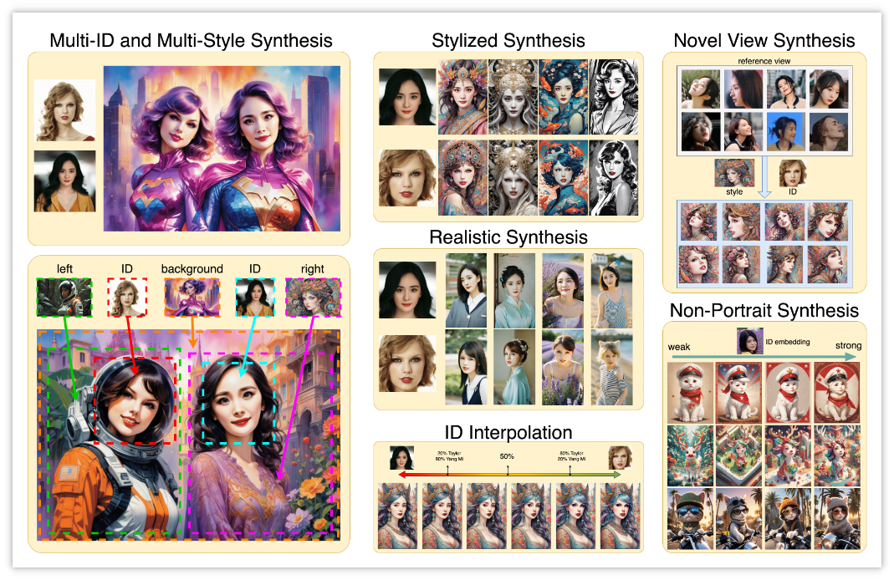
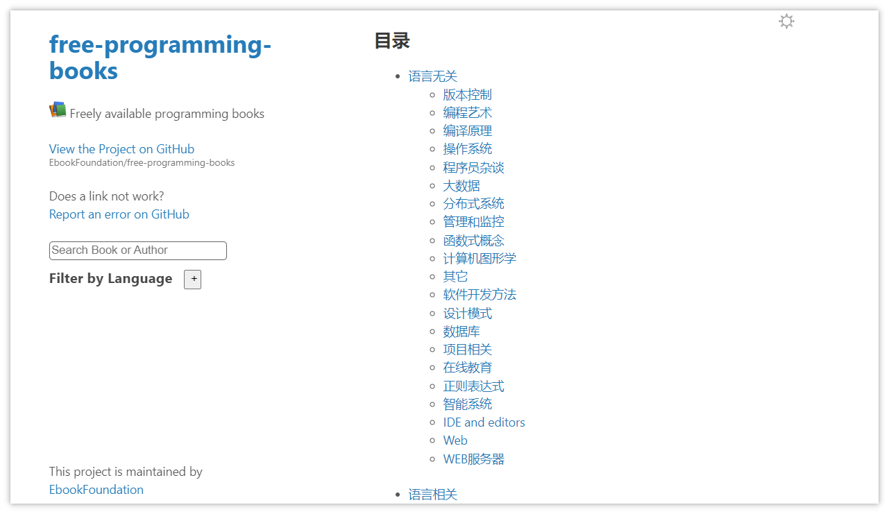

> GitHub一周热点汇总第4期 (2024.01.22-01.28)，梳理每周热门的GitHub项目，了解热点技术趋势，掌握前沿科技方向，发掘更多商机！


### 1 rustdesk / rustdesk

```text
🔥 本周 stars：4,541
🔨 语 言：Rust
⭐ stars：58,022
🍴 fork：6,245
```


rustdesk 是一款用 rust 编写的远程桌面软件，开箱即用，无需任何配置，数据完全可以由自己掌控，不用担心安全问题。用户可以使用作者提供的的注册/中继服务器， 或者自己开发搭建。


 


 
 ### 2 RVC-Boss / GPT-SoVITS
 
```text
🔥 本周 stars：3,132
🔨 语 言：Python
⭐ stars：5,949
🍴 fork：613
```

GPT-SoVITS 是一款强大的少样本语音转换与语音合成 Web 用户界面。仅仅用 1 分钟的声音样本也能训练出一个不错的 TTS 模型！

它具备以下功能特性：
1. **零样本文本到语音（TTS）：** 输入5秒的声音样本，即刻体验文本到语音转换。
2. **少样本TTS：** 仅需1分钟的训练数据即可微调模型，提升声音相似度和真实感。
3. **跨语言支持：** 支持与训练数据集不同语言的推理，目前支持英语、日语和中文。
4. **WebUI工具：** 集成工具包括声音伴奏分离、自动训练集分割、中文自动语音识别(ASR)和文本标注，协助初学者创建训练数据集和GPT/SoVITS模型。


 
 ### 3 stas00 / ml-engineering

```text
🔥 本周 stars：2,616
🔨 语 言：Python
⭐ stars：7,004
🍴 fork：405
```

ml-engineering 是一本机器学习工程的开放手册。它提供了一个开放的方法集，用于帮助大家能够成功训练出大语言模型和多模态模型。是一本适合 LLM/VLM 培训工程师和操作人员的技术资料。


 
### 4  InstantID / InstantID

```text
🔥 本周 stars：2,583
🔨 语 言：Python
⭐ stars：3,659
🍴 fork：184
```

InstantID 提出了一种新的图像生成方法。可以仅用 1 张照片即可生成保留人物特征的图像。


 


### 5  EbookFoundation / free-programming-books

```text
🔥 本周 stars：2,304
🔨 语 言：无
⭐ stars：309,842
🍴 fork：59,466
```

 
free-programming-books 是一个收集编程相关的电子书的项目，旨在帮助与编程相关电子书的创建、分享和存档。在上面你可以按照分组查找所需的电子书资源，比如按照语言，或者书籍所属分类等。




以上就是本期的全部内容，有感兴趣的赶紧去试试吧！我是四阿哥，关注我不错过每一周的热点项目，也可以在我的主页查看往期的精彩内容！