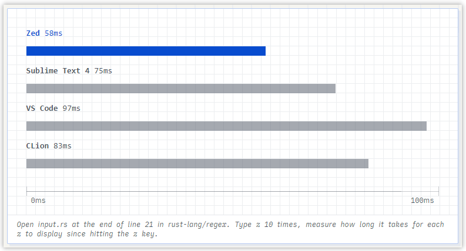
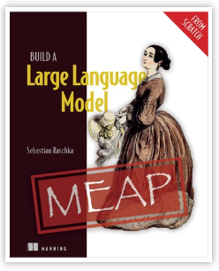
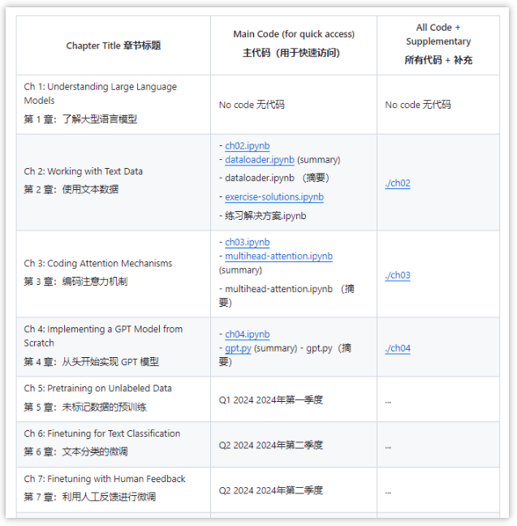
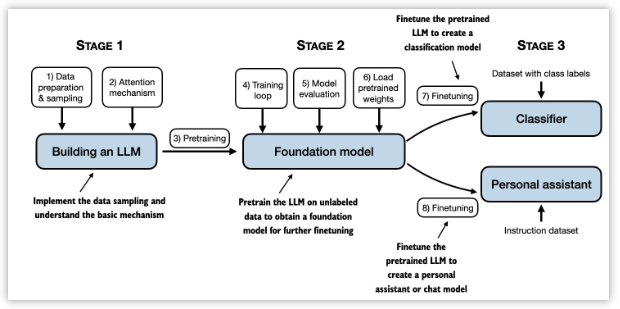
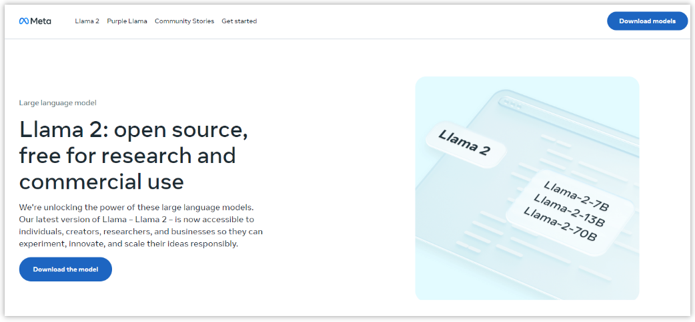

> GitHub一周热点汇总第5期 (2024.01.29-02.04)，梳理每周热门的GitHub项目，了解热点技术趋势，掌握前沿科技方向，发掘更多商机！

### 1 zed-industries / zed

```text
🔥 本周 stars：8,417
🔨 语 言：Rust
⭐ stars：18,720
🍴 fork：609
```


zed 是一款高性能的支持多人编辑的代码编辑器，由 Atom 的作者和 Tree-sitter 的作者联手打造。其特色在于专为性能而设计、开箱即用的 AI 支持、多人编辑支持等。其能否赶超甚至击败 VS Code 呢？让我们试着期待一下吧！


 

### 2 rasbt / LLMs-from-scratch
 
```text
🔥 本周 stars：6,604
🔨 语 言：Jupyter Notebook
⭐ stars：8,088
🍴 fork：465
```


LLMs-from-scratch 是《构建大语言模型》的随书项目，这本书还在编撰过程中，其进度及实验内容、代码等会逐步在这个仓库中完善。这本书旨在教你如何从零开始构建一个你自己的大预言模型。目前已经写了 4 章了，后续计划也公布在了网址上，感兴趣的同学可以留意一下。






 


### 3 lizongying / my-tv
 
```text
🔥 本周 stars：3,699
🔨 语 言：C
⭐ stars：6,504
🍴 fork：717
```

 my-tv 是一款电视直播软件，安装即可使用。家里的安卓电视可以直接通过 ADB 安装，小米电视可以通过小米电视助手进行安装。过年了，可以装起来一家人开开心心看电视了！
 
 


 
 
### 4 facebookresearch / codellama

```text
🔥 本周 stars：1,011
🔨 语 言：Python
⭐ stars：13,123
🍴 fork：1,350
```

 
codellama 是 Facebook 开源的，基于 Llama2 的大语言模型。在开放模型中提供最先进的性能、填充功能、对大型输入上下文的支持以及编程任务的零样本指令跟踪能力。该项目旨在释放大语言模型的力量，让个人、创作者、研究人员和企业可以自由地进行实验、创新和扩展他们的想法。感兴趣的同学可以自行前往下载使用。




以上就是本期的全部内容，有感兴趣的赶紧去试试吧！我是四阿哥，关注我不错过每一周的热点项目，也可以在我的主页查看往期的精彩内容！