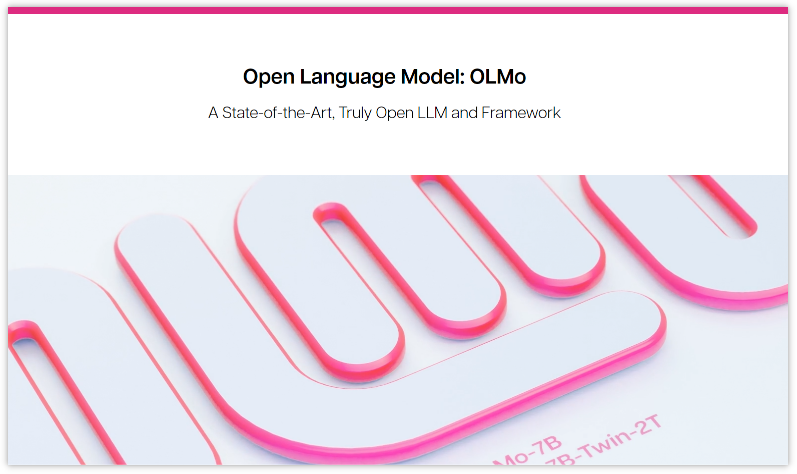
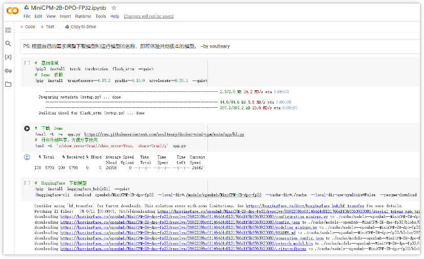
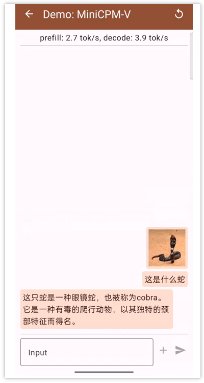
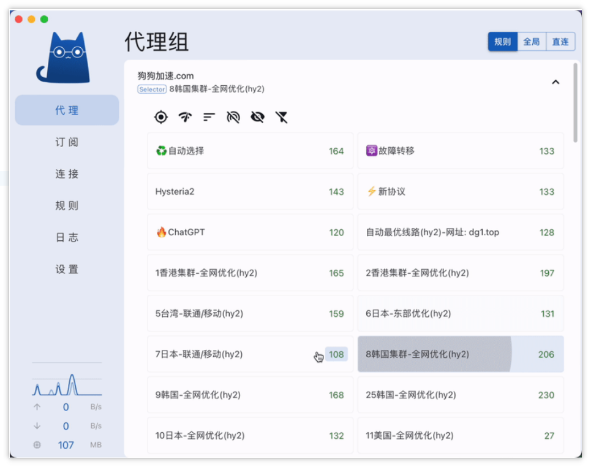
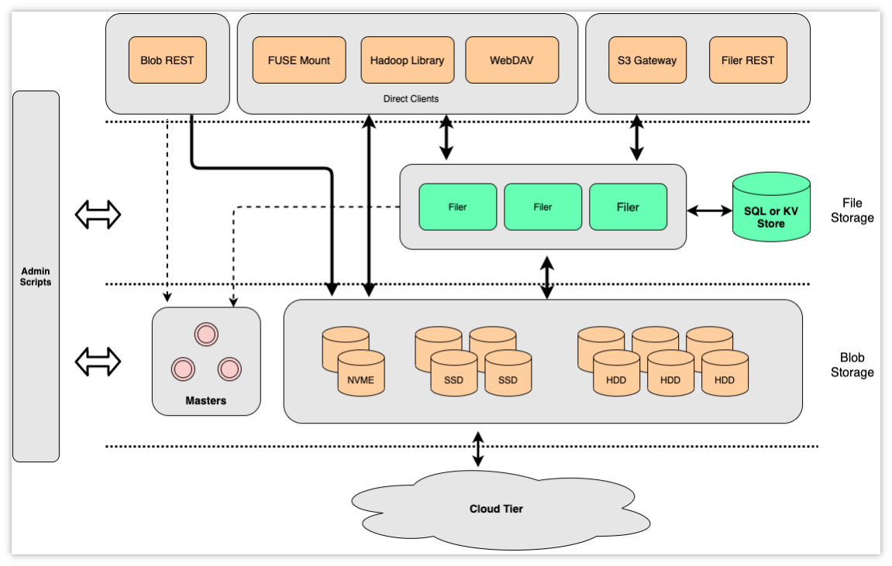

> GitHub一周热点汇总第6期 (2024.02.05-02.11)，梳理每周热门的GitHub项目，了解热点技术趋势，掌握前沿科技方向，发掘更多商机！


本周热门项目前两名是前几期介绍的电视直播软件（my-tv）和个人财务管理软件（maybe），感兴趣的可以前往第5期和第3期查看详细内容。

### 1. allenai / OLMo

```text
🔥 本周 stars：1,996
🔨 语 言：Python
⭐ stars：2,832
🍴 fork：232
```

开放语言模型 （OLMo） - AI2 LLM 框架旨在提供对数据、训练代码、模型和评估代码的访问，这些数据、训练代码、模型和评估代码是通过开放研究推进人工智能的，使学者和研究人员能够共同研究语言模型的科学。




### 2. OpenBMB / MiniCPM

```text
🔥 本周 stars：1,581
🔨 语 言：Python
⭐ stars：2,666
🍴 fork：182
```

  MiniCPM 是面壁智能与清华大学自然语言处理实验室共同开源的系列端侧大模型，主体语言模型 MiniCPM-2B 仅有 24亿（2.4B）的非词嵌入参数量, 总计2.7B参数量。


  



### 3. danielmiessler / fabric

```text
🔥 本周 stars：1,380
🔨 语 言：Python
⭐ stars：5,088
🍴 fork：401
```

Fabric 是一个旨在帮助大众更方便、轻松地使用 AI 的能力来解决日常问题的开源项目。其主要的实现方式就是通过收集 prompt 并帮助人们集成配置，形成一个解决问题的模型（pattern）。

Fabric 中提供了众多用于解决生活中各类问题的模式，包括：
- 提取 YouTube 视频和播客中最有趣的部分
- 用自己的声音写一篇文章，只用一个想法作为输入
- 向您解释代码
- 从任何内容输入创建社交媒体帖子
- ……


  

### 4. usememos / memos

```text
🔥 本周 stars：1,306
🔨 语 言：Go
⭐ stars：24,412
🍴 fork：1,789
```

memos 是一款隐私至上的轻量级笔记服务。致力于轻松捕捉和分享您的伟大想法。如果你对笔记的私密性有要求，你可以轻松地在服务器上部署一个自己的笔记服务。

  
  

### 5. clash-verge-rev / clash-verge-rev

```text
🔥 本周 stars：1,015
🔨 语 言：TypeScript
⭐ stars：7,886
🍴 fork：514
```


经常上网的同学应该对 clash 软件不陌生。clash-verge-rev 项目是一款基于 Tauri 的 Clash Meta 软件。软件拥有简单的用户界面，支持自定义主题颜色。由于冲突核心已被移除。该项目不再维护 clash 核心，而只维护 Clash Meta 核心。




### 6. seaweedfs / seaweedfs

```text
🔥 本周 stars：559
🔨 语 言：Go
⭐ stars：20,327
🍴 fork：2,145
```

SeaweedFS 是一个高速的分布式存储系统，适用于 Blob、对象、文件和数据湖，支持高达数十亿个文件的存储！Blob 存储具有 O(1) 磁盘查找性能、云分层等特性。SeaweedFS 的 Filer 支持 Cloud Drive、跨 DC 双活复制、Kubernetes、POSIX FUSE 挂载、S3 API、S3 网关、Hadoop、WebDAV、加密、纠删码。

SeaweedFS 起初是为了搞一个基于 Fackbook 的 Haystack 论文的实现，Haystack 旨在优化 Fackbook 内部图片存储和获取。后来这个基础上，SeaweedFS 作者又增加了若干功能特性，形成了目前的 SeaweedFS。




以上就是本期的全部内容，有感兴趣的赶紧去试试吧！我是四阿哥，关注我不错过每一周的热点项目，也可以在我的主页查看往期的精彩内容！


