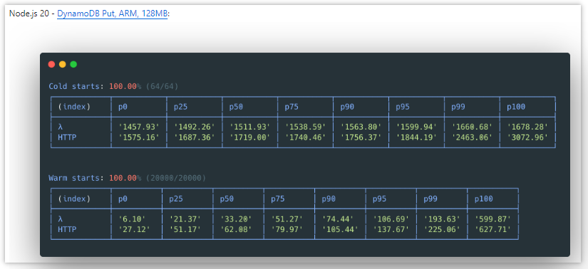
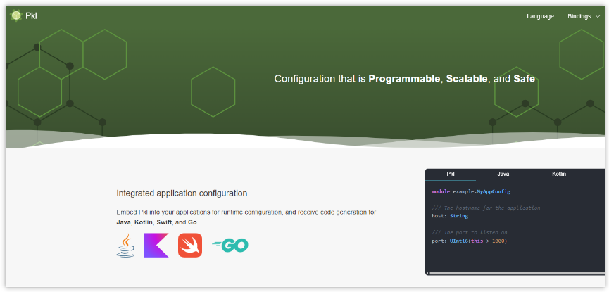
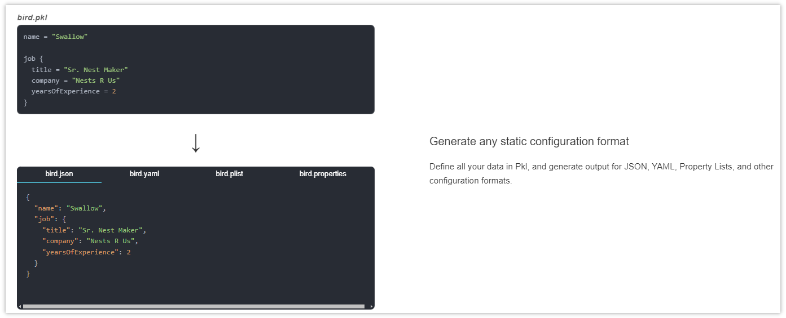
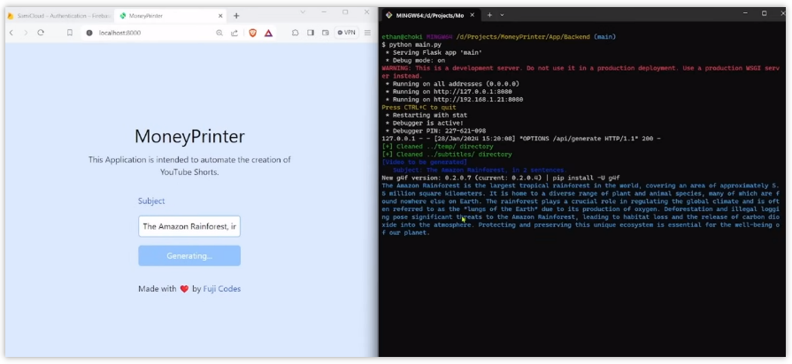
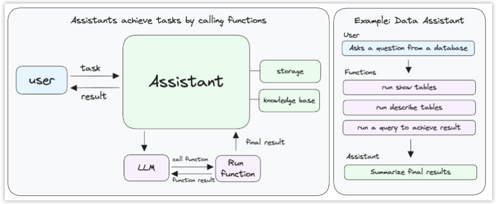

> GitHub一周热点汇总第7期 (2024.02.12-02.18)，梳理每周热门的GitHub项目，了解热点技术趋势，掌握前沿科技方向，发掘更多商机！

  

### 1. awslabs / llrt

```text
🔥 本周 stars：4,597
🔨 语 言：JavaScript
⭐ stars：6,300
🍴 fork：287
```

LLRT (**L**ow **L**atency **R**un**t**ime) 是由亚马逊开发团队推出的一个轻量级的 JavaScript 运行时，旨在满足日益增长的，开发快速高效的 Servless 应用程序的需求。与在 AWS Lambda 上运行的其他 JavaScript 运行时相比，LLRT 的启动速度提高了 10 倍以上，总体成本降低了 2 倍。

它内置于 Rust 中，利用 QuickJS 作为 JavaScript 引擎，确保高效的内存使用和快速启动。





### 2. apple / pkl

```text
🔥 本周 stars：4,086
🔨 语 言：Java
⭐ stars：7,508
🍴 fork：226
```

  pkl 是由 Apple 开发团队推出的，一种配置即代码语言，具有丰富的验证和工具。它可以用作命令行工具、软件库或构建插件。pkl 的理念就是：配置最好用一种特殊的语言来表达。简单来说，你可以通过一次编写，生成不同的 json、yml 等不同格式的静态配置，具有极大地灵活性。





  
  
### 3. FujiwaraChoki / MoneyPrinter
  
```text
🔥 本周 stars：3,474
🔨 语 言：Python
⭐ stars：7,732
🍴 fork：936
```


MoneyPrinter 是一个能够自动生成短视频的工具，你可以仅仅提供一个要讨论的主题，然后 MoneyPrinter 就能自动地为你生成对应的短视频。

它的底层用到了 GPT（生成脚本）、Pexels API（搜索视频）、Tiktok-Voice-TTS（配音）、moviePy（剪辑）等。




### 4.  microsoft / sudo

```text
🔥 本周 stars：4,597
🔨 语 言：JavaScript
⭐ stars：6,300
🍴 fork：287
```


熟悉 Linux 的小伙伴对于 sudo 命令肯定都不陌生。它能够让用户以安全的方式使用特定的权限执行程序（通常为操作系统的超级用户）。现在 Windows 版的 sudo 也要来啦！

Windows 版的 sudo 要求 Windows 11 版本 26045 及更高版本。如果你使用的是带有 sudo 的预览体验成员版本，则可以在 Windows 设置应用的“开发人员功能”页面上启用它。


### 5. phidatahq / phidata

```text
🔥 本周 stars：1,527
🔨 语 言：Python
⭐ stars：2,146
🍴 fork：224
```


phidata 又是一个新的 AI 智能助理项目。它的特点在于，Phidata 是一个使用函数调用构建 AI 助手的工具包。函数调用可以通过LLMs调用函数并根据响应智能选择下一步来完成任务，就像人类解决问题一样。

它是如何工作的？主要通过 3 步：
- 第 1 步：创建一个 `Assistant`
- 第 2 步：添加工具（函数）、知识（vectordb）和存储（数据库）
- 第 3 步：使用 Streamlit、FastApi 或 Django 构建 AI 应用程序




以上就是本期的全部内容，有感兴趣的赶紧去试试吧！我是四阿哥，关注我不错过每一周的热点项目，也可以在我的主页查看往期的精彩内容！
