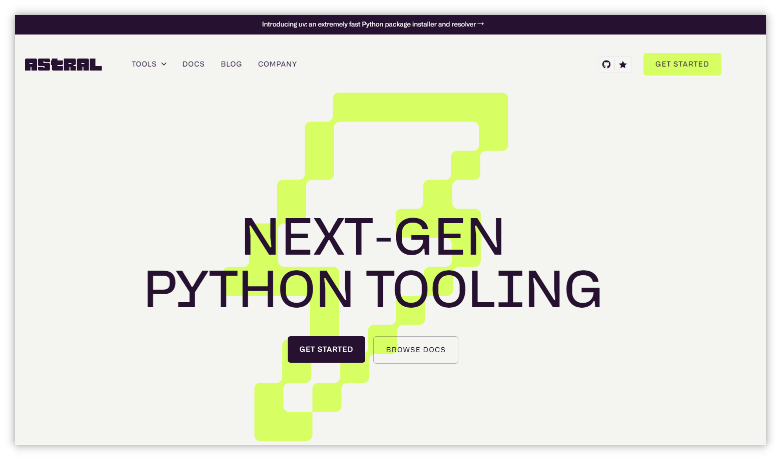
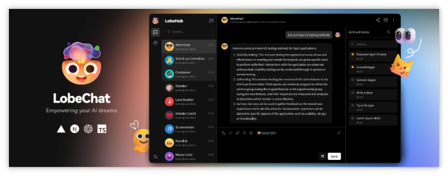
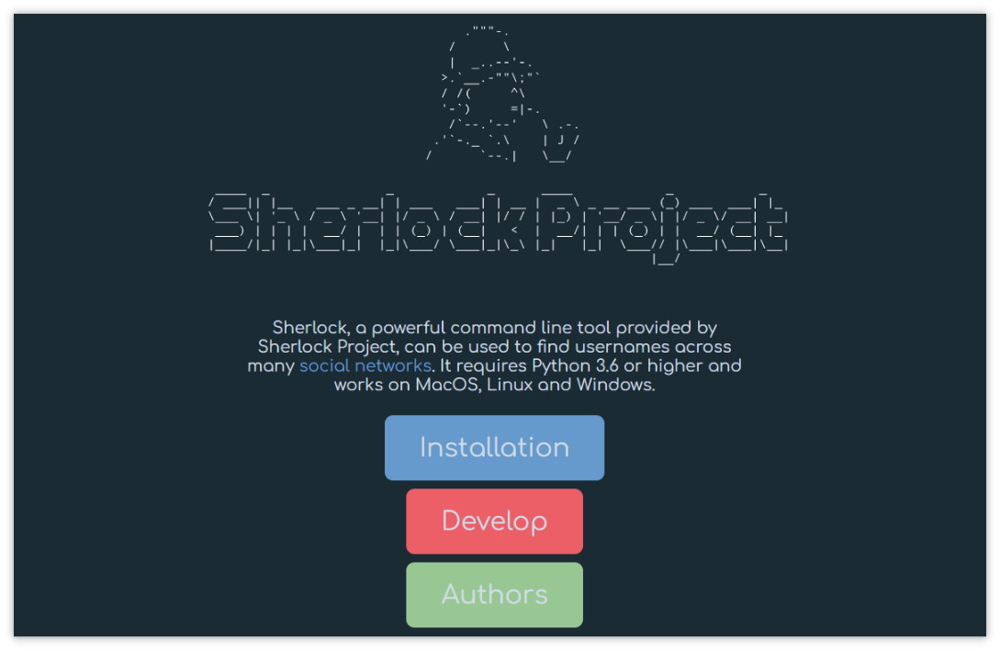
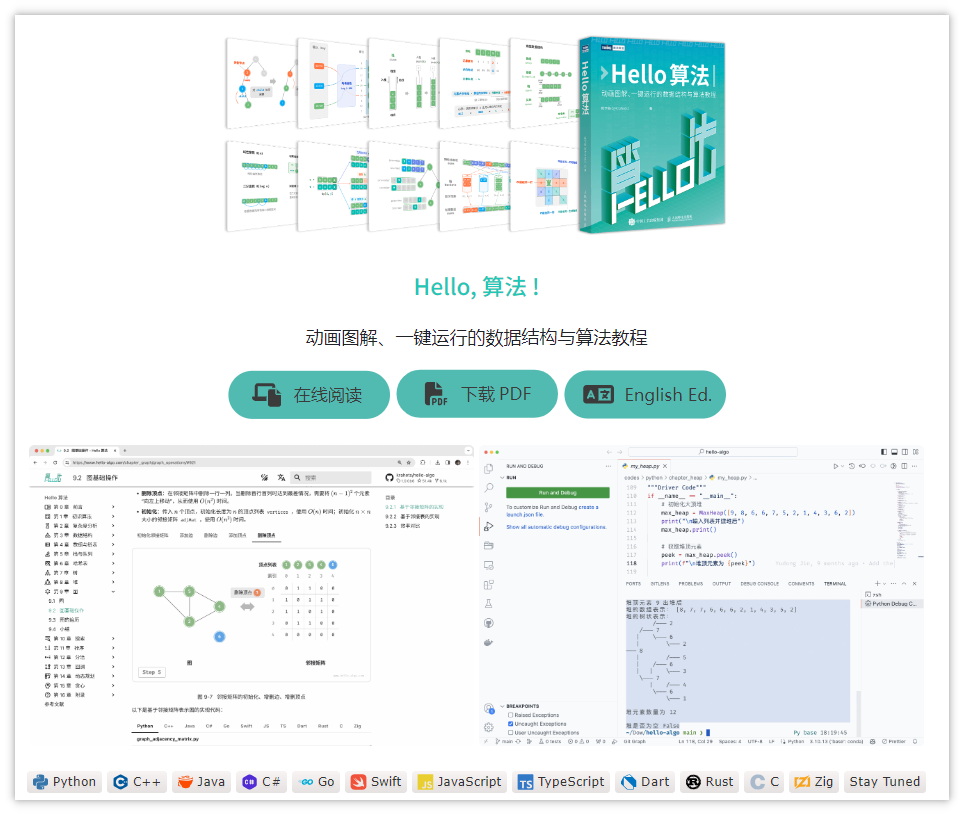

> GitHub一周热点汇总第8期 (2024.02.19-02.25)，梳理每周热门的GitHub项目，了解热点技术趋势，掌握前沿科技方向，发掘更多商机！


### 1. google / magika

```text
🔥 本周 stars：5,218
🔨 语 言：Python
⭐ stars：6,512
🍴 fork：352
```

Magika 是由 Google 推出的一种新的 AI 驱动的文件类型检测工具，它依靠深度学习的最新进展来提供准确的检测。Magika 采用了定制的、高度优化的 Keras 模型，该模型仅重约 1MB，即使在单个 CPU 上运行，也能在几毫秒内实现精确的文件识别。项目提供了演示环境，可以在线试用。


### 2. astral-sh / uv

```text
🔥 本周 stars：3,193
🔨 语 言：Rust
⭐ stars：6,980
🍴 fork：201
```


uv 是一个速度极快的 Python 包安装程序和解析器，采用 Rust 编写。设计为 `pip` 和 `pip-compile` 的直接替代品。



 ### 3. lobehub / lobe-chat

```text
🔥 本周 stars：2,657
🔨 语 言：TypeScript
⭐ stars：20,578
🍴 fork：4,006
```

 🤯 Lobe Chat 是一个开源的、现代设计的 ChatGPT/大模型 的 UI 及框架。支持语音合成、多模态和可扩展的插件系统。支持一键部署您的私人 ChatGPT/Gemini/Ollama 聊天应用程序。




### 4. sherlock-project / sherlock

```text
🔥 本周 stars：2,512
🔨 语 言：Python
⭐ stars：49,259
🍴 fork：5,917
```

sherlock 正如其名夏洛克，是一个可以帮助你根据用户名在社交网络上搜索相关社交媒体账号的工具。试想下，通过敲几行命令，输入你的用户名，就能在全网搜索出你的相关信息，想想就很极客！




 ### 5. krahets / hello-algo

```text
🔥 本周 stars：1,531
🔨 语 言：Java
⭐ stars：63,834
🍴 fork：7,769
```

如果你正在学习算法，或者在准备算法面试。那你一定不能错过这个项目！
hello-algo 项目旨在打造一本开源免费、新手友好的数据结构与算法入门教程。教程中包含大量动画图解、一键运行的数据结构与算法教程，支持 Python, C++, Java, C#, Go, Swift, JS, TS, Dart, Rust, C, Zig 等语言。感兴趣可以前往官方仓库查看更多内容。




以上就是本期的全部内容，有感兴趣的赶紧去试试吧！我是四阿哥，关注我不错过每一周的热点项目，也可以在我的主页查看往期的精彩内容！

 
 