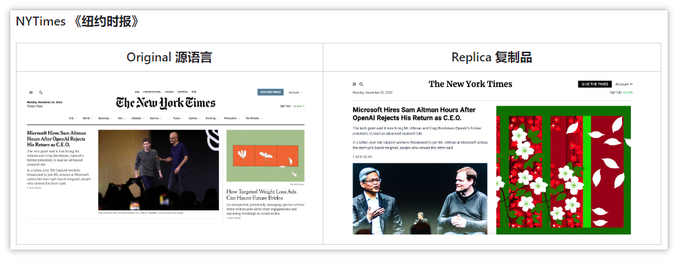
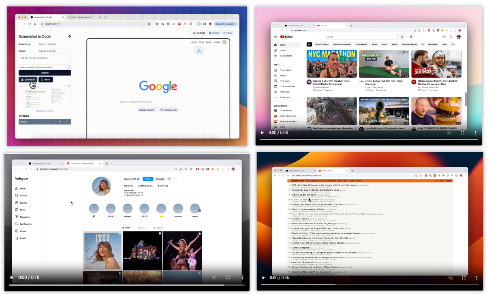
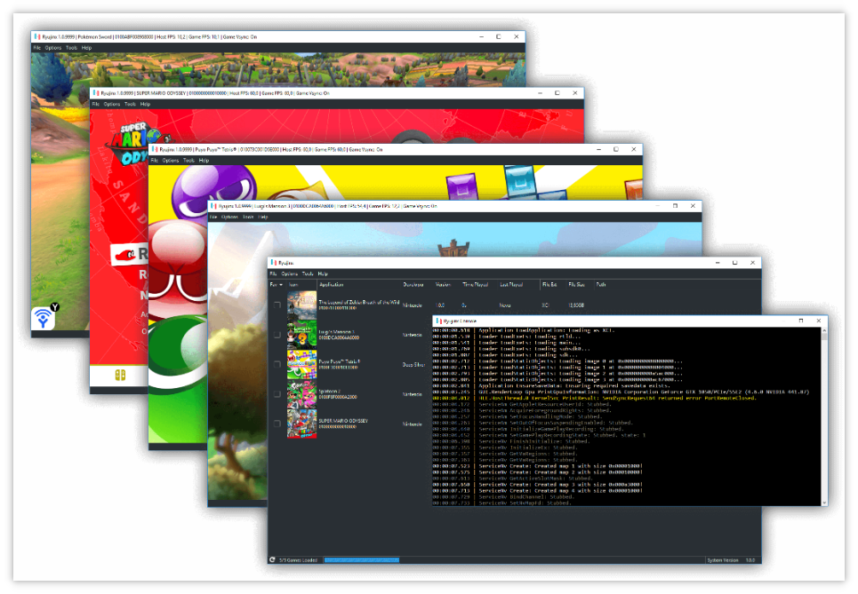
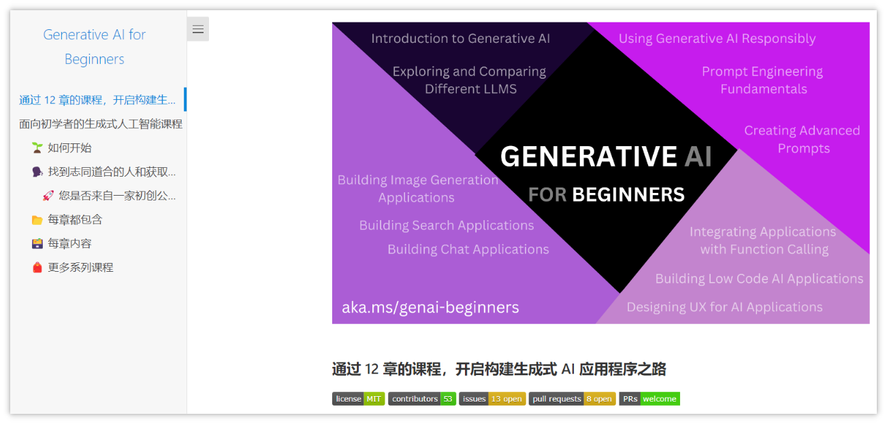
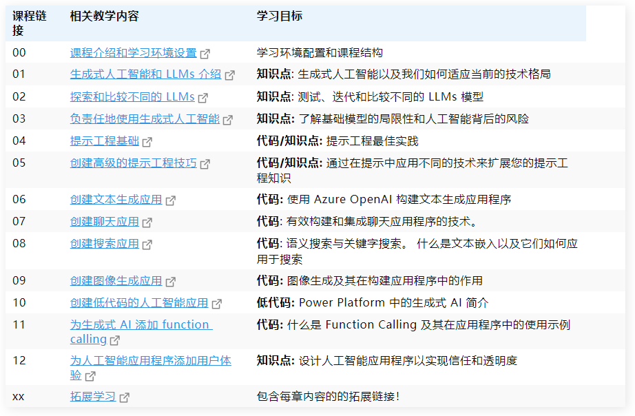
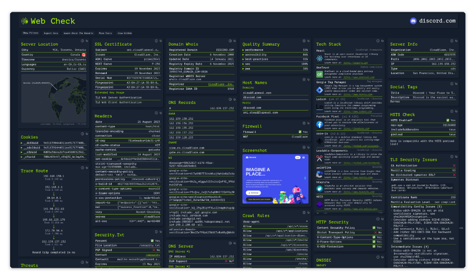

> GitHub一周热点汇总第10期 (2024.03.04-03.10)，梳理每周热门的GitHub项目，了解热点技术趋势，掌握前沿科技方向，发掘更多商机！


### 本期看点
1. 丢给我一个网页截图，我就能为你生成能够完整复刻这个网站的代码！
2. ollama 一款能够让你在本地运行大模型的软件。
3. 一个收集公共 API 的项目，涉及动漫、视频、音乐，新闻，天气等。独立开发或准备开发网站的同学一定不能错过。
4. 一款 Windows 和 Office 的开源激活工具，你懂的！


### 1. abi / screenshot-to-code

```text
🔥 本周 stars：7,627
🔨 语 言：TypeScript
⭐ stars：44,021
🍴 fork：5,163
🔗 链接：https://github.com/abi/screenshot-to-code
```

丢给我一个 Web 截图，我就能为你生成能够完整复刻这个网站的代码！

你可能是个产品经理或者后端开发，对前端一窍不通的你，常常困扰于无法把想法或者 demo 变成代码。现在借助 screenshot-to-code 你可以利用 AI 将屏幕截图、模型和 Figma 设计轻松地转换为干净、实用的代码。

以《纽约时报》为例，左边是原页面，右边是复刻的页面。


官方仓库中还有更多视频和文档示例。



### 2. cloudflare / pingora


```text
🔥 本周 stars：4,804
🔨 语 言：Rust
⭐ stars：16,352
🍴 fork：866
🔗 链接：https://github.com/cloudflare/pingora
```

一款由 cloudflare 出品 Nginx 开源平替产品！

Pingora 是一个由 cloudflare 出品的 Rust 框架，用于构建快速、可靠和可编程的网络系统。Pingora 是经过实战考验的，它已经在 cloudflare 服务了多年，每天处理超过 1 万亿个请求。

如果你也在寻求一款超越 Nginx 的新的代理工具，或者对 cloudflare 是如何优化他们的代理架构的感兴趣，可以去其官方仓库查看更多详细内容。


### 3. Ryujinx / Ryujinx


```text
🔥 本周 stars：3,933
🔨 语 言：C#
⭐ stars：30,525
🍴 fork：3,429
🔗 链接：https://github.com/Ryujinx/Ryujinx
```


yuzu 被任天堂起诉，还有别的平替模拟器吗？Ryujinx 它来了！

Ryujinx 是一个开源的 Nintendo Switch 模拟器，用 C# 编写，旨在提供出色的性能和用户友好的界面。截至 2023 年 10 月，Ryujinx 已在大约 4,200 款游戏上进行了测试;超过 4,150 个启动菜单并进入游戏，其中大约 3,500 个被认为是可玩的。不过要运行此模拟器，您的 PC 必须配备至少 8G 的内存; 如果不满足此要求，可能会导致游戏体验不佳或意外崩溃。


更多关于游戏列表和配置要求等详细内容，可以前往 GitHub 官方仓库查看更多信息。



  ### 4. microsoft / generative-ai-for-beginners

```text
🔥 本周 stars：3,427
🔨 语 言：Jupyter Notebook
⭐ stars：28,397
🍴 fork：16,986
🔗 链接：https://github.com/microsoft/generative-ai-for-beginners
```

试问过去的一年科技圈什么最火，绝对非大模型莫属！如果你也想抓紧布局 LLM，这有一份微软出品的零基础课程送给你！

这是由微软出品的一款面向初学者的生成式人工智能课程，一共 18 节课，从零开始向初学者讲授关于生成式人工智能所需的一些必备知识。课程每期都有一个主题，零基础到从环境搭建开始教起，而且还有中文版！更适合中国宝宝体质！赶紧加入你的收藏夹吃灰！






|课程链接|相关教学内容|学习目标|
|---|---|---|
|00|[课程介绍和学习环境设置](https://microsoft.github.io/generative-ai-for-beginners/#/00-course-setup/translations/cn/README?wt.mc_id=academic-105485-koreyst)|学习环境配置和课程结构|在学习本课程的同时帮助您取得成功|
|01|[生成式人工智能和 LLMs 介绍](https://microsoft.github.io/generative-ai-for-beginners/#/01-introduction-to-genai/translations/cn/README?wt.mc_id=academic-105485-koreyst)|**知识点**: 生成式人工智能以及我们如何适应当前的技术格局|了解什么是生成式人工智能 以及 LLMs 的工作原理。|
|02|[探索和比较不同的 LLMs](https://microsoft.github.io/generative-ai-for-beginners/#/02-exploring-and-comparing-different-llms/translations/cn/README?wt.mc_id=academic-105485-koreyst)|**知识点**: 测试、迭代和比较不同的 LLMs 模型|为您的应用场景选择正确的模型|
|03|[负责任地使用生成式人工智能](https://microsoft.github.io/generative-ai-for-beginners/#/03-using-generative-ai-responsibly/translations/cn/README?wt.mc_id=academic-105485-koreyst)|**知识点:** 了解基础模型的局限性和人工智能背后的风险|了解如何负责任地构建生成式人工智能应用程序|
|04|[提示工程基础](https://microsoft.github.io/generative-ai-for-beginners/#/04-prompt-engineering-fundamentals/translations/cn/README?wt.mc_id=academic-105485-koreyst)|**代码/知识点:** 提示工程最佳实践|了解提示结构和用法|
|05|[创建高级的提示工程技巧](https://microsoft.github.io/generative-ai-for-beginners/#/05-advanced-prompts/translations/cn/README?wt.mc_id=academic-105485-koreyst)|**代码/知识点:** 通过在提示中应用不同的技术来扩展您的提示工程知识|应用提示工程技术来改善提示结果。|
|06|[创建文本生成应用](https://microsoft.github.io/generative-ai-for-beginners/#/06-text-generation-apps/translations/cn/README?wt.mc_id=academic-105485-koreyst)|**代码:** 使用 Azure OpenAI 构建文本生成应用程序|了解如何有效地使用令牌和温度来改变模型的输出|
|07|[创建聊天应用](https://microsoft.github.io/generative-ai-for-beginners/#/07-building-chat-applications/translations/cn/README?wt.mc_id=academic-105485-koreyst)|**代码**: 有效构建和集成聊天应用程序的技术。|确定关键指标和注意事项，以有效监控和维护人工智能聊天应用程序的质量|
|08|[创建搜索应用](https://microsoft.github.io/generative-ai-for-beginners/#/08-building-search-applications/translations/cn/README?wt.mc_id=academic-105485-koreyst)|**代码**: 语义搜索与关键字搜索。 什么是文本嵌入以及它们如何应用于搜索|创建一个使用嵌入来搜索数据的应用程序。|
|09|[创建图像生成应用](https://microsoft.github.io/generative-ai-for-beginners/#/09-building-image-applications/translations/cn/README?wt.mc_id=academic-105485-koreyst)|**代码:** 图像生成及其在构建应用程序中的作用|构建图像生成应用程序|
|10|[创建低代码的人工智能应用](https://microsoft.github.io/generative-ai-for-beginners/#/10-building-low-code-ai-applications/translations/cn/README?wt.mc_id=academic-105485-koreyst)|**低代码:** Power Platform 中的生成式 AI 简介|使用低代码为我们的教育初创公司构建学生作业跟踪应用程序|
|11|[为生成式 AI 添加 function calling](https://microsoft.github.io/generative-ai-for-beginners/#/11-integrating-with-function-calling/translations/cn/README?wt.mc_id=academic-105485-koreyst)|**代码:** 什么是 Function Calling 及其在应用程序中的使用示例|设置 Function Calling 以从外部 API 检索数据|
|12|[为人工智能应用程序添加用户体验](https://microsoft.github.io/generative-ai-for-beginners/#/12-designing-ux-for-ai-applications/translations/cn/README?wt.mc_id=academic-105485-koreyst)|**知识点:** 设计人工智能应用程序以实现信任和透明度|开发生成式人工智能应用时用户体验设计的相关原则|
|xx|[拓展学习](https://aka.ms/genai-collection?WT.mc_id=academic-105485-koreyst)|包含每章内容的的拓展链接！|掌握生成式人工智能相关技能|


  ### 5. Lissy93 / web-check


```text
🔥 本周 stars：3,227
🔨 语 言：TypeScript
⭐ stars：16,849
🍴 fork：1,247
🔗 链接：https://github.com/Lissy93/web-check
```

🕵️‍♂️ 一款可以分析任何网站的一站式 OSINT（开源网络情报）工具。

**web-check 可以做什么？**
深入了解给定网站的内部工作原理：发现潜在的攻击媒介，分析服务器架构，查看安全配置，并了解网站正在使用哪些技术。

**web-check 有哪些特性？**
目前，仪表板将显示：IP 信息、SSL 链、DNS 记录、cookie、标头、域信息、搜索爬网规则、页面地图、服务器位置、重定向账本、开放端口、traceroute、DNS 安全扩展、站点性能、跟踪器、关联主机名、碳足迹。请继续关注，因为我很快就会添加更多内容！




以上就是本期的全部内容，有感兴趣的赶紧去试试吧！我是四阿哥，关注我不错过每一周的热点项目，也可以在我的主页查看往期的精彩内容！
