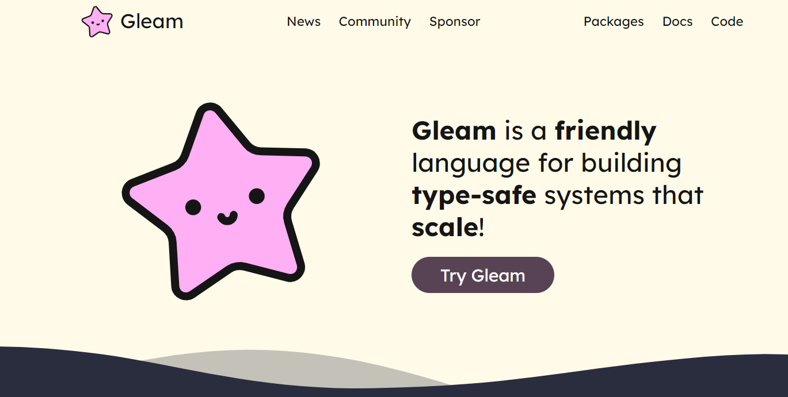
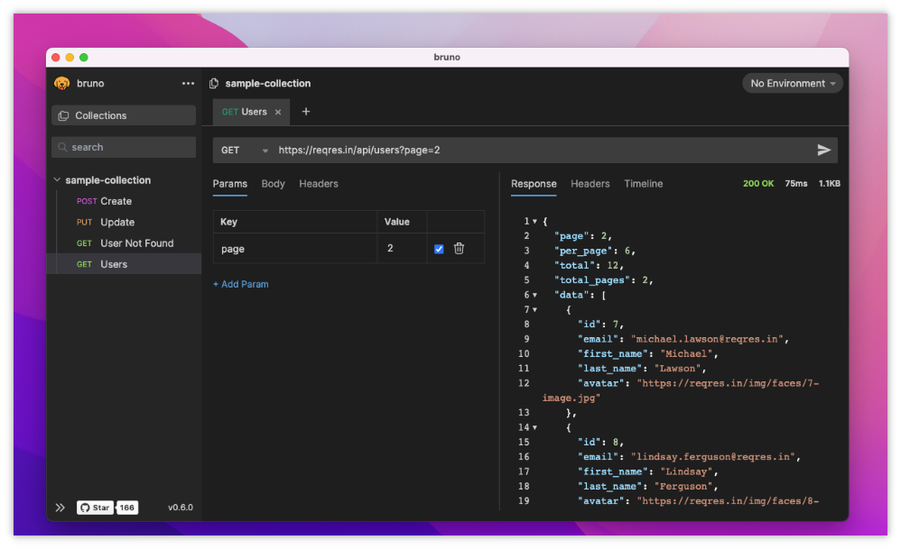
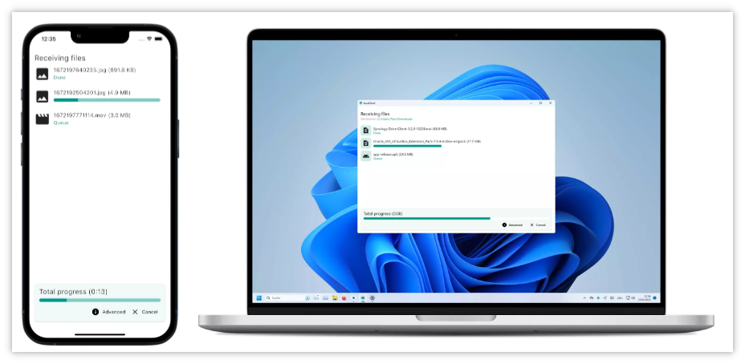

> GitHub一周热点汇总第11期 (2024.03.11-03.17)，梳理每周热门的GitHub项目，了解热点技术趋势，掌握前沿科技方向，发掘更多商机！


### 本期看点
1. 用 Erlang 的程序员不能错过的项目，一款函数式编程语言 Gleam！
2. 独立开发的小伙伴或许能够用得到的 Web 模板项目 full-stack-fastapi-template。
3. 一款 Postman 的开源平替软件！
4. 都 2024 年了你不会还用 QQ/微信传文件吧？一款开源跨设备文件传输工具，Airdrop 的开源平替！
5. 你的下一个操作系统何必要装在电脑上，或许是浏览器里！一款运行在浏览器里的操作系统！

### 1. gleam-lang / gleam

```text
🔥 本周 stars：6,895
🔨 语 言：Rust
⭐ stars：13,165
🍴 fork：554
🔗 链接：https://github.com/gleam-lang/gleam
```

Gleam 是一个静态类型的函数式编程语言，用于构建可伸缩的并发系统。它可以编译到 Erlang VM 上运行，并且可以直接与其它 BEAM 语言例如 Erlang、Elixir 和 LFE 互操作。



如果你是 Erlang 使用者或者对这方向感兴趣，可以去其官方仓库了解更多信息。这里截取部分其官网的 Q&A 以帮助大家做一个简单的了解。


### 2. tiangolo / full-stack-fastapi-template

```text
🔥 本周 stars：3,605
🔨 语 言：TypeScript
⭐ stars：18,749
🍴 fork：3,153
🔗 链接：https://github.com/geekan/MetaGPT
```

full-stack-fastapi-template 项目正如其名，是一个全栈的、现代风格的 Web 应用程序模板。它使用到了 FastAPI、React、SQLModel、PostgreSQL、Docker、GitHub Actions、自动 HTTPS 等技术。


### 3. usebruno / bruno

```text
🔥 本周 stars：3,358
🔨 语 言：TypeScript
⭐ stars：16,068
🍴 fork：718
🔗 链接：https://github.com/usebruno/bruno
```

你是否在寻找一款 Postman 的替代品？

bruno 是一款旨在改进 Postman 和现有 API 客户端工具的开源产品。Bruno 直接在用户的电脑文件夹中存储API 信息。使用纯文本标记语言 Bru 来保存有关 API 的信息。可以使用 Git 或任何版本控制系统来对 API 信息进行版本控制和协作。

看了一下，他的界面和 Postman 很像，因此如果你熟悉 Postman，上手成本应该不高。



### 4. localsend / localsend

```text
🔥 本周 stars：2,861
🔨 语 言：Dart
⭐ stars：32,508
🍴 fork：1,630
🔗 链接：https://github.com/localsend/localsend
```

LocalSend 是一个自由、开源的应用程序，允许你在本地网络上安全地与附近设备共享文件和消息，无需互联网连接。
LocalSend 是一个跨平台应用程序，使用 REST API 和 HTTPS 加密实现设备之间的安全通信。与依赖外部服务器的其他消息应用程序不同，LocalSend 不需要互联网连接或第三方服务器，因此成为本地通信的快速可靠解决方案。




### 5. HeyPuter / puter

```text
🔥 本周 stars：2,883
🔨 语 言：JavaScript
⭐ stars：9,386
🍴 fork：457
🔗 链接：https://github.com/HeyPuter/puter
```

puter 是一款号称是互联网操作系统的开源产品。这是一款可以在你的浏览器中运行的操作系统！感觉这个创意很不错，等于说是将 UI 层搬到了浏览器中，意味着你可以为你的系统“安装”自己喜欢的不同的 Web OS。

它可以用来做什么？（玩法十分丰富）
✅ Dropbox、Google Drive、OneDrive 等的替代品，具有全新的界面和强大的功能
✅ 服务器和工作站的远程桌面环境。
✅ 用于构建和托管网站、Web 应用程序和游戏的平台。
✅ 一个友好的开源项目和社区，用于了解 Web 开发、云计算、分布式系统等等！


以上就是本期的全部内容，有感兴趣的赶紧去试试吧！我是四阿哥，关注我不错过每一周的热点项目，也可以在我的主页查看往期的精彩内容！

