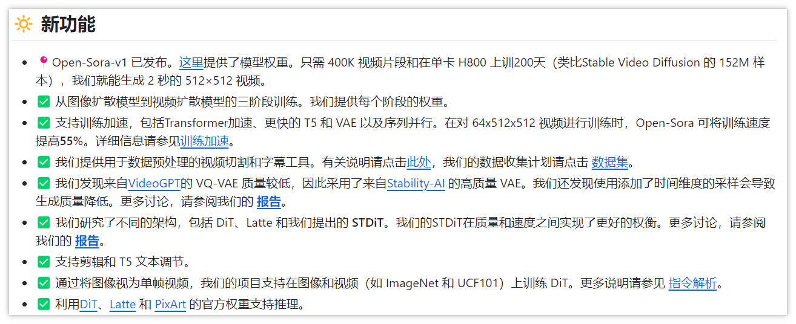
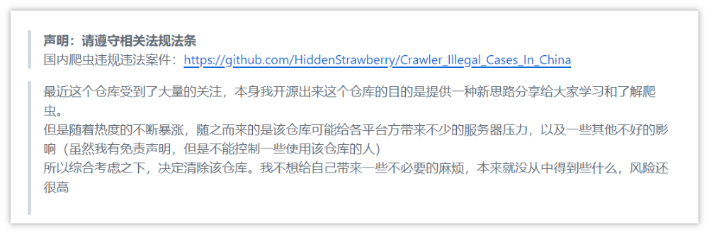
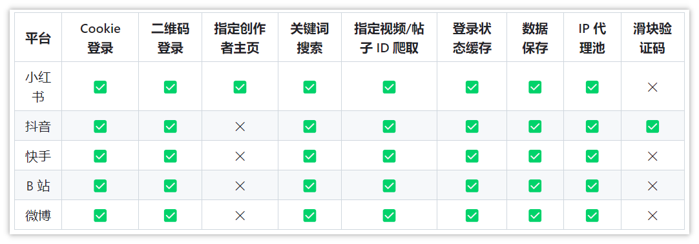
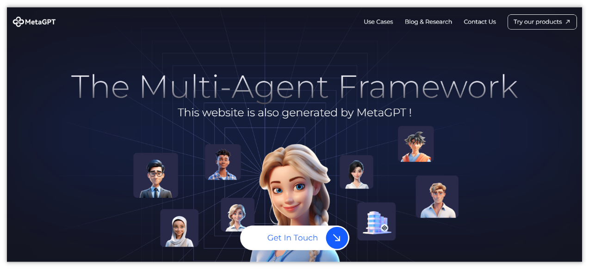

> GitHub一周热点汇总第12期 (2024.03.18-03.24)，梳理每周热门的GitHub项目，了解热点技术趋势，掌握前沿科技方向，发掘更多商机！


### 本期看点
1. Sora 还没用上，开源的 Sora 已经来了！
2. 超火爆🔥的社交媒体爬虫项目，发布没几天就被作者紧急删除？
3. 一款强大的计算机视觉工具，帮助你轻松实现视觉检测等功能！
4. 有没有想过让 AI 成立一个软件公司来为你工作？MetaGPT 让它成为了现实！


### 1. hpcaitech / Open-Sora

```text
🔥 本周 stars：10,001
🔨 语 言：Python
⭐ stars：12,349
🍴 fork：1,097
🔗 链接：https://github.com/hpcaitech/Open-Sora
```

Sora 还没用上，开源的 Sora 已经来了！

Open-Sora 项目是一项致力于高效制作高质量视频，并使所有人都能使用其模型、工具和内容的计划。 通过采用开源原则，Open-Sora 不仅实现了先进视频生成技术的低成本普及，还提供了一个精简且用户友好的方案，简化了视频制作的复杂性。 通过 Open-Sora，我们希望更多开发者一起探索内容创作领域的创新、创造和包容。

项目自 3 月发布以来，已经收获了 12k 的 star，火爆程度由此可见一斑。

目前已经支持的功能：


open-sora 的演示视频：


### 2. NanmiCoder / MediaCrawler


```text
🔥 本周 stars：8,175
🔨 语 言：Python
⭐ stars：10,048
🍴 fork：2,786
🔗 链接：https://github.com/NanmiCoder/MediaCrawler
```


本周热点第二的项目是一个已经不存在了的项目 😂。因为项目发布爆火后，很快就被作者删除了。原因嘛，只能说是国籍的锅了。

MediaCrawler 是一个爬虫项目，支持爬取各个社交媒体的内容及评论，但是作者因为担心被滥用，以及潜在的法律风险，在爆火后不久就删掉了。不过笔者看了下，还是有不少人已经提前 fork 了，想要进行研究的可以自行搜索😏。




  


 

  
### 3. roboflow / supervision

```text
🔥 本周 stars：2,314
🔨 语 言：Python
⭐ stars：12,287
🍴 fork：993
🔗 链接：https://github.com/roboflow/supervision
```

  
supervision 是一款强大的计算机视觉工具。无论您是需要从硬盘驱动器加载数据集、在图像或视频上绘制检测，还是计算区域中有多少检测，都可以利用 supervision 轻松完成。

项目提供了丰富的视频教程及文档，帮助开发者快速上手，感兴趣的可以前往官方仓库了解更多内容。


### 4. geekan / MetaGPT

```text
🔥 本周 stars：2,314
🔨 语 言：Python
⭐ stars：12,287
🍴 fork：993
🔗 链接：https://github.com/geekan/MetaGPT
```


MetaGPT 是一个多代理的 GPT 框架，同其他角色扮演类型的 GPT 代理类似，都是通过为 GPT 分配不同的角色，以便能够使其协助来解决复杂任务。


但是与同其他同类型框架不同的是，MetaGPT 创新地采用一家软件公司作为系统代理，每个代理均充当着这家公司的不同角色。MetaGPT 以单行需求为输入，输出用户故事/竞争分析/需求/数据结构/API/文档等。在内部，MetaGPT 包括产品经理/架构师/项目经理/工程师。它提供了软件公司的整个过程以及精心编排的 SOP。

  
  

以上就是本期的全部内容，有感兴趣的赶紧去试试吧！我是四阿哥，关注我不错过每一周的热点项目，也可以在我的主页查看往期的精彩内容！
