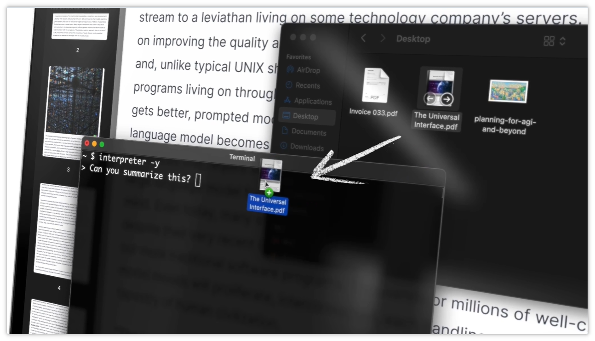

> GitHub一周热点汇总第13期 (2024.03.25-03.31)，梳理每周热门的GitHub项目，了解热点技术趋势，掌握前沿科技方向，发掘更多商机！


本周最火的当属 Devin 相关的话题，因为热门项目前两名的都是关于 Devin 的！

Devin 是什么？它是由人工智能初创公司 Cognition 推出的全球首个全自主的 AI 软件工程师。具有长期推理和规划能力，可执行复杂工程任务，并与用户进行实时协作。

本期有两个项目都是开源版的 Devin，足见其热度之高，那么话不多说，下面具体看看本周的热门项目吧！

### 本期看点
1. 🔥 爆火的 AI 程序员 Devin 的开源平替版来了，一周斩获 10k+ 赞！
2. 未来已来！人与计算机 💻 的交互从 GUI 到自然语言或将成为可能？
3. 当 Redis 不再免费了，又有什么开源平替呢？🤔

### 1. stitionai / devika

```text
🔥 本周 stars：10,944
🔨 语 言：Python
⭐ stars：12,867
🍴 fork：1,535
🔗 链接：https://github.com/stitionai/devika
```

Devika 是一名代理 AI 软件工程师，可以理解高级人类指令，将它们分解为步骤，研究相关信息，并编写代码以实现给定的目标。Devika 旨在成为 Cognition AI 的 Devin 的有竞争力的开源替代品。

Devika 利用大型语言模型、规划和推理算法以及 Web 浏览能力来智能开发软件。无论您是需要创建新功能、修复错误还是从头开始开发整个项目，Devika 都能为您提供帮助。

Devika 可以做什么？有哪些功能特性？
🤖 通过 Ollama 支持 Claude 3、GPT-4、GPT-3.5 和 LocalLLMs。为获得最佳性能：使用 Claude 3 系列型号。
🧠 先进的 AI 规划和推理能力
🔍 用于重点研究的上下文关键字提取
🌐 无缝网页浏览和信息收集
💻 用多种编程语言编写代码
💬 通过聊天界面进行自然语言交互
……

更多相关内容，可以前往官方仓库了解更多。


  
### 2. OpenDevin / OpenDevin

```text
🔥 本周 stars：8,454
🔨 语 言：Python
⭐ stars：11,416
🍴 fork：981
🔗 链接：https://github.com/OpenDevin/OpenDevin
```

OpenDevin 是另一个旨在复制 Devin 的开源项目。该项目希望通过开源社区的力量复制、增强和创新 Devin。目前项目处于起步阶段，功能和配套设施都不完善，项目还在招募中，后续规划及更多内容可以前往其官方仓库查看。


  
  


### 3. OpenInterpreter / open-interpreter

```text
🔥 本周 stars：3,081
🔨 语 言：Python
⭐ stars：46,060
🍴 fork：3,979
🔗 链接：https://github.com/OpenInterpreter/open-interpreter
```

计算机交互界面的发展，从命令行到图形用户界面 GUI，已经算是革命性的发展了。但是离我们想象中的未来还有一定的差距。我们能否直接使用自然语言的方式来操作计算机呢？大模型的出现为我们提供了一定的想想空间。


open-interpreter 利用了 LLM 的能力，让大模型在本地运行代码从而能够调用计算机的系统接口，从而实现通过自然语言的交互方式来调用计算机通用功能。比如：
- 创建和编辑照片、视频、PDF 等。
- 控制 Chrome 浏览器
- 绘制、清理和分析大型数据集
- ……


通过演示视频可以看到，利用 open interpreter 我们可以为系统设置暗夜模式、





### 4. microsoft / garnet

```text
🔥 本周 stars：2,150
🔨 语 言：C#
⭐ stars：7,900
🍴 fork：330
🔗 链接：https://github.com/microsoft/garnet
```

Garnet 是微软研究院推出的基于 C# 开发的高性能缓存服务，兼容Redis服务API。官方声称其在性能和使用架构上较Redis有很大提升，并提供与Redis一样的命令操作存储数据，因此可以在不更换现有Redis客户端与库的情况下，即可无缝使用Garnet，从而降低开发难度与使用成本。


### 5. OpenInterpreter / 01

```text
🔥 本周 stars：1,988
🔨 语 言：Python
⭐ stars：3,806
🍴 fork：351
🔗 链接：https://github.com/OpenInterpreter/01
```

01 项目还是 OpenInterpreter 发起的另一个开源项目，旨在为 AI 设备构建一个开源的生态系统。通过将代码解释语言模型（“解释器”）与语音识别和语音合成相结合，让用户能够通过语音，以对话的方式操作计算机。目前项目也是处于刚启动研发阶段，感兴趣的可以留意一下最新进展。


以上就是本期的全部内容，有感兴趣的赶紧去试试吧！我是四阿哥，关注我不错过每一周的热点项目，也可以在我的主页查看往期的精彩内容！