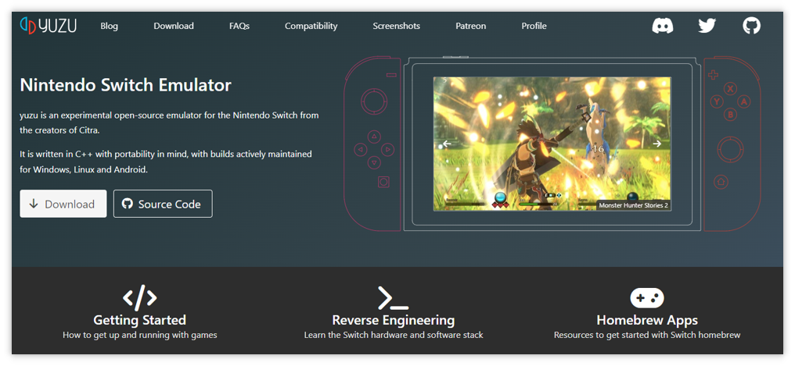
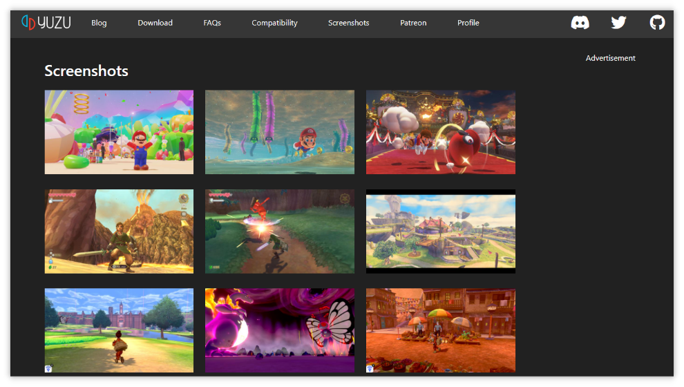
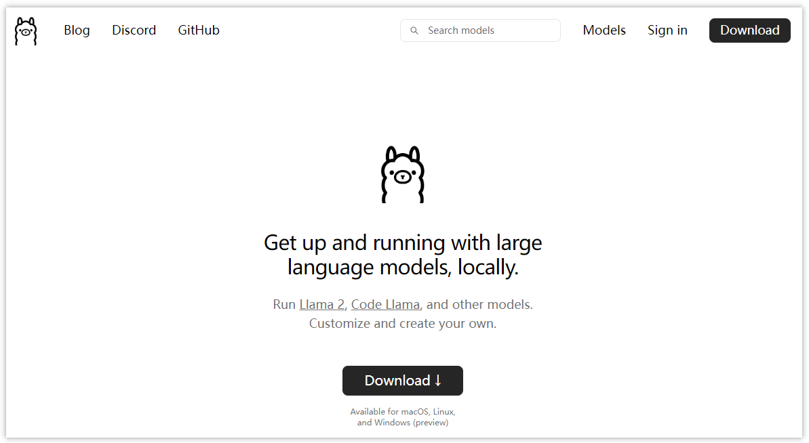
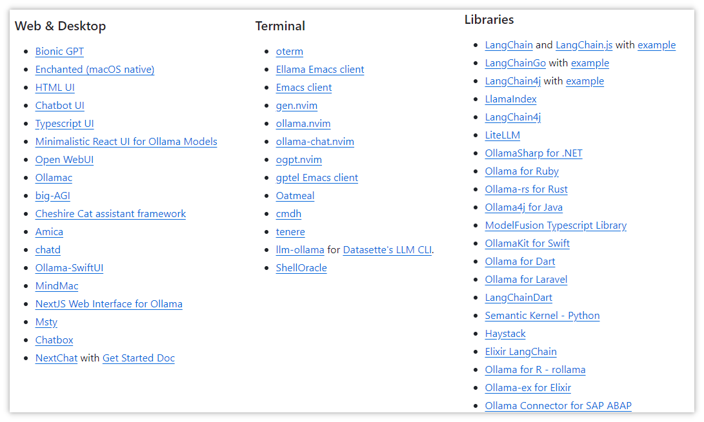
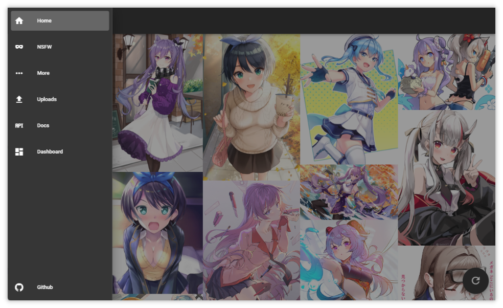

#GitHub/热门项目


> GitHub一周热点汇总第9期 (2024.02.26-03.03)，梳理每周热门的GitHub项目，了解热点技术趋势，掌握前沿科技方向，发掘更多商机！


### 本期看点
1. 想玩 Switch 上的游戏，但是没有 Switch 主机怎么办？
2. ollama 一款能够让你在本地运行大模型的软件。
3. 一个收集公共 API 的项目，涉及动漫、视频、音乐，新闻，天气等。独立开发或准备开发网站的同学一定不能错过。
4. 一款 Windows 和 Office 的开源激活工具，你懂的！

### 1. yuzu-emu / yuzu

```text
🔥 本周 stars：4,868
🔨 语 言：C++
⭐ stars：38,656
🍴 fork：4,027
🔗 链接：https://github.com/yuzu-emu/yuzu
```

想玩 Switch 游戏但是没有 Switch？不要慌，yuzu 模拟器来帮忙！

yuzu 号称是世界上最受欢迎的开源 Nintendo Switch 模拟器——由 Citra 的创造者创立。它是用 C++ 编写的，考虑到了可移植性，项目同时还维护了 Windows、Linux 和 Android 的构建。

只要机器满足足必要的硬件要求，模拟器就能够全速运行大多数商业游戏。感兴趣的可以去官网了解更多信息！






### 2.  ollama / ollama
  
```text
🔥 本周 stars：3,744
🔨 语 言：Go
⭐ stars：43,109
🍴 fork：2,788
🔗 链接：https://github.com/ollama/ollama
```

ollama 是一款能够让你在启动并运行 Llama 2、Mistral、Gemma 和其他大型语言模型的工具。目前社区相关的集成项目也很多，在乎数据隐私性，或是想要进行私人定制的同学可以去研究研究。


 



### 3. public-apis / public-apis
  
```text
🔥 本周 stars：3,429
🔨 语 言：Python
⭐ stars：283,781
🍴 fork：30,980
🔗 链接：https://github.com/public-apis/public-apis
```

public-apis 是一个收集用于软件和 Web 开发的免费 API 的项目。里面汇集了大量的各行各业的公共 API，比如有动漫、书籍、餐饮、音乐，新闻等等。如果你正在考虑开发相关的网站，不妨上去找找有没有适合的公共 API，当然如果你也有御用的 API，不妨也可以提 PR 贡献一下🤣。

下图是部分 API 的截图。


比如下图是一个公开的动漫图片 API。



### 4. massgravel / Microsoft-Activation-Scripts

```text
🔥 本周 stars：2,808
🔨 语 言：Batchfile
⭐ stars：65,695
🍴 fork：6,540
🔗 链接：https://github.com/massgravel/Microsoft-Activation-Scripts
```

Microsoft Activation Scripts (MAS) 是一款激活工具，它是一款使用 HWID / Ohook / KMS38 / Online KMS 激活方法的 Windows 和 Office 激活器，专注于开源代码和更少的防病毒检测。


以上就是本期的全部内容，有感兴趣的赶紧去试试吧！我是四阿哥，关注我不错过每一周的热点项目，也可以在我的主页查看往期的精彩内容！
