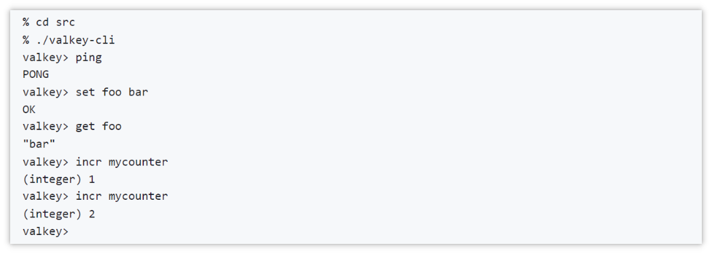
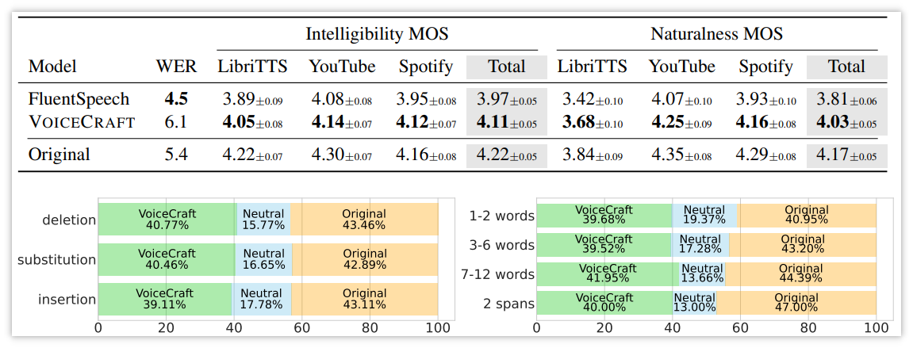
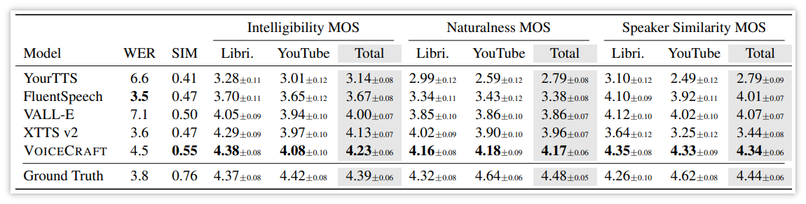
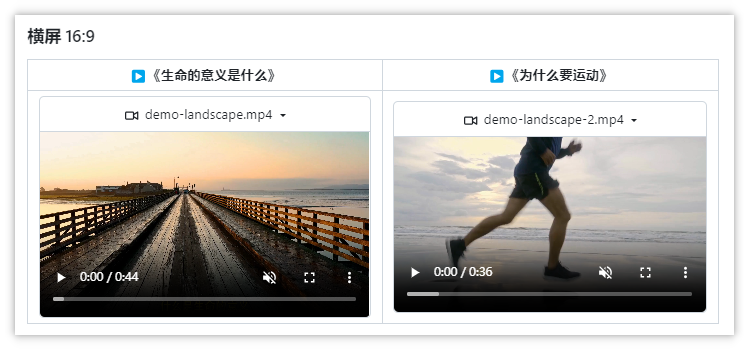
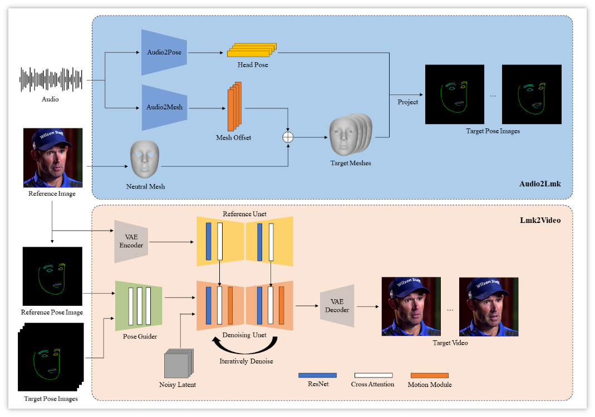
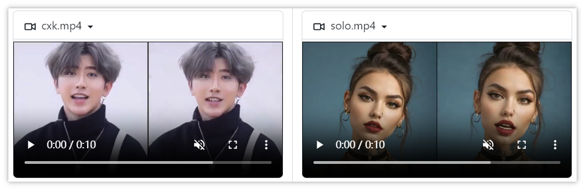
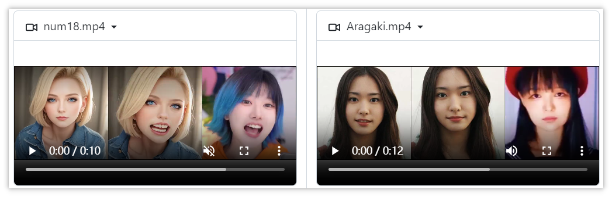
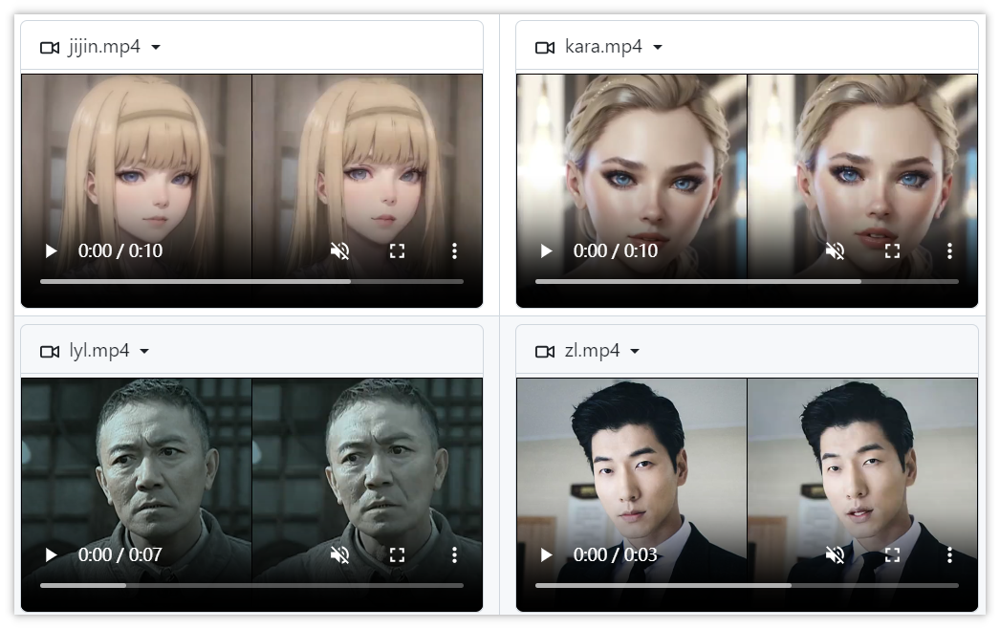

> GitHub一周热点汇总第14期 (2024.04.01-04.07)，梳理每周热门的GitHub项目，了解热点技术趋势，掌握前沿科技方向，发掘更多商机！


### 本期看点
1. 当 Redis 宣布不再免费后的又一开源平替项目！👍
2. 🔥国人开发的利用 AI 制作高清短视频项目来了！支持文心一言等国内大模型！
3. 仅用一张照片外加一段音频，就能生成高质量的人像！😮应用前景广泛……


本期最火的前两个项目 `OpenDevin` 和 `generative-ai-for-beginners`，分别在第 13 期和第 10 期介绍过，感兴趣的小伙伴可以前往查看详细介绍，这里就不过多赘述了。除此之外，下面继续看看本期还有哪些热门项目吧！


### 1. valkey-io / valkey

```text
🔥 本周 stars：5,718
🔨 语 言：C
⭐ stars：8,280
🍴 fork：310
```

K/V 缓存最近也是开源的热点方向，前面介绍过微软开源了自己的缓存项目 garnet，而 Valkey 则是另一个 K/V 高速缓存项目。这主要是由于前段时间，Redis 宣布变更开源协议，导致托管 redis 的云服务厂商不能再免费的使用。

Valkey 是一个高性能的数据结构服务器，主要服务于键/值工作。它支持广泛的原生结构和可扩展的插件系统，用于添加新的数据结构和访问模式。

值得注意的是，此项目是 fork 自 Redis 项目的，只不过是在其变更许可之前。这也意味着，其操作和命令基本和 Redis 兼容。

例如下面演示了如何通过 valkey-cli 客户端执行命令。



### 2. jasonppy / VoiceCraft

```text
🔥 本周 stars：4,048
🔨 语 言：Jupyter Notebook
⭐ stars：5,630
🍴 fork：550
```

VoiceCraft 则是又一个零样本的语音编辑和文本转语音的项目。它的底层是一个令牌填充神经编解码器语言模型，可在语音编辑和零样本文本转语音 （TTS） 方面实现最先进的性能，处理包括有声读物、互联网视频和播客在内的实时数据。
只需要提供几秒钟的声音样本，VoiceCraft 就能为你进行声音克隆。


VoiceCraft 执行语音编辑任务与其他模型的对比。


VoiceCraft 执行 TTS 任务与其他模型的对比。



### 3. harry0703 / MoneyPrinterTurbo

```text
🔥 本周 stars：2,978
🔨 语 言：Python
⭐ stars：7,657
🍴 fork：1,138
```

之前第 7 期介绍过一款文本生成短视频的开源项目 MoneyPrinter，现在另一个适合中国宝宝的自动短视频生成开源项目来了。
用户只需提供一个视频 **主题** 或 **关键词** ，就可以全自动生成视频文案、视频素材、视频字幕、视频背景音乐，然后合成一个高清的短视频。

工具分别提供了 Web 界面和接口，并且可以在线体验，大大降低大家的使用成本。此外值得注意的是，项目支持接入**OpenAI**、**moonshot**、**Azure**、**gpt4free**、**one-api**、**通义千问**、**Google Gemini**、**Ollama** 等多种模型，对国内的朋友来说方便很多。





### 4. Zejun-Yang / AniPortrait

```text
🔥 本周 stars：1,799
🔨 语 言：Python
⭐ stars：3,062
🍴 fork：406
```

AniPortrait 是腾讯开源的照片级音频驱动的人像动画合成框架。简单来说，你可以通过一张照片外加一段音频生成高质量的人像视频。这块技术也有很多的应用场景，比如虚拟现实、游戏和数字媒体等。

所提出的框架包括两个模块，**Audio2Lmk** 和 **Lmk2Video**。前者旨在从音频输入中提取一系列能够捕捉复杂面部表情和嘴唇运动的关键点序列。后者利用这些关键点序列生成具有时间稳定性的高质量人像视频。下图1中概述了该框架，并在下文提供了更多细节。


下面是官方提供的一些样例。







以上就是本期的全部内容，有感兴趣的赶紧去试试吧！我是四阿哥，关注我不错过每一周的热点项目，也可以在我的主页查看往期的精彩内容！