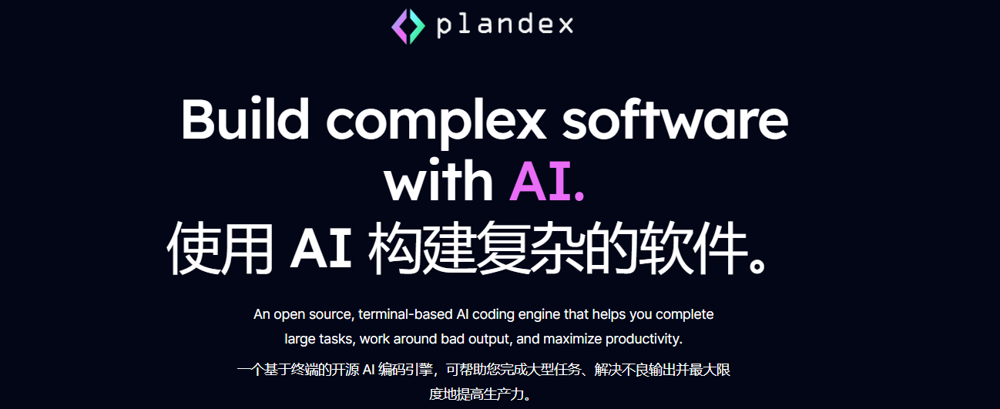
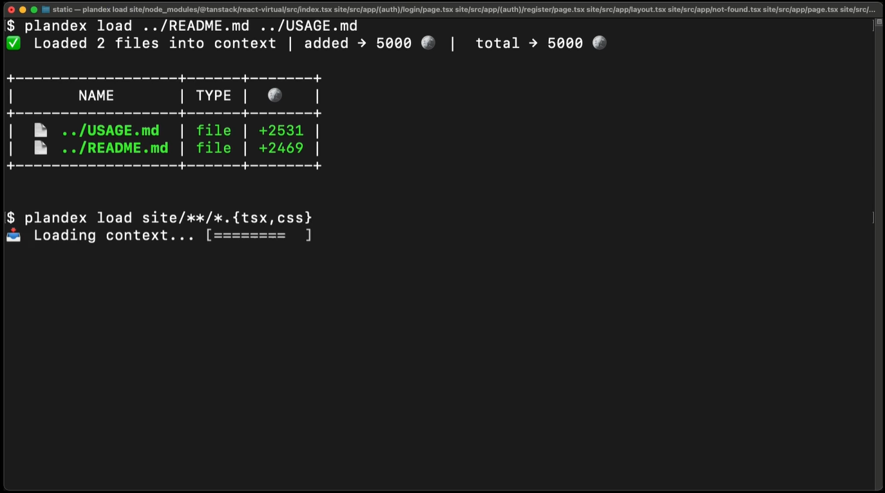
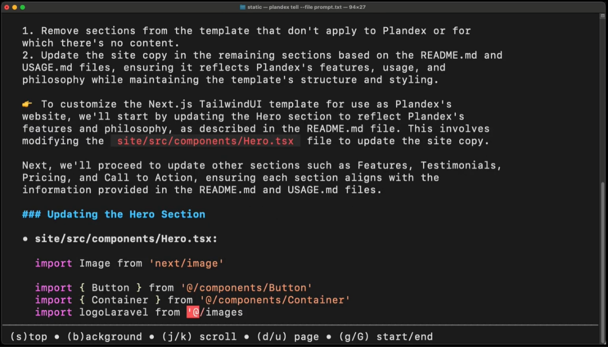
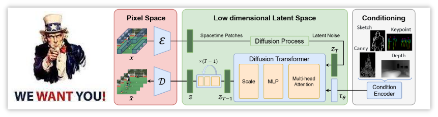
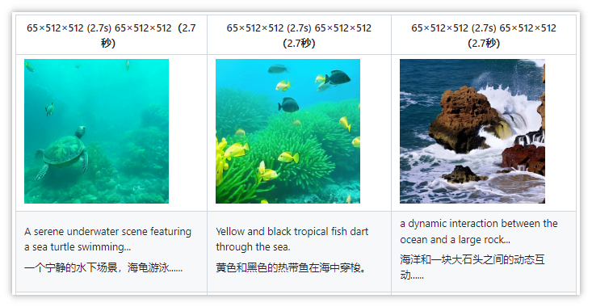
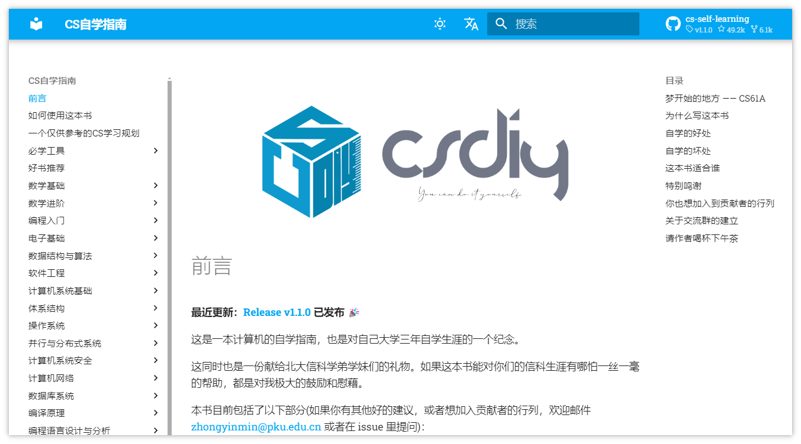
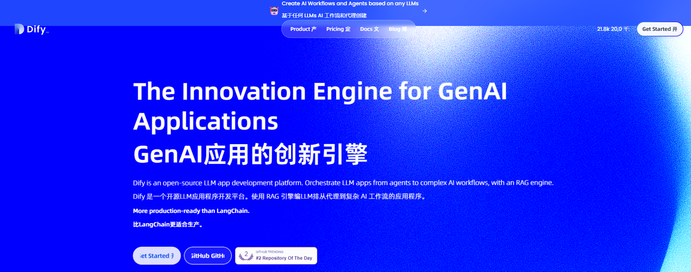
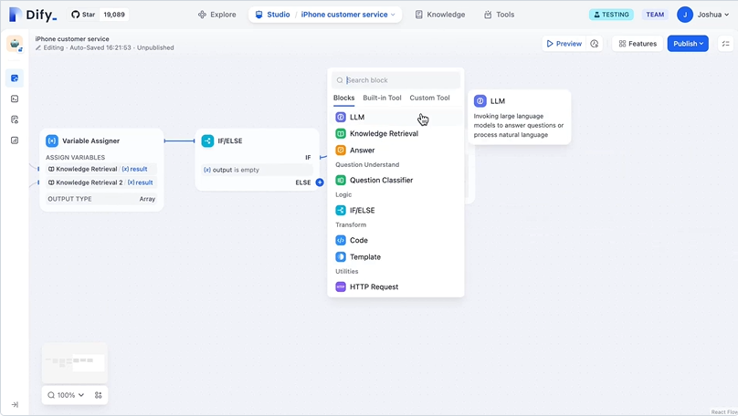
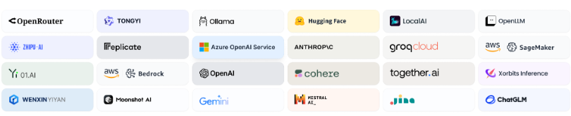
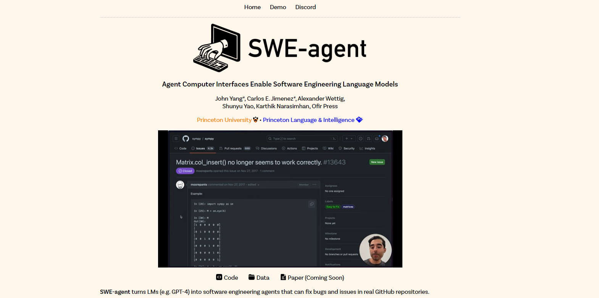

> GitHub一周热点汇总第15期 (2024.04.08-04.14)，梳理每周热门的GitHub项目，了解热点技术趋势，掌握前沿科技方向，发掘更多商机！


### 本期看点
1. 一款 AI 命令行工具🔮，能够帮助你从头到尾实现一个项目，不需要你写一行代码！
2. 🔥国人号召发起的 Sora 开源项目 Open Sora Plan 它来了！
3. 这儿有一份来自北大学长的计算机自学指南📚，请务必收下……


本期最火的前两个项目 `OpenDevin` 和 `generative-ai-for-beginners`，分别在第 13 期和第 10 期介绍过，感兴趣的小伙伴可以前往查看详细介绍，这里就不过多赘述了。除此之外，下面继续看看本期还有哪些热门项目吧！

### 1. plandex-ai / plandex

```text
🔥 本周 stars：5,482
🔨 语 言：Go
⭐ stars：8,388
🍴 fork：645
```

🔮 Plandex 是一个开源的、基于终端运行的，能够执行复杂任务的 AI 编程引擎。

Plandex 使用长时间运行的代理来完成<u>跨多个文件且需要多步骤</u>来完成的任务。它将大型任务分解为较小的子任务，然后实现每个子任务，继续直到完成所有任务。它可以帮助您处理积压工作，使用不熟悉的技术，摆脱困境，并减少在无聊的事情上花费的时间。




使用 plandex 加载待会要用到的文件作为上下文。


基于生成的 prompt 帮你实现代码，继而一步步完成任务！


感兴趣的赶紧去安装试试吧！


之前第 12 期介绍过一个致力于开源 Sora 研究的 Open-Sora 项目。本期同样也有这样一个项目，不过是由国内来自北京大学的团队主导的开源项目 Open-Sora-Plan。


### 2. PKU-YuanGroup / Open-Sora-Plan

```text
🔥 本周 stars：3,323
🔨 语 言：Python
⭐ stars：9,741
🍴 fork：877
```

Open-Sora-Plan 项目旨在借助开源社区的力量重现 Sora（Open AI 的 T2V 模型），并号召开大家行动起来加入这个开源项目。



目前项目的最新成果是推出了 Open-Sora-Plan v1.0.0，它显着增强了视频生成质量和文本控制功能。目前团队正在训练更高分辨率 （>1024） 以及更长持续时间 （>10s） 的视频。





### 3. PKUFlyingPig / cs-self-learning

```text
🔥 本周 stars：2,741
🔨 语 言：HTML
⭐ stars：48,970
🍴 fork：6,108
```

随着欧美众多名校将质量极高的计算机课程全部开源，自学 CS 成了一件可操作性极强的事情。
项目的作者是来自北大的一位学长，整理了自己大学四年一路自学走来的经验和教训，把那些受益终身的课程记录下来，分享给大家，形成了这本CS自学指南，以期能给所有想自学计算机的朋友一点帮助。

想要转码的同学一定不能错过！



### 4. langgenius / dify

```text
🔥 本周 stars：2,418
🔨 语 言：TypeScript
⭐ stars：21,498
🍴 fork：2,834
```

Dify 是一个开源 LLM 应用程序开发平台。它具备简洁直观的界面、AI 工作流程、RAG 管道、代理功能、模型管理、可观测性功能等。能够帮助您快速实现从原型到生产的开发！


其核心功能列表如下：
**1. 工作流**: 在视觉画布上构建和测试功能强大的AI工作流程，利用以下所有功能以及更多功能。


**2. 全面的模型支持**: 与数百种专有/开源LLMs以及数十种推理提供商和自托管解决方案无缝集成，涵盖GPT、Mistral、Llama2以及任何与OpenAI API兼容的模型。


**3. Prompt IDE**: 用于制作提示、比较模型性能以及向基于聊天的应用程序添加其他功能（如文本转语音）的直观界面。

**4. RAG Pipeline**: 广泛的RAG功能，涵盖从文档摄入到检索的所有内容，支持从PDF、PPT和其他常见文档格式中提取文本的开箱即用的支持。

**5. Agent 智能体**: 您可以基于LLM函数调用或ReAct定义代理，并为代理添加预构建或自定义工具。Dify为AI代理提供了50多种内置工具，如谷歌搜索、DELL·E、稳定扩散和WolframAlpha等。

**6. LLMOps**: 随时间监视和分析应用程序日志和性能。您可以根据生产数据和注释持续改进提示、数据集和模型。

**7. 后端即服务**: 所有Dify的功能都带有相应的API，因此您可以轻松地将Dify集成到自己的业务逻辑中。


### 5. princeton-nlp / SWE-agent

```text
🔥 本周 stars：2,263
🔨 语 言：Python
⭐ stars：9,121
🍴 fork：868
```

如果你是开源项目小能手，那你一定疲于处理各种 GitHub issues。这款工具或许可以帮到你！

SWE-agent 能够处理 GitHub issues，并尝试使用 GPT-4 或您选择的 LM 自动修复它。

SWE-agent 将大模型（例如 GPT-4）转换为软件工程 Agent，然后就可以利用它修复真实 GitHub 仓库库中的 bug 和 issues，并且在测试集上取得了不错的效果！感兴趣的可以去研究研究吧！




以上就是本期的全部内容，有感兴趣的赶紧去试试吧！我是四阿哥，关注我不错过每一周的热点项目，也可以在我的主页查看往期的精彩内容！