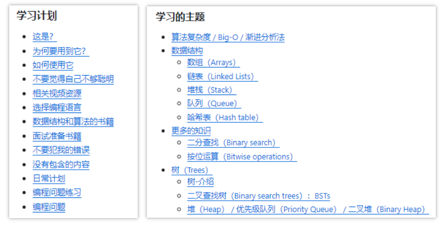
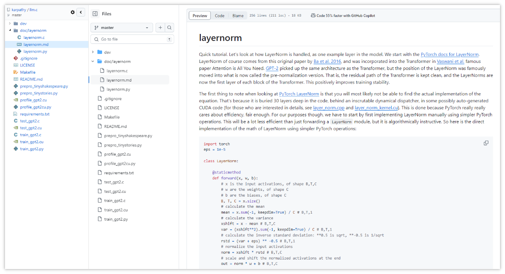
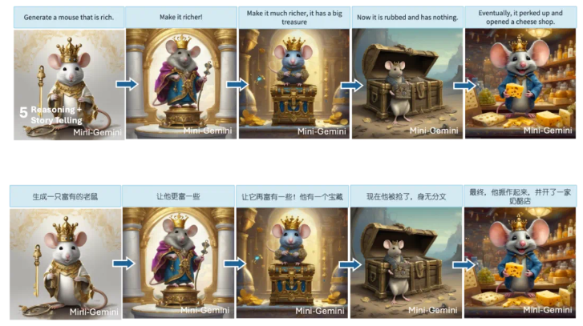
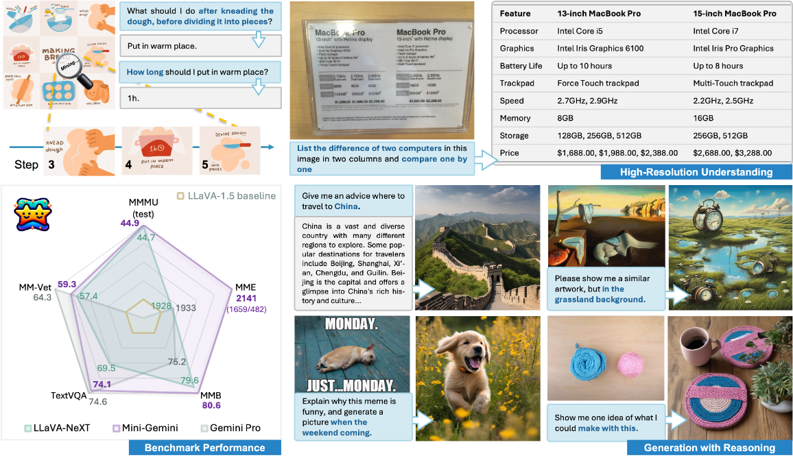
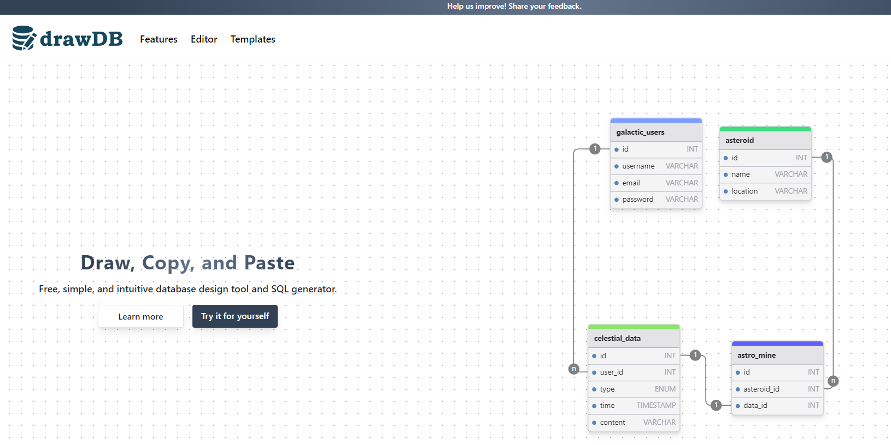
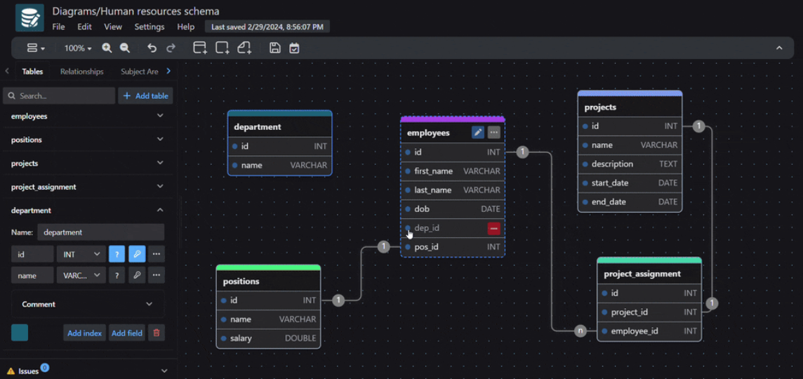

> GitHub一周热点汇总第16期 (2024.04.15-04.21)，梳理每周热门的GitHub项目，了解热点技术趋势，掌握前沿科技方向，发掘更多商机！


### 本期看点
1. 如果你准备大厂的面试，或者准备转码，那么这份清单📑你肯定不能错过！
2. 无需庞大的 PyTorch 依赖，使用纯 C/CUDA 仅需 2000 行代码也能实现一个 GPT-2…
3. 如果你的业务需要快速接入大模型问答系统💬，MaxKB 或许能帮到你！
4. 刷爆多模态任务榜单！贾佳亚团队 Mini-Gemini 登热榜，代码、模型、数据全部开源！
5. drawdb——简单、直观的在线数据库设计工具和 SQL 生成器。


### 1. jwasham/coding-interview-university

```text
🔥 本周 stars：6,540
🔨 语 言：无
⭐ stars：288,508
🍴 fork：73,258
```

如果你准备大厂的面试，或者准备转码，那么这份清单你肯定不能错过！

这个项目原本是一位博主，记录自己准备大厂面试的学习清单和过程的记录。现在博主已经成功上岸亚马逊。便将这份清单分享出来，帮助大家少走弯路。
笔者粗略看了下，大都是算法笔试题的学习攻略，感觉更适合北美的程序员朋友们。如果你也正在准备 Amazon、Facebook、Google，以及 Microsoft 等的面试，不妨参考一下！





### 2. karpathy / llm.c

```text
🔥 本周 stars：2,734
🔨 语 言：Cuda
⭐ stars：16,232
🍴 fork：1,629
```

这个仓库的作者，使用纯 C/CUDA 实现了 LLM 的训练！事实证明，你不需要245MB 的 PyTorch 或 107MB 的 cPython 代码。训练一个 GPT-2（CPU，fp32）仅仅需要一个大约 1000 行的代码。而利用 GPU 也只需要大约 2000 行代码就能实现。

对 LLM 领域感兴趣的朋友，不妨前去其仓库，无论您是初学者还是经验丰富的 AI 从业人员，相信都能从中找到不少的收获！




### 3. 1Panel-dev / MaxKB

```text
🔥 本周 stars：2,533
🔨 语 言：Python
⭐ stars：2,932
🍴 fork：447
```

如果你的业务需要快速接入大模型问答系统💬，MaxKB 或许能帮到你！

MaxKB 是一款基于 LLM 大语言模型的知识库问答系统。MaxKB = Max Knowledge Base，旨在成为企业的最强大脑。

它具有以下特性：
- **开箱即用**：支持直接上传文档、自动爬取在线文档，支持文本自动拆分、向量化，智能问答交互体验好；
- **无缝嵌入**：支持零编码快速嵌入到第三方业务系统；
- **多模型支持**：支持对接主流的大模型，包括本地私有大模型（如 Llama 2、Llama 3）、通义千问、OpenAI、Azure OpenAI、Kimi 和百度千帆大模型等。


### 4. dvlab-research / MiniGemini


```text
🔥 本周 stars：1,923
🔨 语 言：Python
⭐ stars：2,652
🍴 fork：249
```


刷爆多模态任务榜单！贾佳亚团队 Mini-Gemini 登热榜，代码、模型、数据全部开源！

MiniGemini 是由香港中文大学团队出品的多模态模型。它结合了图像推理与生成技术，各项Benchmark 测试显示，它在图像理解、训练数据质量和图像解析推理能力方面展现出不错的性能。

Mini-Gemini 的推理生成功能可以在多轮对话中通过简单指令生成连环小故事。


仓库中还提供了一些精选示例，可以在项目页面找到，也提供了在线演示，供大家测试！



### 5. drawdb-io / drawdb

```text
🔥 本周 stars：1,741
🔨 语 言：JavaScript
⭐ stars：6,051
🍴 fork：379
```

drawdb——简单、直观的在线数据库设计工具和 SQL 生成器。
用户通过在线编辑数据库实体关系的方式，交互地构建图表，支持导出 SQL 脚本。并且编辑器无需注册登录，大家可以随意试用。





以上就是本期的全部内容，有感兴趣的赶紧去试试吧！我是四阿哥，关注我不错过每一周的热点项目，也可以在我的主页查看往期的精彩内容！
