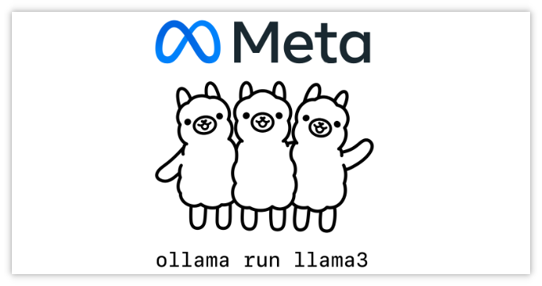

> GitHub一周热点汇总第17期 (2024.04.22-04.28)，梳理每周热门的GitHub项目，了解热点技术趋势，掌握前沿科技方向，发掘更多商机！


### 本期看点
1. 重磅！Meta Llama-3 震撼发布🔥！短短一周斩获 13k 赞！
2. Meta Llama-3 发布后，ollama 紧跟时事，第一时间对 Llama-3 进行了适配！
3. 一个 Notion 风格的的、现代化、开源 CRM 系统⚙️！
4. LLaMA-Factory 🛠️是一个易用且高效的大模型微调平台！
5. open-webui，一个适配 ollama 的、易用的、可扩展的 Web 界面。


### 1. meta-llama / llama3

```text
🔥 本周 stars：13,156
🔨 语 言：Python
⭐ stars：17,727
🍴 fork：1,490
```

重磅！Meta Llama-3 震撼发布！🔥短短一周斩获 13k 赞！

近期科技巨头 Meta 在其官网正式发布了开源大模型 Llama-3。Llama-3 共有 80亿、700亿两种参数，与 Llama-2 相比，Llama-3 使用了 15T tokens 的训练数据，在推理、数学、代码生成、指令跟踪等能力获得大幅度提升。Meta 称它们是目前“功能最强大的、公开可用的大模型”。

与此同时，Meta 还推出了基于 Llama 3 构建的 Meta AI。


支持类似 ChatGPT 的聊天问答功能之外，还与自己 APP 生态保持兼容，可以在 Facebook、Ins 等 APP 中流畅使用。


更多详细内容，可以前往 Meta Llama 3 官方 GitHub 仓库查看！


### 2. ollama / ollama

```text
🔥 本周 stars：4,425
🔨 语 言：Go
⭐ stars：60,980
🍴 fork：4,381
```

Meta Llama-3 发布后，ollama 紧跟时事，第一时间对 Llama-3 进行了适配。网上也有大量关于如何使用 ollama 本地运行 llama3 的教程。感兴趣的可以自己下载尝试。




通过 Ollama WebUI 使用 llama3。


### 3. twentyhq / twenty

```text
🔥 本周 stars：3,426
🔨 语 言：TypeScript
⭐ stars：12,633
🍴 fork：1,197
```

一个 Notion 风格的、现代化、开源 CRM 系统！

twenty 是一个开源 CRM 项目，旨在构建由社区提供支持的 Salesforce 的替代方案。

起因就是，作者发现同 Pipedrive 和 Salesforce 等传统 CRM 厂商打交道，实现自己的业务需求非常繁琐，并且由于闭源的原因，定制起来很复杂。因此作者希望借助开源社区的力量，打造一个开源的 CRM 平台。

至于为啥叫 20，是因为，作者认为经历了 20 年发展的 CRM 软件，如今需要新的变革，以便更容易定制和使用。


### 4. hiyouga / LLaMA-Factory

```text
🔥 本周 stars：3,193
🔨 语 言：Python
⭐ stars：19,954
🍴 fork：2,405
```

LLaMA-Factory 是一个易用且高效的大模型微调平台。它集成了业界最广泛使用的微调方法和优化技术，并支持业界众多的开源模型的微调和二次训练，开发者可以使用私域数据、基于有限算力完成领域大模型的定制开发。


此外，LLaMA-Factory 还为开发者提供了可视化训练、推理平台，一键配置模型训练，实现零代码微调LLM。网上也有不少关于使用 LLaMA-Factory 进行模型微调的文章，感兴趣的可以深入研究一下！


### 5. open-webui / open-webui

```text
🔥 本周 stars：-
🔨 语 言：Svelte
⭐ stars：16,556
🍴 fork：1,676
```

open-webui 是一个适配 ollama 的、易用的、可扩展的 Web 界面。（ollama WebUI）

使用它，你可以非常方便的调试和调用本地模型。你能用它连接你在本地的大语言模型（包括 Ollama 和 OpenAI 兼容的 API），支持 Docker 部署，功能非常丰富，包括代码高亮、数学公式、网页浏览、预设提示词、本地 RAG 集成、对话标记、下载模型、聊天记录、语音支持等。


以上就是本期的全部内容，有感兴趣的赶紧去试试吧！我是四阿哥，关注我不错过每一周的热点项目，也可以在我的主页查看往期的精彩内容！
