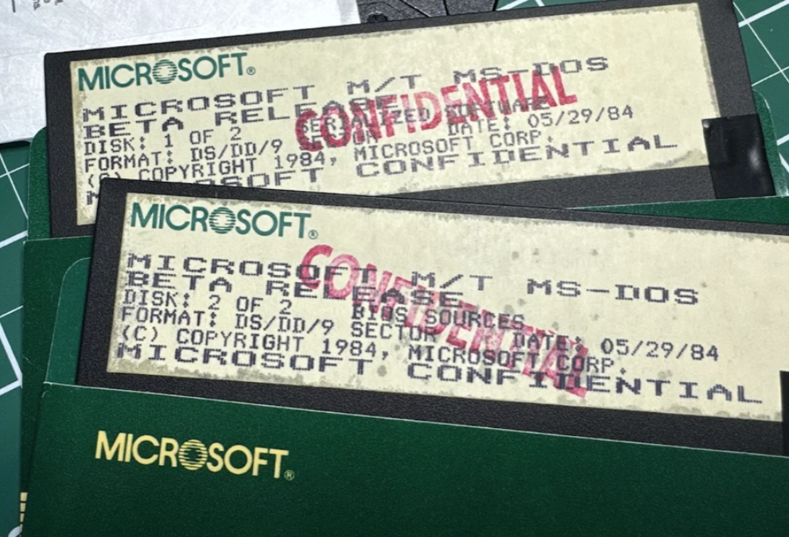
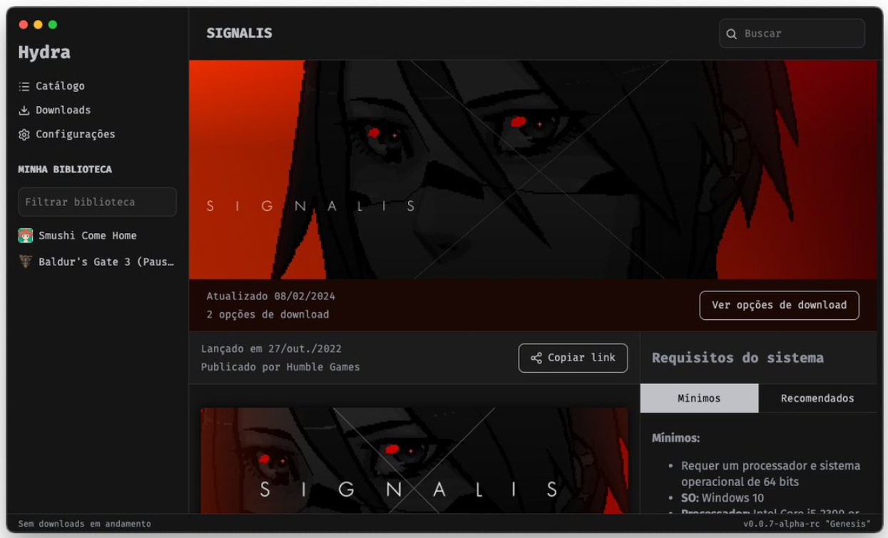
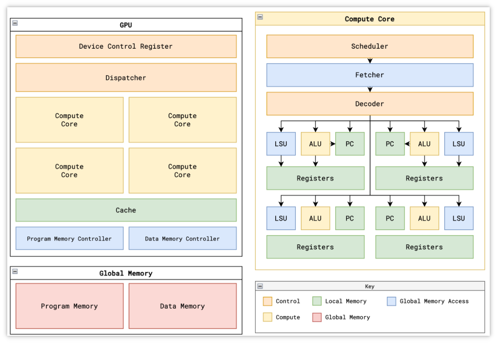
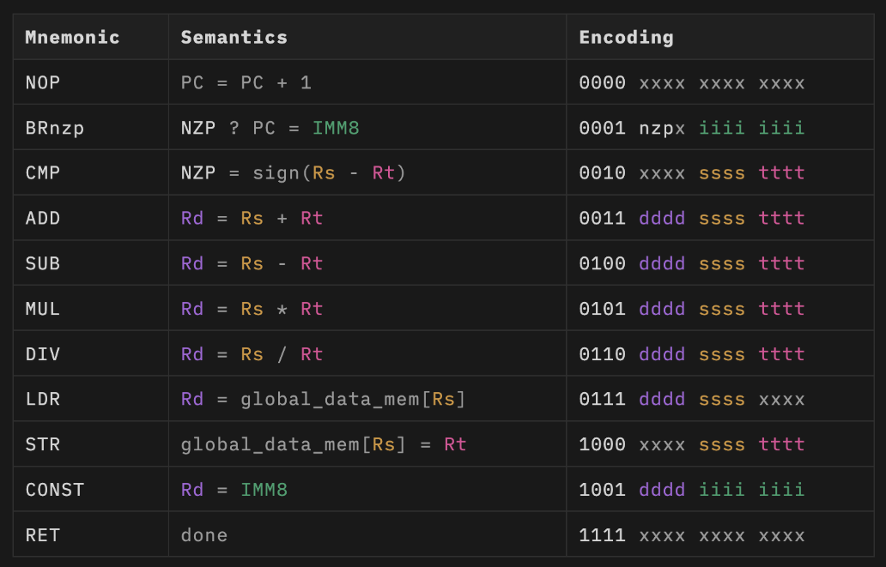

 
> GitHub一周热点汇总第18期 (2024.04.29-05.05)，梳理每周热门的GitHub项目，了解热点技术趋势，掌握前沿科技方向，发掘更多商机！


### 本期看点
1. 重磅！🔈微软宣布 MS-DOS 系统开源！
2. 一款 Vue3 + Pinia + Vite5 仿抖音项目，堪称 Vue 在移动端的最佳实践！
3. Hydra，一款内置 BitTorrent 客户端和打包工具的游戏启动器 🎮
4. tiny-gpu，教你如何手搓一个 GPU ⚙


### 1. microsoft / MS-DOS

```text
🔥 本周 stars：4,983 
🔨 语 言：Assembly
⭐ stars：28,467
🍴 fork：3,951
```

重磅！微软宣布 MS-DOS 系统开源！


MS-DOS，也即微软磁盘操作系统，是由微软开发的，运行在 Intel x86上的操作系统。它是 DOS 操作系统家族中最著名的一个，在 Windows 95以前，DOS 是 IBM PC 及兼容机中的最基本配备，而MS-DOS则是个人电脑中最普遍使用的DOS操作系统。

MS-DOS 仓库包含 MS-DOS v1.25 和 MS-DOS v2.0 的原始源代码和编译的二进制文件，以及由 IBM 和 Microsoft 联合开发的 MS-DOS v4.00 的源代码。

对早期 PC 操作系统感兴趣的或者想研究操作系统原理的一定不能错过！


### 2. zyronon / douyin

```text
🔥 本周 stars：3,329
🔨 语 言：Vue
⭐ stars：6,696 
🍴 fork：1,640
```

`douyin-vue` 是一个模仿 `抖音|TikTok` 的移动端短视频项目。项目使用了最新的 Vue 技术栈，基于 Vue3、Vite5 、Pinia实现。数据保存在项目本地，通过 `axios-mock-adapter` 库拦截Api 并返回本地json数据，模拟真实后端请求。

可以作为 Vue 在移动端的"最佳实践"，媲美原生 App 丝滑流畅的使用体验。


作者也提供了一个演示环境，供大家在线体验。


另外作者也将开发过程中的技术整理成文章，提供在了仓库主页。感兴趣的可以前往仓库获取更多信息！


 ### 3. hydralauncher / hydra

```text
🔥 本周 stars：3,011
🔨 语 言：TypeScript
⭐ stars：3,618
🍴 fork：402
```

Hydra 是一个游戏启动器，内置了 BitTorrent 客户端和一个自我管理的重新打包抓取工具。启动器使用了 TypeScript (Electron) 和 Python 进行开发。torrent 的处理使用了 libtorrent。

启动器支持自定义下载路径、更新通知、游戏页面还集成了 HLTB（通关时间）等。





### 4. adam-maj / tiny-gpu

```text
🔥 本周 stars：2,855
🔨 语 言：SystemVerilog
⭐ stars：4,884
🍴 fork：346
```

tiny-gpu 是一个在仿真中设计实现的一个最小功能的 GPU，主要用于帮助大家理解 GPU 的工作原理。

由于 GPU 的市场竞争激励，所有现代架构的底层技术细节仍然是私有的，网络上很少有关于 GPU 底层架构细节的资料。而通过 Miaow 和 VeriGPU 等开源 GPU 来学习又过于困难，对新手不友好。因此作者创建了这个仓库。

仓库中还包含了有关架构、 ISA、矩阵加法/乘法等的完整文档，对 GPU 设计实现感兴趣的，可以前往仓库了解更多。






以上就是本期的全部内容，有感兴趣的赶紧去试试吧！我是四阿哥，关注我不错过每一周的热点项目，也可以在我的主页查看往期的精彩内容！
