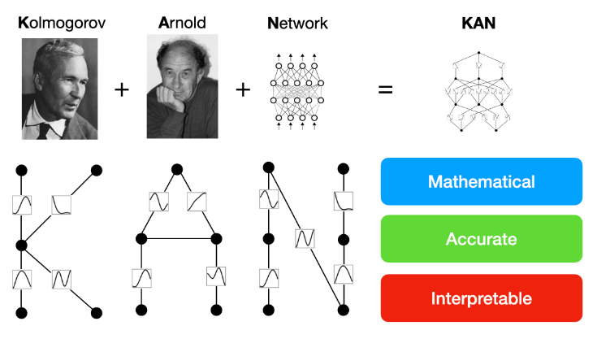
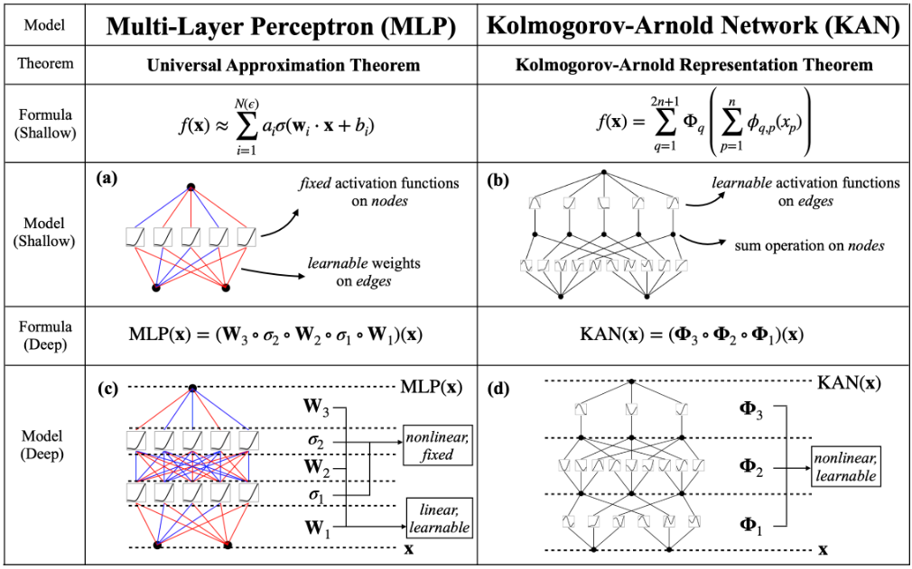
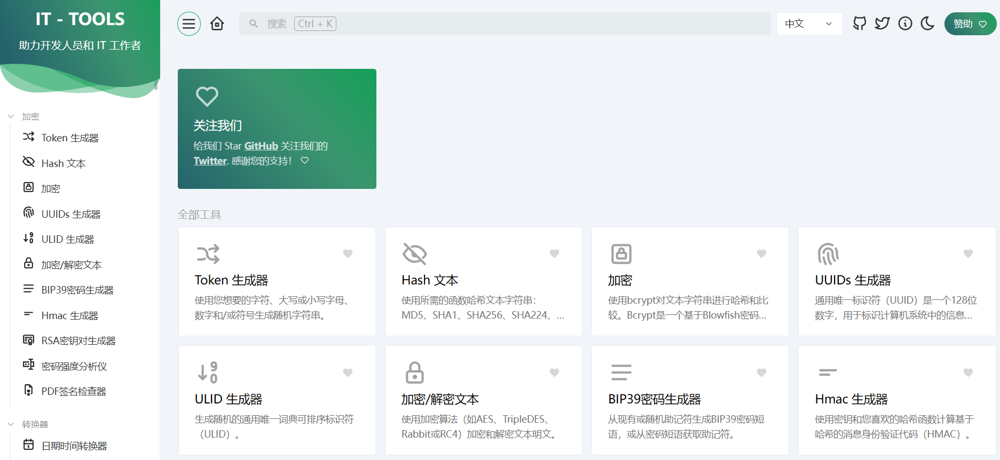
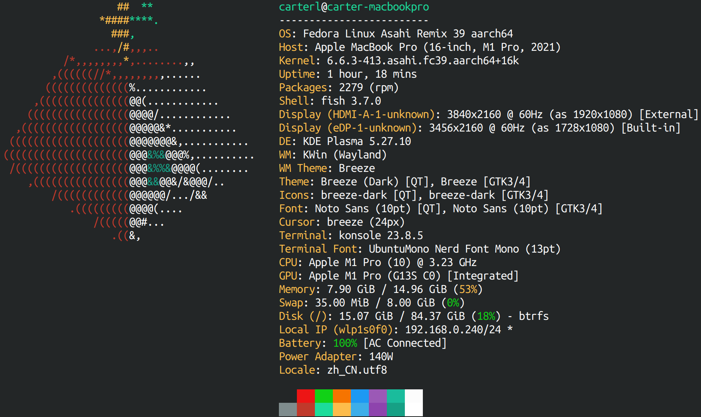
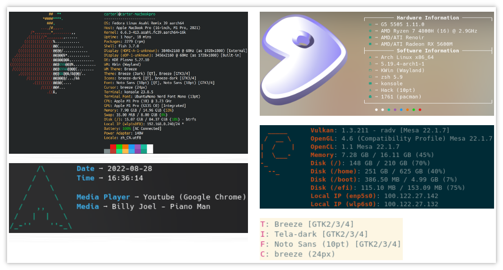

> GitHub一周热点汇总第19期 (2024.05.06-05.12)，梳理每周热门的GitHub项目，了解热点技术趋势，掌握前沿科技方向，发掘更多商机！


### 本期看点
1. 一键去广告！OFGB 让你告别 Windows 11 广告烦恼！❌
2. 超全！IT-Tools，一款开发人员常用工具合集🛠️。提升开发效率！
3. 一款漂亮的获取展示系统信息的命令行工具！💻


### 1. pykan

```text
🔥 本周 stars：5,071 
🔨 语 言：Jupyter Notebook
⭐ stars：10,124
🍴 fork：802
```

pykan 项目是论文 `《KAN：Kolmogorov-Arnold Networks》` 的官方仓库。


根据论文可以看出，Kolmogorov-Arnold 网络（KAN）有望成为多层感知器（MLP）的替代品。KAN 与 MLP 一样具有强大的数学基础：MLP 基于通用近似定理，而 KAN 基于 Kolmogorov-Arnold 表示定理。KAN 和 MLP 是双重的：KAN 在边缘具有激活函数，而 MLP 在节点上具有激活函数。这个简单的变化使KAN在模型准确性和可解释性方面都比MLP更好（有时要好得多！




### 2. OFGB

```text
🔥 本周 stars：2,918
🔨 语 言：C#
⭐ stars：4,592
🍴 fork：150
```

OFGB 是一款基于`C#` 和 `WPF` 开发的强大工具，它的主要功能是通过修改 Windows 注册表来关闭 Windows 11 中各种内置的广告。
自2024 年4月23日以来，微软发布了 Windows 11 的更新，在整个操作系统中添加了广告，包括文件资源管理器、开始菜单等。如果你也受够了这些内置的广告，不妨安装试一试！


### 3. it-tools

```text
🔥 本周 stars：2,251
🔨 语 言：Vue
⭐ stars：14,077
🍴 fork：1,690
```

IT-Tools 是一款开源的开发人员的工具箱，收集了大量日常开发过程中经常会用到的小工具。项目支持 Docker 部署，如果您有特殊的需求也可以非常方便的定制并进行私有部署。




### 4. Fastfetch

```text
🔥 本周 stars：-
🔨 语 言：C
⭐ stars：6541
🍴 fork：303
```

Fastfetch 是一个类似 neofetch 的工具，主要用于获取系统信息并以漂亮的方式显示它们。考虑到性能和可定制性,它主要用 `C` 编写。目前支持 Linux、Android、FreeBSD、MacOS 和 Windows 7+。





以上就是本期的全部内容，有感兴趣的赶紧去试试吧！我是四阿哥，关注我不错过每一周的热点项目，也可以在我的主页查看往期的精彩内容！