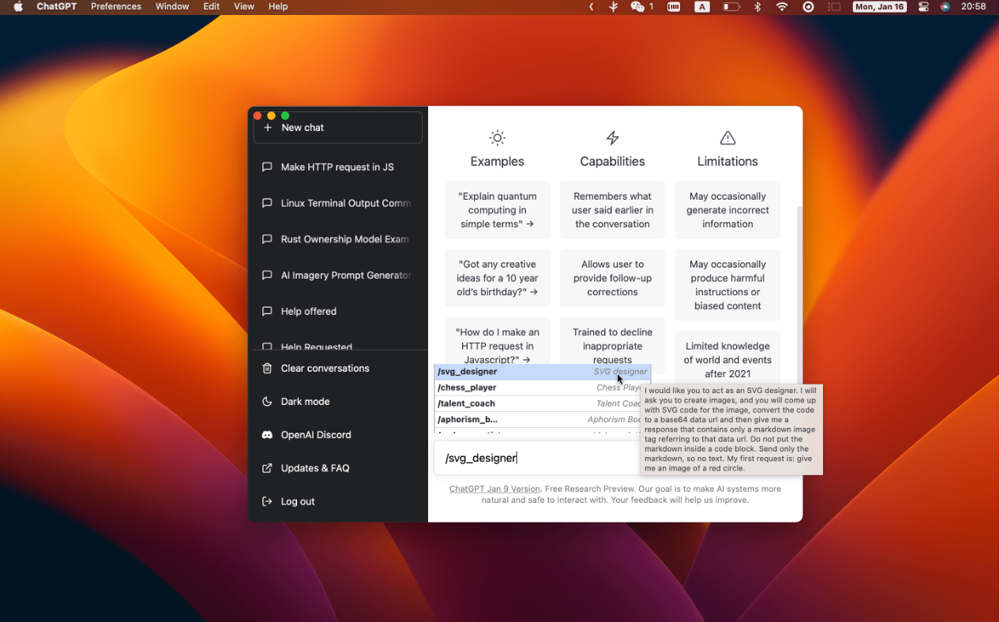
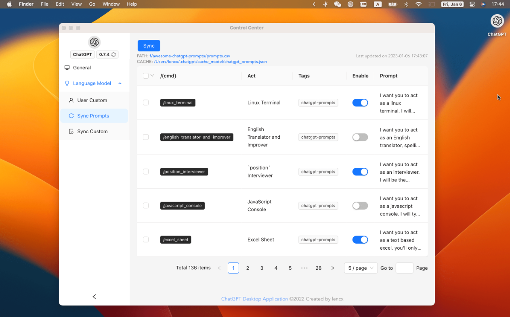
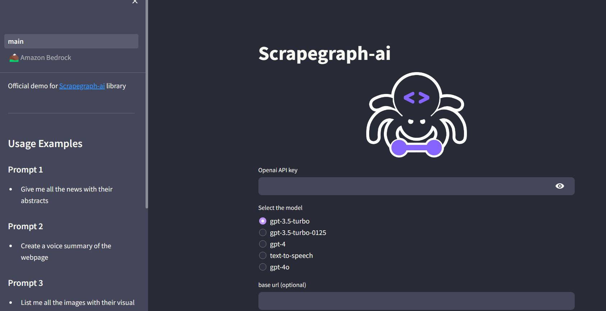
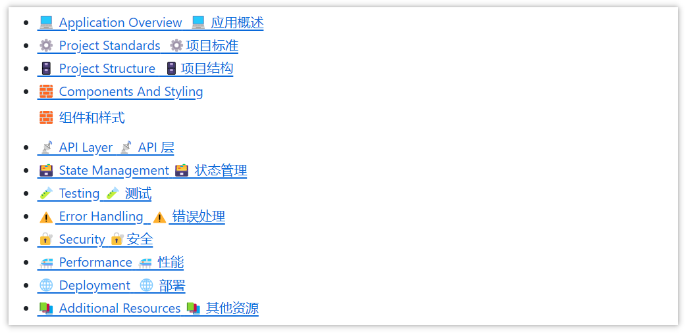
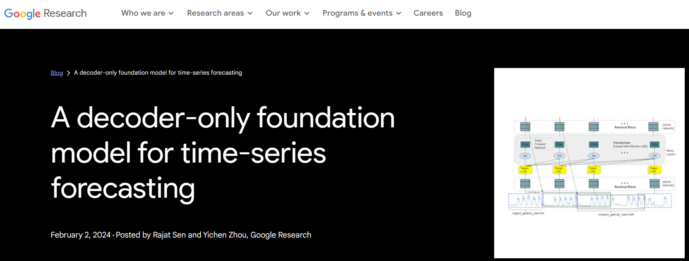

> GitHub一周热点汇总第20期 (2024.05.13-05.19)，梳理每周热门的GitHub项目，了解热点技术趋势，掌握前沿科技方向，发掘更多商机！


### 本期看点
1. 一款功能丰富的跨平台 ChatGPT 桌面应用🔮，支持导出备份聊天记录！
2. 借助 AI 的能力实现的 Web 爬虫 Python 库 🕷
3. 🛡️bulletproof-react ⚛️，简单易用的 React 应用架构，React 开发最佳实践！
4. 谷歌发布时序预测基础模型 TimesFM，消费级 GPU 可运行，应用前景广泛！


### 1. lencx / ChatGPT

```text
🔥 本周 stars：2,382 
🔨 语 言：Rust
⭐ stars：49,938
🍴 fork：5,613
```

ChatGPT 项目是一个非官方的、开源的 ChatGPT 桌面应用（Mac, Windows and Linux）。它在 OpenAI 的 ChatGPT 基础上进行了封装，扩展了一些额外的功能。比如支持导出 ChatGPT 聊天记录、支持斜杠命令及其配置、丰富的快捷键等。






### 2. VinciGit00 / Scrapegraph-ai

```text
🔥 本周 stars：1,605
🔨 语 言：Python
⭐ stars：8,636
🍴 fork：605
```

ScrapeGraphAI 是一个 Web 爬虫 Python 库，它利用大模型以及有向图，为要爬取的网页或本地文档（XML、HTML、JSON 等）创建管道。

项目也提供了在线试用，供演示使用。

  


### 3. alan2207 / bulletproof-react

```text
🔥 本周 stars：1,165
🔨 语 言：TypeScript
⭐ stars：24,067
🍴 fork：2,251
```

bulletproof-react，一个简单、可扩展且功能强大的、可供生产使用的 React 应用架构。

React 是构建前端应用程序的优秀工具。它拥有一个多元化的生态系统，拥有数百个优秀的库，可以满足您可能需要的任何内容。然而用户也被迫需要在如此多的选项中作出选择。由于没有开发人员可以遵循的预定义架构，因此通常会导致混乱、不一致且过于复杂的代码库。

bulletproof-react 就是一个可供开发人员遵循的预定义架构，目标是作为开发 React 应用程序时的资源和最佳实践的集合。



### 4. google-research / timesfm

```text
🔥 本周 stars：1,112
🔨 语 言：Python
⭐ stars：2,150
🍴 fork：135
```

TimesFM （时序预测基础模型）是 Google Research 开发的用于时间序列预测的预训练时间序列基础模型。对应的论文 《用于时间序列预测的仅解码器基础模型》（https://arxiv.org/abs/2310.10688）

时序数据在零售、金融、制造、医疗和自然科学等各个领域无处不在，而时序预测则是这些领域中一项至关重要的任务。Google Research 团队的 TimesFM 可以在无需额外训练的情况下，对未曾见过的时序数据进行预测，这将使其在各个领域具有广泛的应用潜力。



以上就是本期的全部内容，有感兴趣的赶紧去试试吧！我是四阿哥，关注我不错过每一周的热点项目，也可以在我的主页查看往期的精彩内容！
