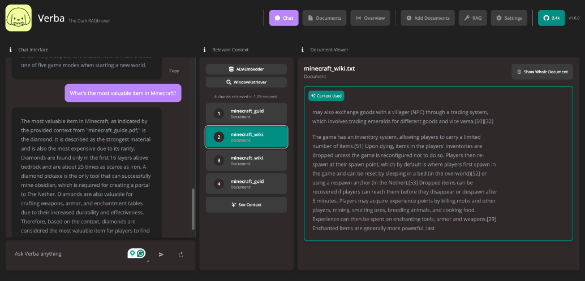

> GitHub一周热点汇总第21期 (2024.05.20-05.26)，梳理每周热门的GitHub项目，了解热点技术趋势，掌握前沿科技方向，发掘更多商机！


### 本期看点
1. Bend，一款高级编程语言 ⚙，让 GPU 编程像像写 Python 一样轻松！
2. khoj，你的个人 AI 数字大脑 🧠！帮你更好地管理和利用自己的知识和信息。
3. 一个可视化浏览器自动化测试/数据采集/爬虫软件 🕷
4. 一款开源检索增强生成 （RAG） 聊天机器人应用 🤖


### 1. HigherOrderCO / Bend

```text
🔥 本周 stars：8,909
🔨 语 言：Rust
⭐ stars：14,588
🍴 fork：358
```

Bend，一种大规模并行的高级编程语言。

AI 爆火后，CUDA 相关的 GPU 编程也大热。Bend 就是一种可以在运行在 GPU 上的高级编程语言。与 CUDA、Metal 等低级替代方案不同，Bend 具有 Python、Haskell 等表达性语言的功能，包括快速对象分配、完全闭包支持的高阶函数、无限制的递归，甚至 continuation。Bend 运行在大规模并行硬件上，具有基于核心数量的近线性加速。Bend 由 HVM2 运行时提供支持。


### 2. khoj-ai / khoj

```text
🔥 本周 stars：2,226
🔨 语 言：Python
⭐ stars：7,463 
🍴 fork：344
```

khoj，你的个人 AI 数字大脑！

khoj 是一个开源的个人 AI 助手，旨在通过智能检索和对话，帮助用户更好地管理和利用自己的知识和信息，成为您的 AI 第二大脑。您可以共享您的笔记和文档以扩展您的数字大脑。您的 AI 代理可以访问互联网，允许您合并实时信息。khoj 可在 Desktop、Emacs、Obsidian、Web 和 Whatsapp 上访问。您可以共享 pdf、markdown、org-mode、notion 文件和 github 存储库。您将在文档之上获得快速、准确的语义搜索。


可以通过官网进行在线体验，也可以通过 docker 自己部署。


### 3. NaiboWang / EasySpider

```text
🔥 本周 stars：2,130
🔨 语 言：JavaScript
⭐ stars：26,084
🍴 fork：3,053
```

EasySpider（易采集），一个可视化浏览器自动化测试/数据采集/爬虫软件，可以无代码图形化的设计和执行爬虫任务。别名：ServiceWrapper面向Web应用的智能化服务封装系统。

由于采用图形化的方式，它的采集可以非常简单.比如采集商品信息，并分成不同的字段保存，可以通过选中要爬取的内容，点击“采集数据”选型即可。


### 4. HigherOrderCO / HVM

```text
🔥 本周 stars：1,786
🔨 语 言：Cuda
⭐ stars：9,883
🍴 fork：367
```

前面介绍了，本期排名第一的 GPU 高级编程语言 Bend 就是基于 HVM 的。


Higher-order Virtual Machine 2 (HVM 2)，是一个大规模并行交互组合器赋值器。通过将高级语言（如 Python 和 Haskell）的程序编译为 HVM，可以直接在大规模并行硬件（如 GPU）上运行这些语言，并具有近乎理想的加速速度。


### 5. weaviate / Verba

```text
🔥 本周 stars：1,435
🔨 语 言：Python
⭐ stars：4,148
🍴 fork：414
```

Verba，是一款开源检索增强生成 （RAG） 聊天机器人应用，旨在为开箱即用的检索增强生成 （RAG） 提供端到端、简化和用户友好的界面。只需几个简单的步骤，即可轻松探索您的数据集并提取见解，无论是在本地使用 HuggingFace 和 Ollama 还是通过 LLM OpenAI、Cohere 和 Google 等提供商。





以上就是本期的全部内容，有感兴趣的赶紧去试试吧！我是四阿哥，关注我不错过每一周的热点项目，也可以在我的主页查看往期的精彩内容！
