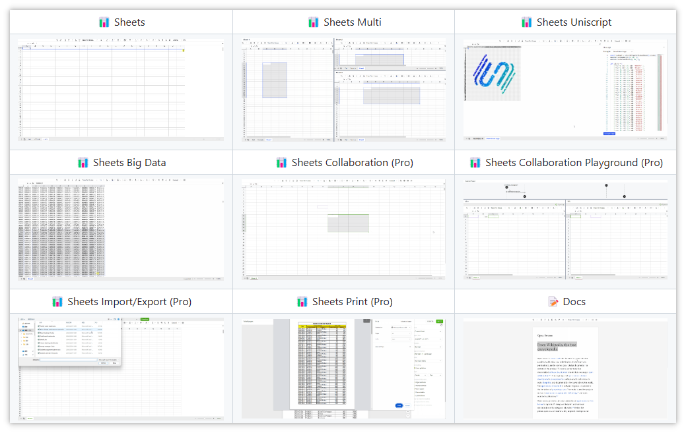

> GitHub一周热点汇总第22期 (2024.05.27-06.02)，梳理每周热门的GitHub项目，了解热点技术趋势，掌握前沿科技方向，发掘更多商机！


### 本期看点
1. RAGapp——在企业中使用 Agentic RAG 最简单的方法。
2. 一套构建可扩展、可靠和高性能的大规模系统的最佳实践合辑，赶紧收藏吧！
3. Univer——Google 表格、幻灯片和文档的开源替代品。
4. 对 SQL 说拜拜？用自然语言查询您的关系数据！


### 1. ragapp / ragapp

```text
🔥 本周 stars：1,783
🔨 语 言：TypeScript
⭐ stars：2,115
🍴 fork：178
```

RAGapp——在企业中使用 Agentic RAG 最简单的方法。

RAGapp 是一个开源的企业级的 RAG 应用程序。RAG（检索增强生成）是一种使用来自私有或专有数据源的信息来辅助文本生成的技术，简单来说它能为训练大模型添加私有的上下文背景信息。

RAGApp 允许你通过聊天的方式，为用户创建各种代理，可以让用户和 PDF、DOC、电子表格等文档聊天。RAGApp 兼容多种平台，包括 Ollama（适用于本地模型） 、OpenAI 等。


### 2. binhnguyennus / awesome-scalability

```text
🔥 本周 stars：1,684
🔨 语 言：无
⭐ stars：55,393
🍴 fork：5,737
```

awesome-scalability 旨在为那些对构建可扩展、可靠和高性能的大规模系统感兴趣的人提供一个资源宝库。这个集合涵盖了从可扩展性原则，到架构，甚至包括系统设计面试的准备等。里面还包含了来自谷歌、Netflix等科技巨头的资深工程师通过案例研究分享的实战经验。

如果你有以下需求，都强烈建议你阅读这个仓库提供的列表！
- 如果您的系统运行缓慢
- 如果您的系统出现故障
- 如果您正在进行系统设计面试
- 如果您正在组建自己的梦想团队


下面是部分列表的截取，可以看到包含大量真实世界的技术案例，涉及 Uber、Netflix、Facebook 等科技巨头。


### 3. dream-num / univer

```text
🔥 本周 stars：1,505
🔨 语 言：TypeScript
⭐ stars：5,046
🍴 fork：413
```

Univer——Google 表格、幻灯片和文档的开源替代品。

Univer 是一套企业文档与数据协同解决方案，融合了电子表格、文档和幻灯片。
Univer 的亮点包括：
- 📈 支持多种类文档
- ⚙️ 易于集成
- 🔌 高度可扩展
- ⚡ 性能优越
- ……

表格功能。


文档功能。


### 4. Dataherald / dataherald

```text
🔥 本周 stars：1,125
🔨 语 言：Python
⭐ stars：2,969
🍴 fork：197
```

对 SQL 说拜拜？用自然语言查询您的关系数据！

Dataherald 是一种自然语言到 SQL 的引擎，专为关系数据的企业级问答而构建。它允许您从数据库中设置一个 API，可以用简单的英语回答问题。您可以使用 Dataherald 来：
- 允许业务用户从数据仓库中获取见解，而无需通过数据分析师
- 从 SaaS 应用程序内的生产数据库启用问答
- 根据您的专有数据创建 ChatGPT 插件
- ……


更多详细内容可以参考其官方文档。


以上就是本期的全部内容，有感兴趣的赶紧去试试吧！我是四阿哥，关注我不错过每一周的热点项目，也可以在我的主页查看往期的精彩内容！
