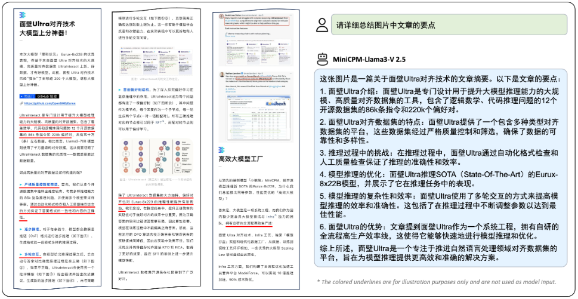
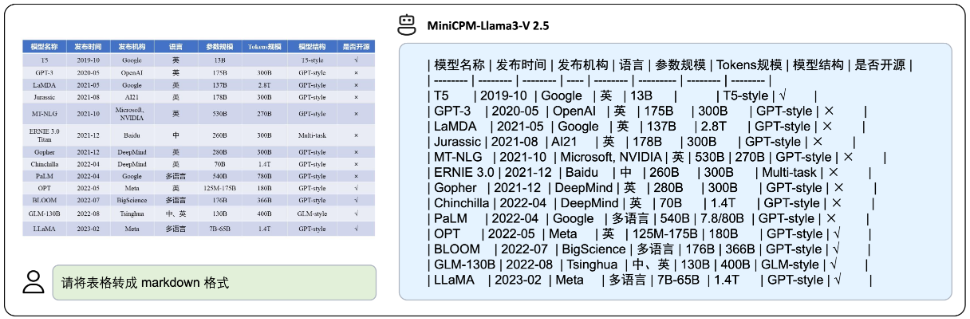
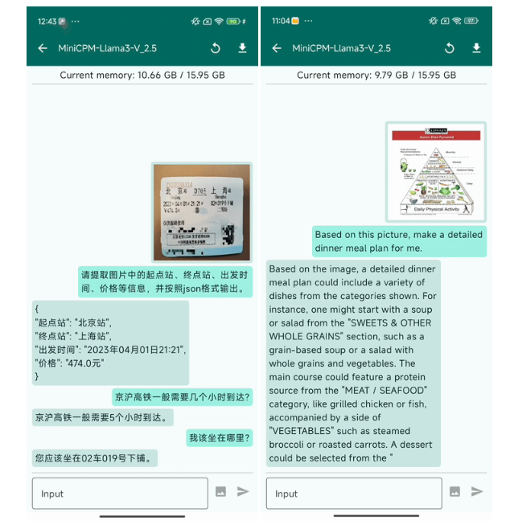
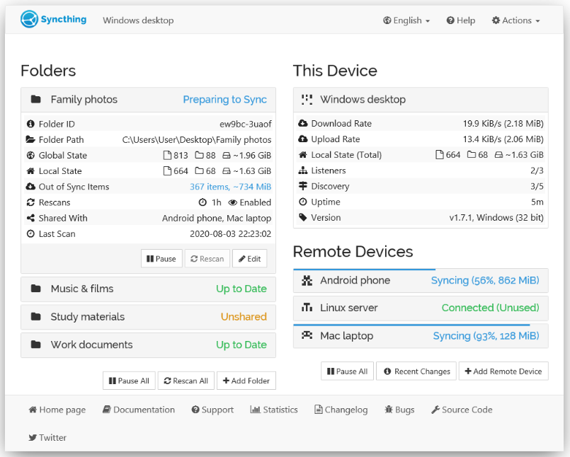
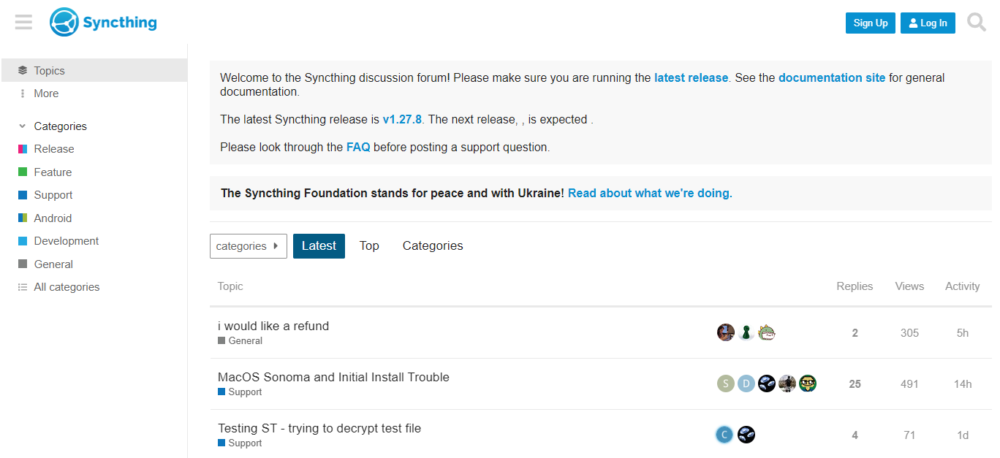
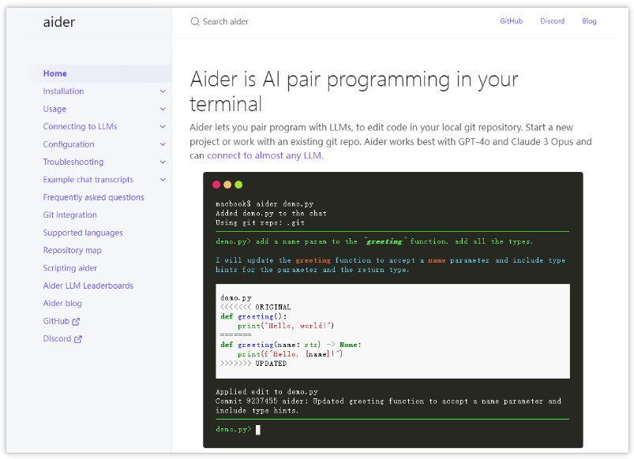

> GitHub一周热点汇总第23期 (2024.06.03-06.09)，梳理每周热门的GitHub项目，了解热点技术趋势，掌握前沿科技方向，发掘更多商机！


### 本期看点
1. MiniCPM-V：揭示端侧大语言模型的无限潜力。
2. 不用买某云、某盘的会员也能实现文件同步自由了！
3. 一款高性能、轻量级、内存优化的分析型数据库系统。
4. 与 AI 进行结对编程是一种怎样的开发体验？

### 1. OpenBMB / MiniCPM-V

```text
🔥 本周 stars：2,299
🔨 语 言：Python
⭐ stars：6,729
🍴 fork：462
```

MiniCPM-V：揭示端侧大语言模型的无限潜力

MiniCPM-V 是面向图文理解的端侧多模态大模型系列。该系列模型接收图像和文本输入，并提供高质量的文本输出。

之前的文章介绍过 OpenBMB 的总参数量达 8B 的大模型 MiniCPM-Llama3。这次推出的 MiniCPM-V 则是专注于端侧可用的总参数量 2B 的大模型。

官方给出了几张示例，可以看看其识别效果。




还有部署在小米 14 Pro 上的演示视频。



### 2. duckdb / duckdb

```text
🔥 本周 stars：972
🔨 语 言：C++
⭐ stars：18,725
🍴 fork：1,554
```

DuckDB 是一个高性能、轻量级、内存优化的分析型数据库系统。它专注于提供快速的查询性能和低延迟的响应时间，以满足数据分析和处理的需求。

DuckDB 的适用场景：
- 交互式数据分析
- 实时数据处理
- 内存受限环境
- 快速原型开发


### 3. syncthing / syncthing

```text
🔥 本周 stars：949
🔨 语 言：Go
⭐ stars：61,226
🍴 fork：4,086
```

不用买某云、某盘的会员也能实现文件同步自由了！

Syncthing 是用 Go 开发的一款开源跨平台文件同步应用。支持 `macOS`、`Windows`、`Linux` 等操作系统上运行，可以同步多个文件夹，支持局域网和互联网上的同步。功能强大且易于使用。
此外，Syncthing 是基于P2P技术实现设备间的文件同步。这意味着同步是去中心化的，因此不用担心中心服务器宕机导致的数据不安全问题。



更多详细内容，可以前去其官网或者官方论坛查看更多。



### 4. paul-gauthier / aider

```text
🔥 本周 stars：650
🔨 语 言：Python
⭐ stars：11,075
🍴 fork：1,058
```

Aider 是一个允许用与 AI 进行结对编程的命令行工具。开发者可以通过选择已有的项目或者新建项目来使用 aider，在 LLM 的帮助下进行结对编程，可以大大提高使用者的开发效率。

Aider 与 GPT-4o 和 Claude 3 Opus 配合使用效果最佳，不过也可以连接到其它任何 LLM。



以上就是本期的全部内容，有感兴趣的赶紧去试试吧！我是四阿哥，关注我不错过每一周的热点项目，也可以在我的主页查看往期的精彩内容！