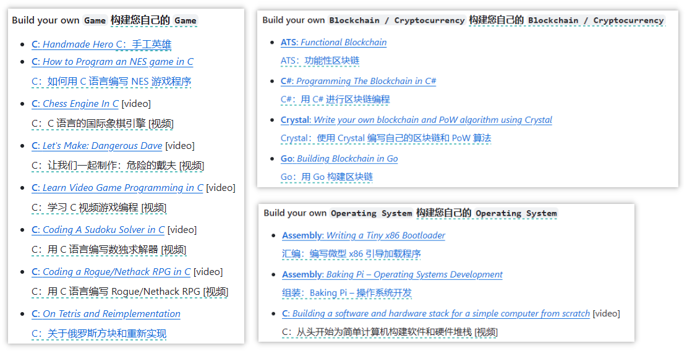
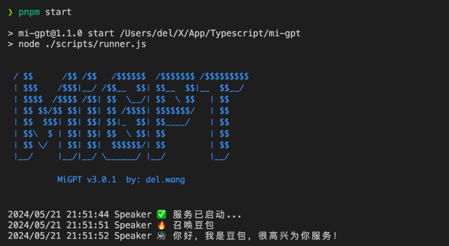
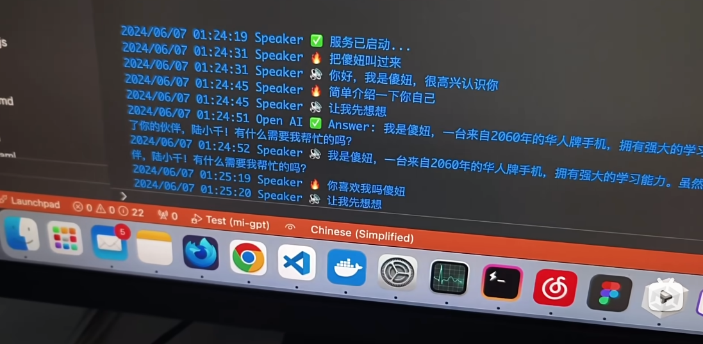

> GitHub一周热点汇总第24期 (2024.06.10-06.16)，梳理每周热门的GitHub项目，了解热点技术趋势，掌握前沿科技方向，发掘更多商机！


### 本期看点
1. 一款开源的自托管网站，可作为 Heroku、Netlify、Vercel 等的平替，并且还支持在自己的机器上一键部署！
2. 如果你曾经想写一个属于自己的游戏/数据库/服务器/文本编辑器，但又无从下手…build-your-own-x 或许可以帮到你！
3. 受不了智障的小爱？那么你可以考虑将小爱音箱接入 ChatGPT 和豆包，改造成你的专属语音助手。
4. NAS 管理照片的好帮手！immich - 高性能的开源自托管照片和视频备份方案。


### 1. coollabsio / coolify

```text
🔥 本周 stars：7,062 
🔨 语 言：PHP
⭐ stars：24,416
🍴 fork：1,239
```

Coolify 是一个开源的自托管网站。可以作为 Heroku、Netlify、Vercel 等的替代方案。它允许你在自己的硬件上管理服务器、应用程序和数据库，只需要 SSH 连接即可。你可以管理 VPS、物理服务器、Raspberry Pi 等设备。Coolify 提供了云服务的便利性，但没有供应商锁定，因此即使停止使用 Coolify，你仍可以管理运行中的资源，只是会失去自动化和其他功能。

Coolify 有着广泛的用途。例如，你可以使用它来部署你的个人博客、电商网站、社交媒体平台等。


### 2. codecrafters-io / build-your-own-x

```text
🔥 本周 stars：3,237
🔨 语 言：无
⭐ stars：274,184
🍴 fork：25,844
```

Build Your Own X 是由 Codecrafters 发起的一个 GitHub 项目，旨在通过一系列教程指导开发者从零开始构建各种软件和系统。这些教程帮助开发者深入理解流行技术的内部工作原理，通过实际编程练习和详细说明进行学习。


下面是教程的部分截图。



### 3. idootop / mi-gpt

```text
🔥 本周 stars：2,887
🔨 语 言：TypeScript
⭐ stars：4,714
🍴 fork：370
```

mi-gpt 项目由 idootop 创建，旨在将小爱音箱接入 ChatGPT 和豆包，从而将小爱音箱改造成一个专属的语音助手，以增强智能家居的互动体验，使其能够进行 AI 驱动的回答、角色扮演和记忆功能。

该项目通过 Docker 和 Node.js 部署，并提供了详细的设置和使用说明。感兴趣的赶紧去折腾一个自己玩玩吧！


作者还在 b 站上发布了演示视频，感兴趣滴可以前去围观。



### 4. immich-app / immich

```text
🔥 本周 stars：1,772
🔨 语 言：TypeScript
⭐ stars：37,052
🍴 fork：1,745
```

immich 是一款高性能的开源自托管照片和视频备份方案。它提供以下功能：
- **自动备份**：支持自动备份照片和视频。
- **去重**：防止重复备份。
- **多用户支持**：允许多个用户管理和访问媒体文件。
- **高级搜索**：通过元数据、对象、人脸和内容搜索照片和视频。
- **共享与协作**：支持相册共享和协作管理。
- **面部识别和聚类**：自动识别和分类面部。


以上就是本期的全部内容，有感兴趣的赶紧去试试吧！我是四阿哥，关注我不错过每一周的热点项目，也可以在我的主页查看往期的精彩内容！