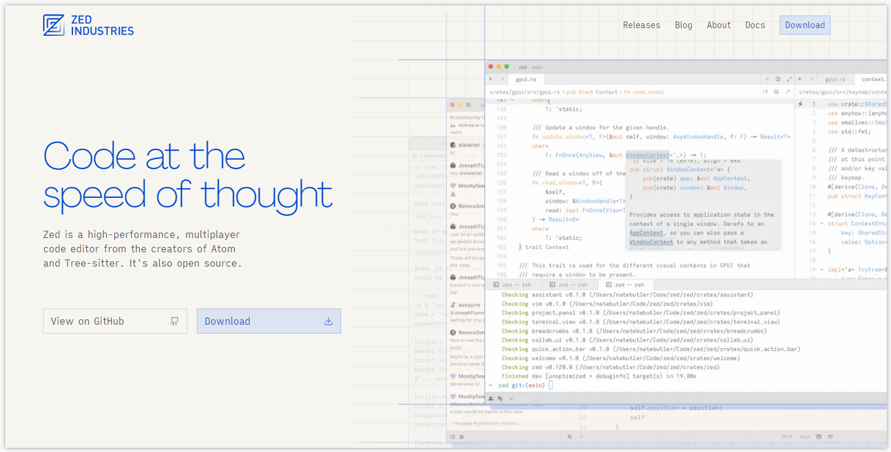
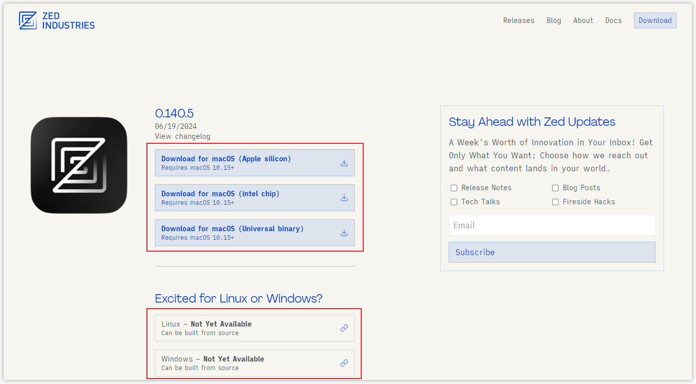
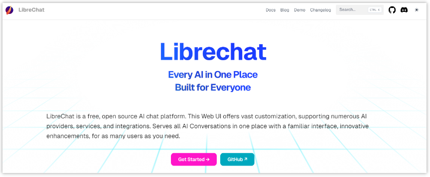
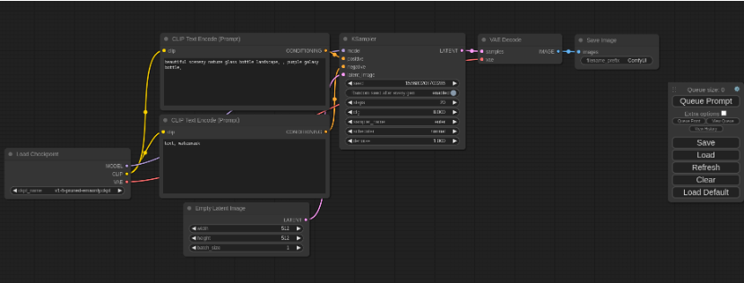
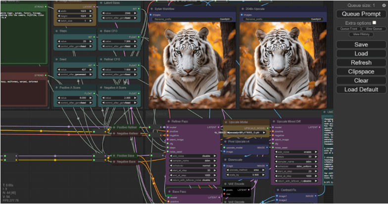
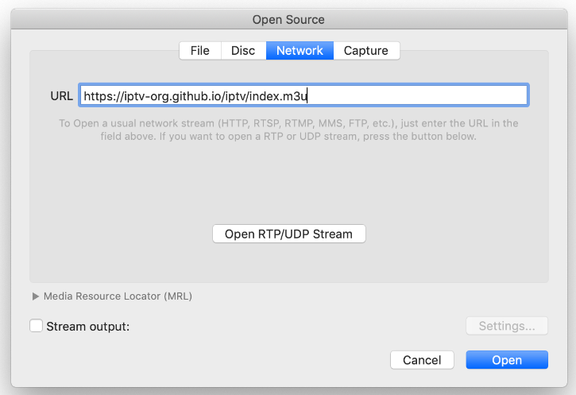

> GitHub一周热点汇总第25期 (2024.06.17-06.23)，梳理每周热门的GitHub项目，了解热点技术趋势，掌握前沿科技方向，发掘更多商机！


### 本期看点
1. 一款轻量级、高性能代码编辑器，支持多人模式，可作为 VS Code 平替
2. 融合了多模型的增强 AI 聊天平台，支持 ChatGPT、Gemini、BingAI 等大模型无缝切换
3. 一个专为 Stable Diffusion 设计的、基于工作流的图形用户界面
4. 一个专门用于收集来自全球各地公开的 IPTV 频道的开源项目，轻松实现看电视自由


### 1. zed-industries / zed

```text
🔥 本周 stars：2,571
🔨 语 言：Rust
⭐ stars：38,560
🍴 fork：1,979
```

Zed 编辑器是一款由 Atom 和 Tree-sitter 的创建者开发的高性能、多人代码编辑器。


遗憾的是目前仅有 Mac 版本，Windows 和 Linux 版本暂时还未提供。



### 2. danny-avila / LibreChat

```text
🔥 本周 stars：1,829
🔨 语 言：TypeScript
⭐ stars：14,260
🍴 fork：2,406
```

LibreChat 是一个融合了最新人工智能技术的聊天平台，它集成了多个AI模型，包括但不限于 OpenAI 的 ChatGPT、Azure OpenAI、BingAI、Gemini、Vertex AI等。


它具有以下功能特性：
- 🖥️ 类似 ChatGPT 的 UI 界面，具有深色模式。
- 🤖 支持模型的切换
- ✅ 兼容本地的模型
- 💾 支持创建和保存预设
- ……




### 3. comfyanonymous / ComfyUI

```text
🔥 本周 stars：1,573
🔨 语 言：Python
⭐ stars：39,693
🍴 fork：4,217
```

ComfyUI 是一个专为 Stable Diffusion 设计的、基于节点的图形用户界面。


用户将整个图像生成过程分解为多个独立的节点，每个节点都有自己独立的功能，例如加载模型，文本提示，生成图片等等。每个模块通过输入和输出的线连在一起变成一个完整的工作流。



### 4. iptv-org / iptv

```text
🔥 本周 stars：838
🔨 语 言：JavaScript
⭐ stars：80,364
🍴 fork：1,980
```

iptv 正如其名，是一个专门用于收集来自全球各地公开的 IPTV 频道的开源项目。看了下咱们国家的频道列表，还是比较全的，从央视到地方台基本都有收录。


使用起来也很简单，你只需要使用支持串流的播放器，导入项目提供的链接即可。



以上就是本期的全部内容，有感兴趣的赶紧去试试吧！我是四阿哥，关注我不错过每一周的热点项目，也可以在我的主页查看往期的精彩内容！
