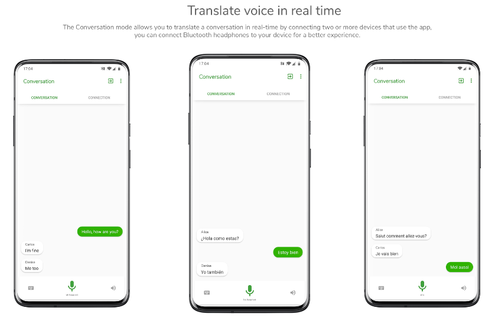
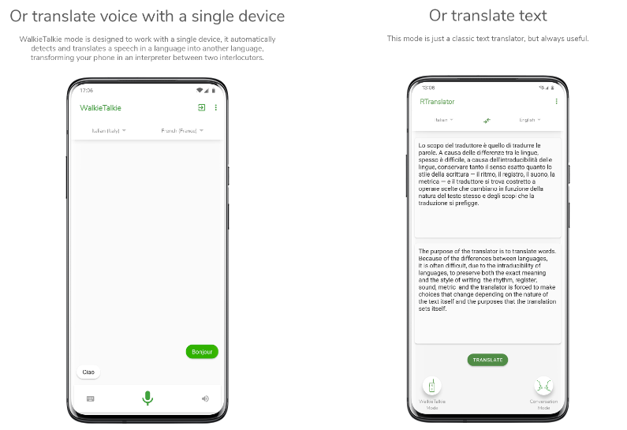
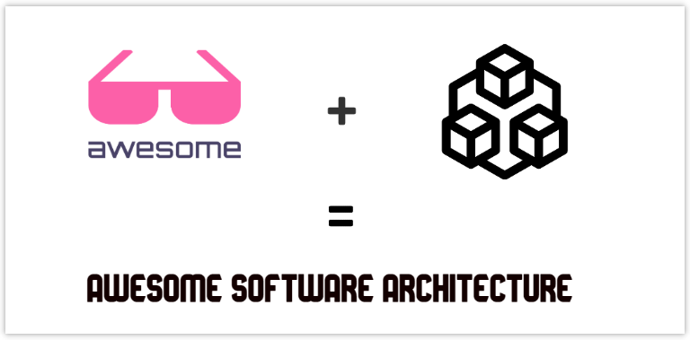
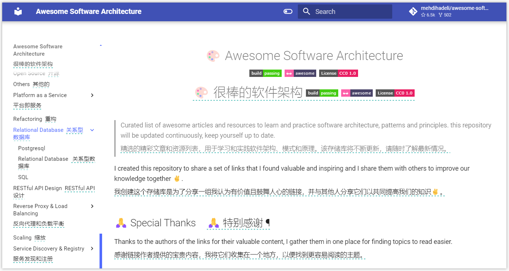
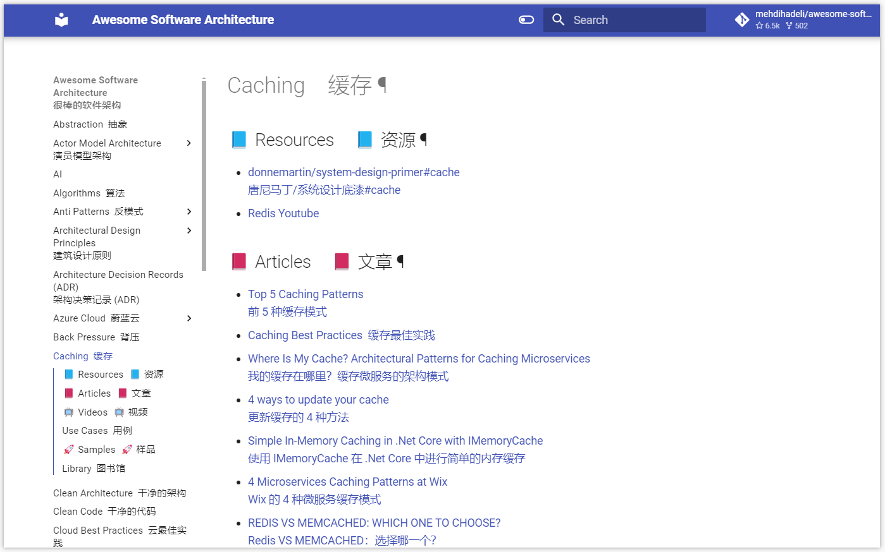
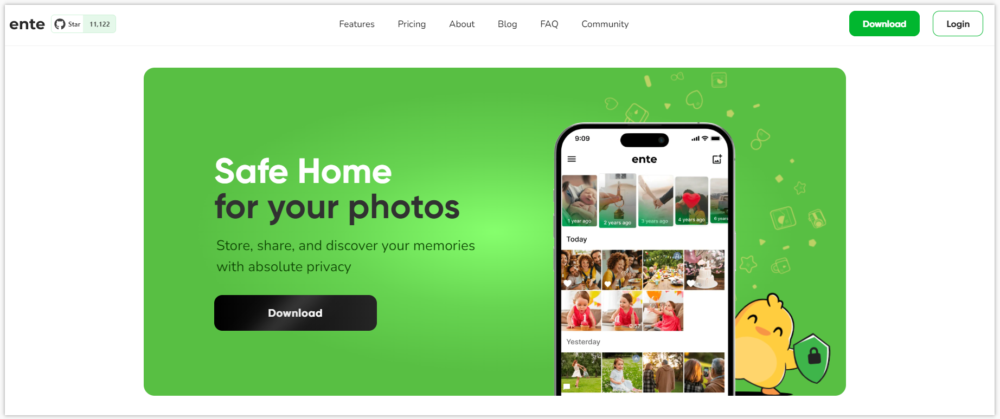
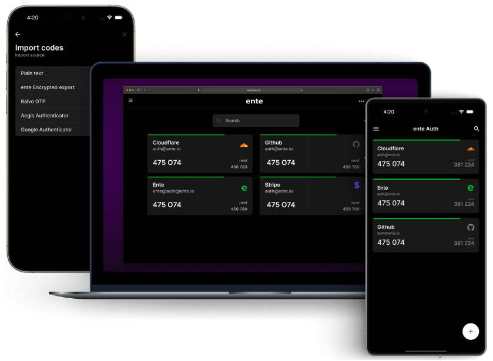
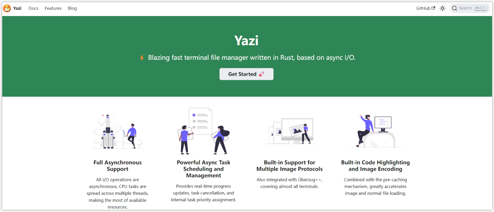
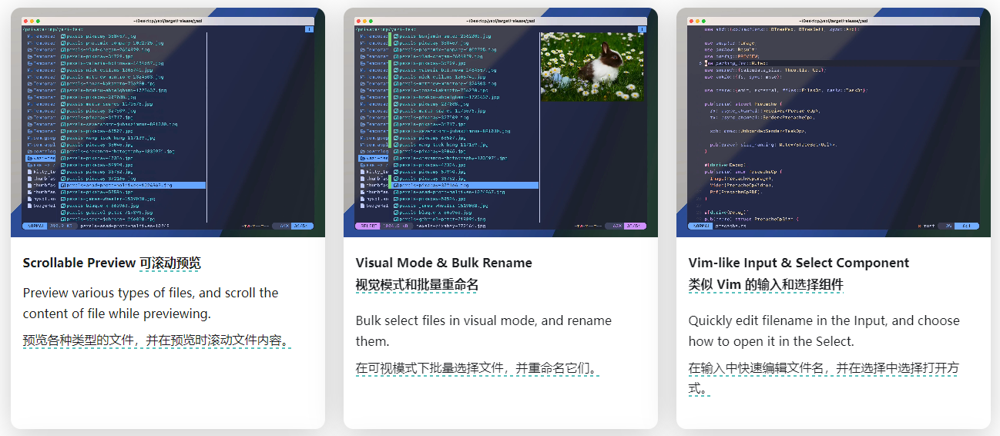
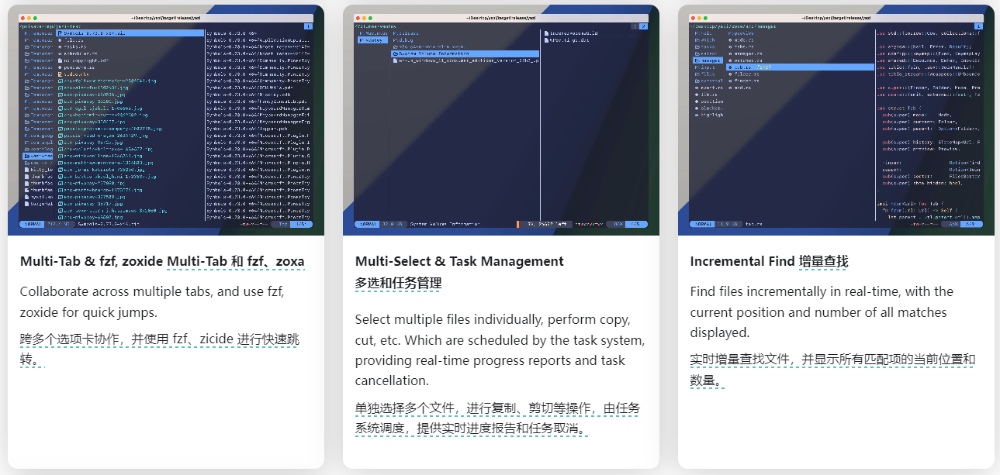

 

> GitHub一周热点汇总第26期 (2024.06.24-06.30)，梳理每周热门的GitHub项目，了解热点技术趋势，掌握前沿科技方向，发掘更多商机！


### 本期看点
1. 超强 AI 🤖同声传译 APP，出国旅游留学居家必备神器！一周斩获 3.5k 点赞！🔥
2. awesome 出品必属精品！🚀awesome 软件架构它来了！程序员进阶修炼的必备手册！
3. 谷歌相册、苹果相册🖼的平替，还附赠一款认证服务，不来学习一下吗？
4. 💻一款极速终端文件管理器，支持命令行高效地预览文件、照片，批量重命名等！


### 1. niedev / RTranslator

```text
🔥 本周 stars：3,593
🔨 语 言：C++
⭐ stars：4,707
🍴 fork：353
```

RTranslator 是一款（几乎）开源、免费、离线的 Android 实时翻译应用程序。

它最大的亮点在于支持对话模式，类似于同声传译。用户只需要与使用该应用程序的另一名用户连线，然后就可以同对方进行跨语言对话。
当然它也支持对讲机模式，这非常适合需要进行快速简单对话的场景，如与店员交流点单等。

RTranslator 使用 Meta 的 NLLB 进行翻译，使用 OpenAi 的 Whisper 进行语音识别，两者都是（几乎）开源且最先进的 AI，具有出色的质量并直接在手机上运行，​​确保绝对隐私，甚至可以在离线状态下使用 RTranslator。






### 2. mehdihadeli / awesome-software-architecture

```text
🔥 本周 stars：1,995 
🔨 语 言：Rust
⭐ stars：6,428
🍴 fork：502
```


awesome-software-architecture 是一个用于收集与软件架构学习/实践相关的资源库。网站汇总了精选的文章、视频资源，并保持不断更新。里面设计到到内容包括：软件架构、整洁架构、洋葱架构、六边形架构、领域驱动设计、缓存、并发、分片、面试……

非常适合开发者进一步提升，以及面试准备。建议收藏备用，相信会有很大帮助！








### 3. ente-io / ente

```text
🔥 本周 stars：1,394
🔨 语 言：Dart
⭐ stars：11,112
🍴 fork：618
```

ente 是一个完全开源的端到端加密的照片（Ente Photos）、认证项目（Ente Auth）。



项目包含两个产品的源代码，包括客户端应用程序（iOS / Android / F-Droid / Web / Linux / macOS / Windows），以及为它们提供支持的服务端应用。

非常适合对此方向感兴趣的开发者研究学习。或者如果说你刚好需要 ente 提供的照片管理和认证服务，也可以进行试用。

Ente Photo


Ente Auth



### 4. sxyazi / yazi

```text
🔥 本周 stars：1,216
🔨 语 言：Rust
⭐ stars：11,237
🍴 fork：263
```

Yazi（意思是“鸭子”）是一个用 Rust 编写的终端文件管理器。它基于非阻塞异步 I/O 实现，旨在提供高效、用户友好且可定制的文件管理体验。








以上就是本期的全部内容，有感兴趣的赶紧去试试吧！我是四阿哥，关注我不错过每一周的热点项目，也可以在我的主页查看往期的精彩内容！
