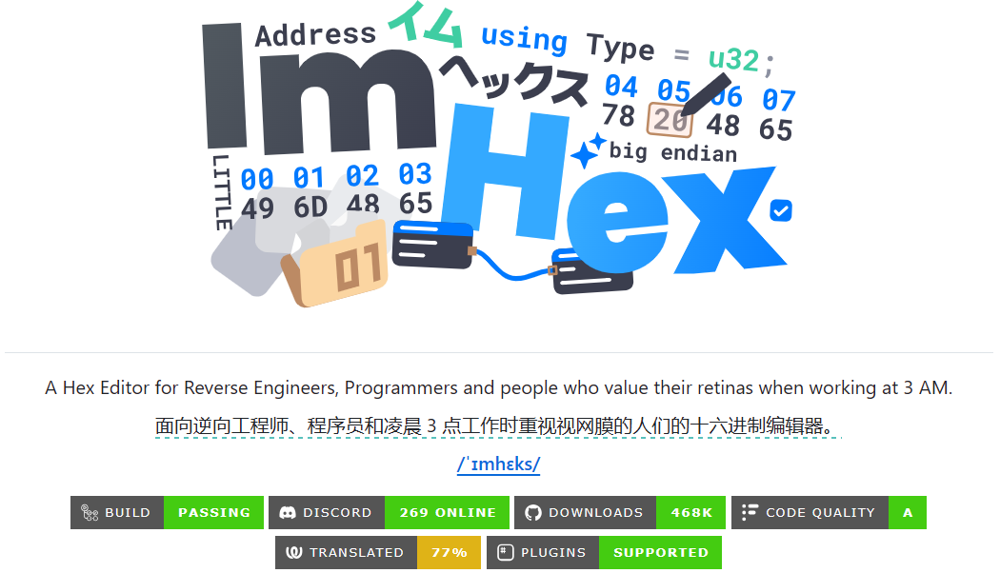
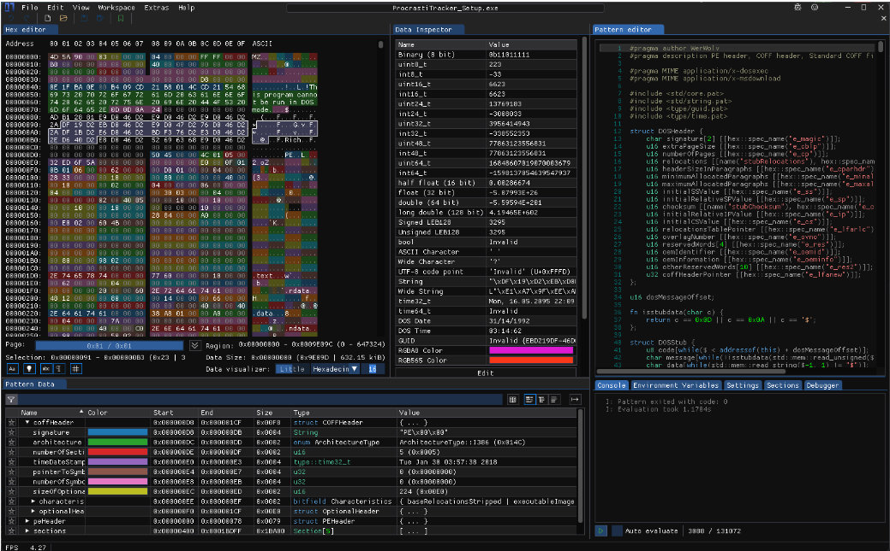
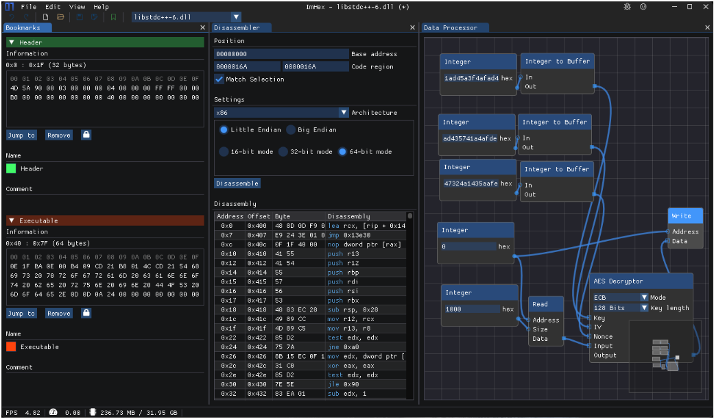
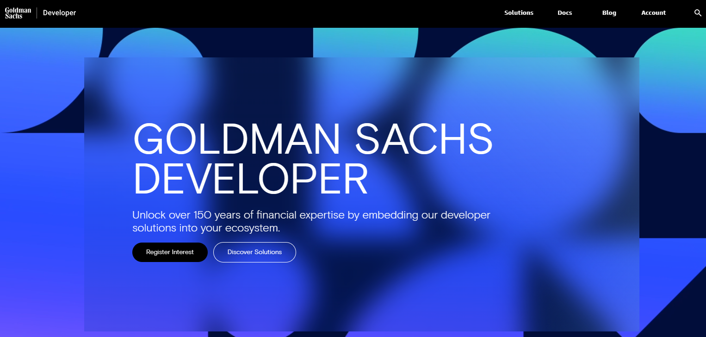
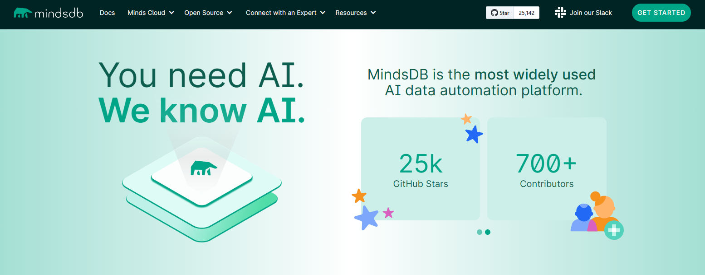
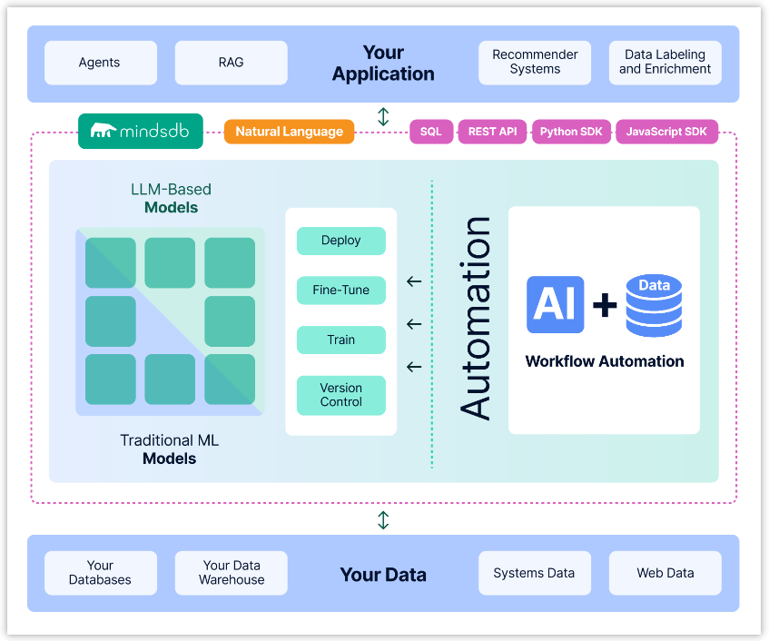
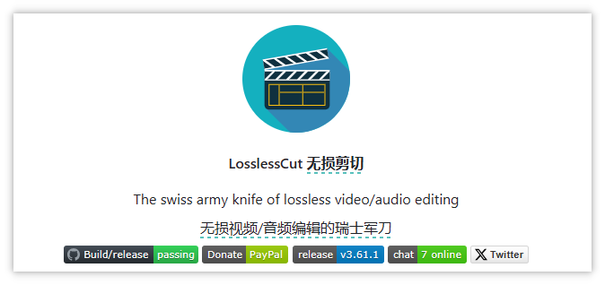
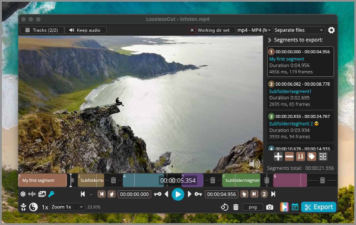

> GitHub一周热点汇总第27期 (2024.07.01-07.07)，梳理每周热门的GitHub项目，了解热点技术趋势，掌握前沿科技方向，发掘更多商机！


### 本期看点
1. 🔍 一款功能强大的，夜间友好的十六进制编辑器
2. 对金融行业💴感兴趣的朋友一定不能错过这款量化金融工具包！
3. 一种更便捷地从企业数据构建人工智能系统🤖的方式 
4. 一款对视频/音频进行无损剪辑的瑞士军刀🔪

### 1. WerWolv / ImHex

```text
🔥 本周 stars：5,987
🔨 语 言：C++
⭐ stars：40,311
🍴 fork：1,765
```


ImHex 是一款面向逆向工程师/程序员的十六进制编辑器。它拥有着功能丰富的十六进制数据界面，支持字节修复、字节拷贝、字符串和十六进制搜索等丰富的十六进制操作，并且配备了对程序员夜间工作友好的深色主题。



下面是软件的一些截图。





### 2. goldmansachs / gs-quant

```text
🔥 本周 stars：2,880
🔨 语 言：Jupyter Notebook
⭐ stars：6,115
🍴 fork：775
```

GS Quant 是一个用于量化金融的 Python 工具包，创建于世界上最强大的风险转移平台之一之上。旨在加速量化交易策略和风险管理解决方案的开发，拥有超过 25 年的全球市场经验。

它由高盛的量化开发人员（Quant）创建和维护，用于开发交易策略和分析衍生产品。 GS Quant 可用于促进衍生品构建、交易和风险管理，或作为数据分析应用程序的一组统计包。



### 3. mindsdb / mindsdb

```text
🔥 本周 stars：2,276
🔨 语 言：Python
⭐ stars：25,062
🍴 fork：4,841
```

MindsDB 是一个旨在从企业数据构建人工智能的平台。用户可以根据数据库、矢量存储和应用程序数据实时创建、提供和微调模型。


MindsDB 与众多数据源集成，包括数据库、向量存储和应用程序，以及流行的 AI/ML 框架，包括 AutoML 和 LLMs。 MindsDB 将数据源与 AI/ML 框架连接起来，并自动执行它们之间的日常工作流程。通过这样做，将数据和人工智能结合在一起，从而更方便地实现定制人工智能系统。



### 4. mifi / lossless-cut

```text
🔥 本周 stars：1,244
🔨 语 言：TypeScript
⭐ stars：24,518
🍴 fork：1,213
```

LosslessCut 是一款对视频/音频进行无损剪辑的利器！它旨在成为终极跨平台 FFmpeg GUI，可对视频、音频、字幕和其他相关媒体文件进行极快速且无损的操作。


你可以利用它粗剪从摄像机、GoPro、无人机等拍摄的大型视频文件，因为不需要重新编码，因此不会造成质量损失。下面部分罗列下它可以实现的功能：
- 大多数视频和音频格式的无损切割
- 无损地重新排列视频/音频片段的顺序
- 任意文件的无损合并/串联（具有相同的编解码器参数，例如来自同一相机）
- 从文件中提取所有曲目
- ……
感兴趣的可以前往其官方仓库查看更多信息。



以上就是本期的全部内容，有感兴趣的赶紧去试试吧！我是四阿哥，关注我不错过每一周的热点项目，也可以在我的主页查看往期的精彩内容！

