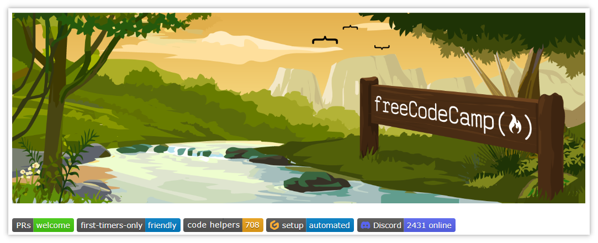
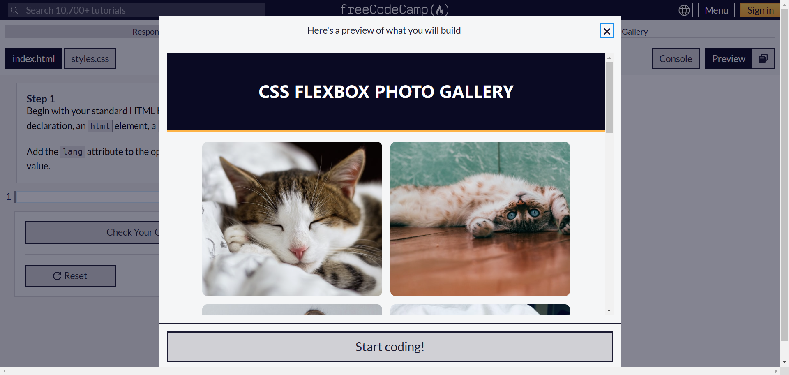
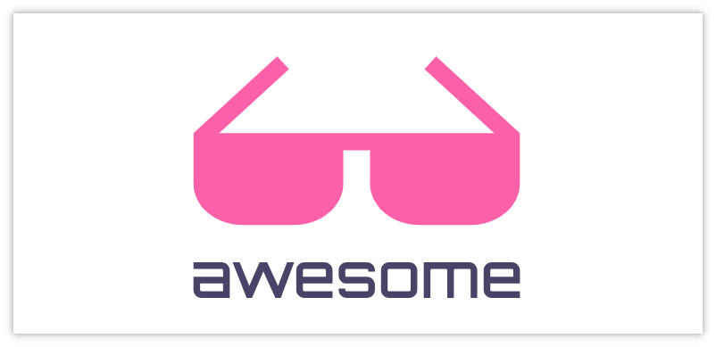
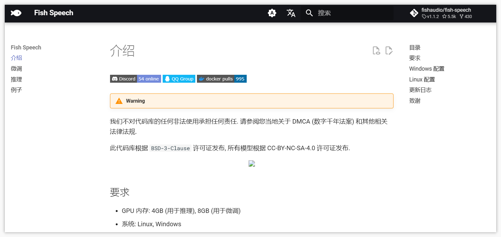
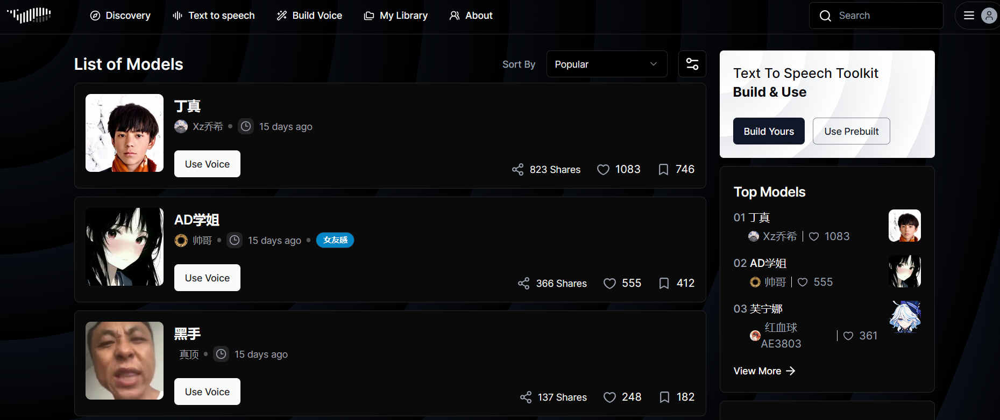

 

> GitHub一周热点汇总第28期 (2024.07.08-07.14)，梳理每周热门的GitHub项目，了解热点技术趋势，掌握前沿科技方向，发掘更多商机！


### 本期看点
1. 微软开源了一个新的基于知识图谱构建的检索增强生成（RAG）系统 🚀
2. 一个非盈利组织运营的，可以帮助大家自学编程的平台 💻
3. 玩开源的你肯定知道大名鼎鼎的 awesome 🕶系列吧，还没收藏的赶紧 mark 起来！
4. 一款强大的免费开源文本转语音（TTS）模型🔈可在线试用超多语音包！


### 1. microsoft / graphrag

```text
🔥 本周 stars：4,284
🔨 语 言：Python
⭐ stars：10,280
🍴 fork：809
```

graphrag 是微软开源的一个新的基于知识图谱构建的检索增强生成（RAG）系统。

GraphRAG 框架包含一个数据管道和转换套件，旨在利用大型语言模型从非结构化文本中提取结构化数据，构建具有标签的知识图谱，以支持数据集问题生成、摘要问答等多种应用场景。


### 2. freeCodeCamp / freeCodeCamp

```text
🔥 本周 stars：1,223
🔨 语 言：TypeScript
⭐ stars：393,892
🍴 fork：36,212
```

freeCodeCamp 是一个由非盈利组织运营的、可以免费学习编程的平台。平台上面有数千个视频、文章和交互式编程课程供用户免费学习，并且提供了相应的免费认证。



许多课程以交互式编程的方式，通过构建一个项目来学习特定的编程技能。



### 3. sindresorhus / awesome

```text
🔥 本周 stars：1,153
🔨 语 言：-
⭐ stars：310,979
🍴 fork：27,063
```


关注开源的肯定对大名鼎鼎的 awesome 项目不陌生吧。awesome 项目是一个旨在收集各类有趣主题及其相关资源的项目，通常命名为 awesome-xxx，xxx 通常为某个主题。

具体来说，其内容涵盖：平台、编程语言、前端开发、后端开发、计算机科学、大数据、编辑器、游戏、数据库、安全……

如果你对某个方向感兴趣，或者正打算学习某个主题，不妨先来上面找找相关的高质量学习资源，能帮助大家少走不少弯路！




### 4. fishaudio / fish-speech

```text
🔥 本周 stars：963
🔨 语 言：Python
⭐ stars：5,395
🍴 fork：424
```

Fish Speech是由 Fish Audio 开发的免费开源文本转语音（TTS）模型。经过十五万小时的数据训练，Fish Speech能够熟练掌握中文、日语和英语，并且 Fish Speech的语言处理能力接近人类水平，声音表现形式丰富多变。


Fish Speech 还提供了一个在线演示环境，上面也有不少训练好的声音可供试用。



以上就是本期的全部内容，有感兴趣的赶紧去试试吧！我是四阿哥，关注我不错过每一周的热点项目，也可以在我的主页查看往期的精彩内容！