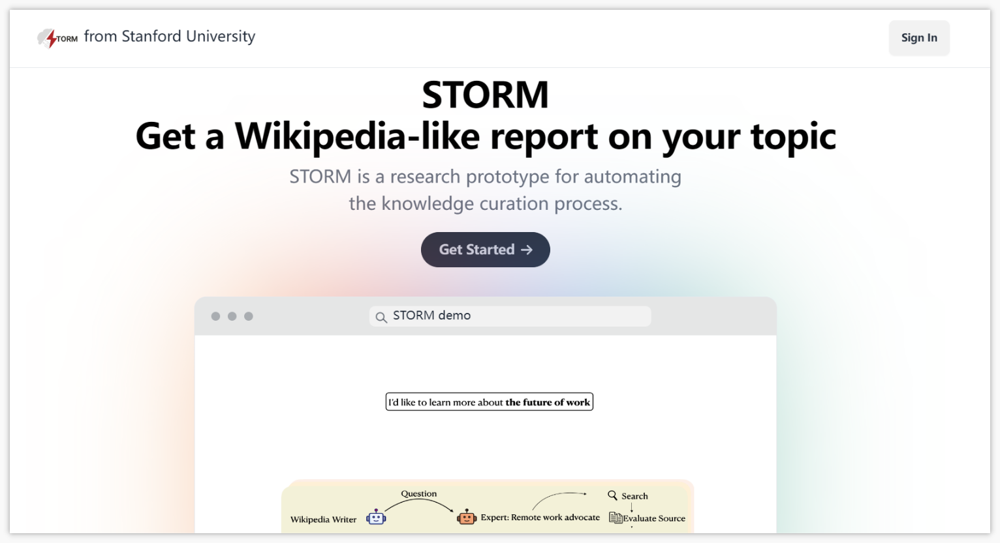
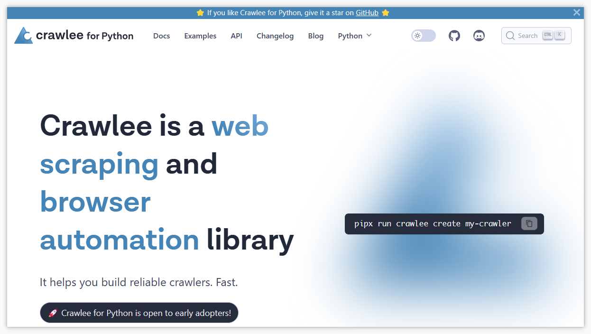
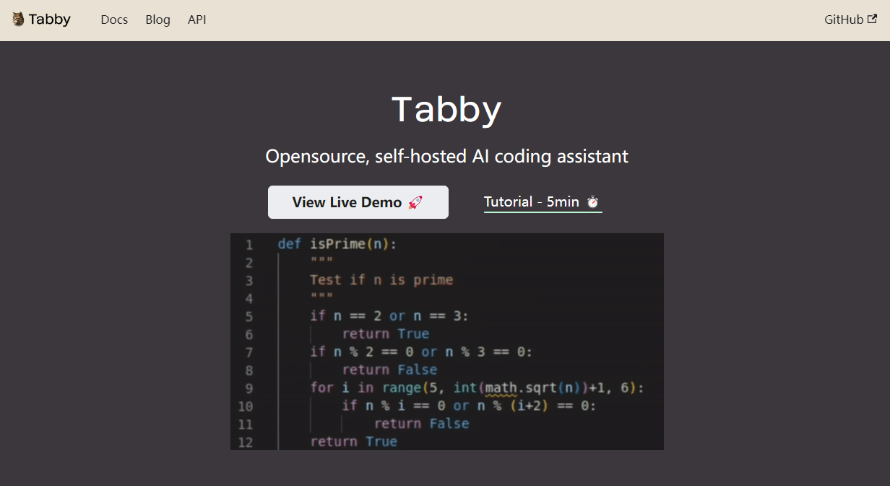
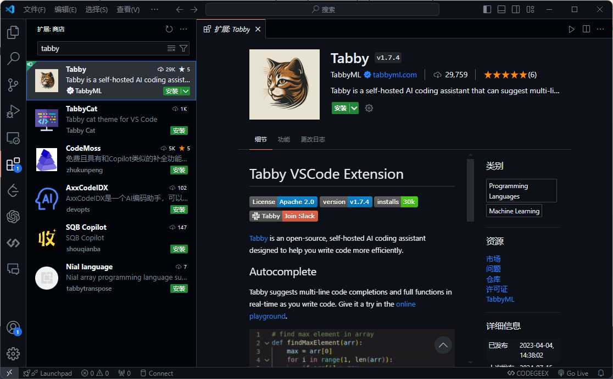
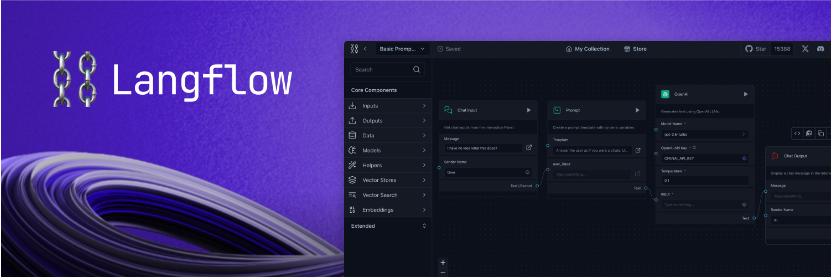
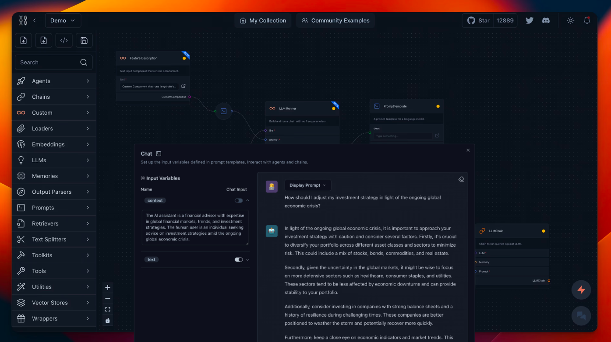
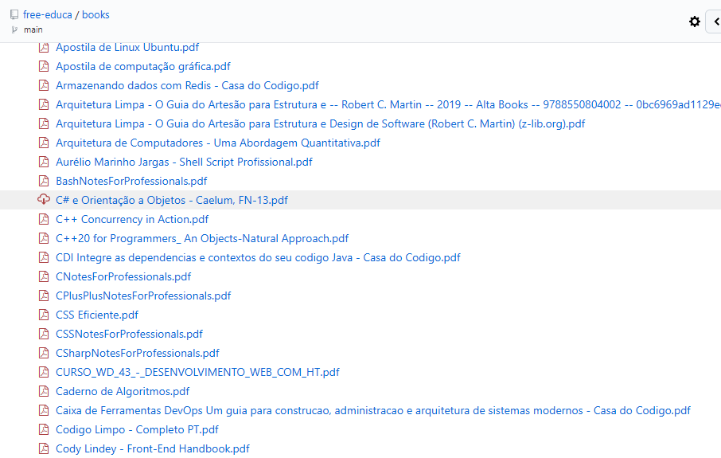

> GitHub一周热点汇总第29期 (2024.07.15-07.21)，梳理每周热门的GitHub项目，了解热点技术趋势，掌握前沿科技方向，发掘更多商机！


### 本期看点
1. 使用大模型从零开始撰写类似维基百科的文章
2. 功能强大的网页爬取和浏览器自动化 Python 库，可用来构建可靠的爬虫程序
3. GitHub Copilot 的平替，支持私有部署的 AI 编码助手
4. 一款开源、强大的，用于构建多代理和 RAG 应用程序的可视化框架

### 1. stanford-oval / storm

```text
🔥 本周 stars：1,924 
🔨 语 言：Python
⭐ stars：7,617
🍴 fork：738
```

STORM 全称 Synthesis of Topic Outlines through Retrieval and Multi-perspective Question Asking（通过检索和多视角提问合成主题大纲），是一个基于 LLM 的知识管理系统，能够为某个主题生成带有引用的完整报告。

STORM 可以基于互联网搜索从头开始编写类似维基百科的文章，这对于写作前的准备阶段是非常有帮助的。

STORM 生成带有引用的长文章可以分为两个步骤：
1. 预写阶段：系统通过互联网进行研究，收集参考资料并生成大纲。
2. 写作阶段：系统使用大纲和参考文献生成带有引文的全文文章。



### 2. apify / crawlee-python

```text
🔥 本周 stars：1,615
🔨 语 言：Python
⭐ stars：2,933
🍴 fork：211
```

crawlee-python 是一个用于网络爬取和浏览器自动化的 Python 库，旨在用来构建可靠的爬虫程序。它可以用来提取 AI、LLMs、RAG 或 GPT 的数据。从网站下载 HTML、PDF、JPG、PNG 和其他文件。基于 BeautifulSoup、Playwright 和 raw HTTP。

crawlee 具备以下特点：
- HTTP & headless browser 的统一接口
- 基于可用系统资源的自动并行爬取
- 出现错误或被阻止时自动重试
- 集成代理轮换和会话管理
- ……



### 3. TabbyML / tabby

```text
🔥 本周 stars：1,138
🔨 语 言：Rust
⭐ stars：19,808
🍴 fork：903
```

Tabby 是一个自托管 AI 代码助手，提供 GitHub Copilot 的开源和本地替代方案。它拥有以下几个关键特性：
- 独立的，不需要 DBMS 或云服务
- OpenAPI 接口，易于与现有基础设施（例如Cloud IDE）集成
- 支持消费级 GPU


tabby 可以很方便地与 IDE/编辑器进行集成。


总而言之，tabby 非常适合注重隐私的企业或个人进行私有部署，从而提高团队的研发效率。


### 4. langflow-ai / langflow

```text
🔥 本周 stars：1,178
🔨 语 言：JavaScript
⭐ stars：22,023
🍴 fork：3,162
```

langflow 是一个用于构建多代理和 RAG 应用程序的可视化框架。它是开源的、由 Python 驱动、完全可定制、并且与模型和向量存储无关。


langflow 拥有直观的用户界面，可以轻松地操纵人工智能构建块，使开发人员能够快速构建原型并将他们的想法转化为强大的现实解决方案。



### 5. free-educa / books

```text
🔥 本周 stars：1,039
🔨 语 言：-
⭐ stars：6,282
🍴 fork：1,276
```

正如其名，这又是一个图书资源的仓库。Dev-Books 中包含与开发和编程相关的精选书籍集。无论您是一位有抱负的程序员、经验丰富的开发人员，还是只是有兴趣跟上最新软件变化和趋势的人，这个存储库都适合您。

该存储库旨在提供一个全面的图书库，涵盖开发和编程方面的广泛主题。从编程语言和框架到软件架构、设计模式等，这些集合都经过精心挑选，可为您提供在快节奏的软件开发世界中取得成功所需的知识。


仓库将书籍分为不同的主题，以便大家能够找到感兴趣的领域。这些主题主要包括：
- 编程语言相关
- Web 开发
- 移动应用开发
- 软件工程
- 数据科学和机器学习
- DevOps 和基础设施
- 软件架构
- 网络安全



以上就是本期的全部内容，有感兴趣的赶紧去试试吧！我是四阿哥，关注我不错过每一周的热点项目，也可以在我的主页查看往期的精彩内容！
