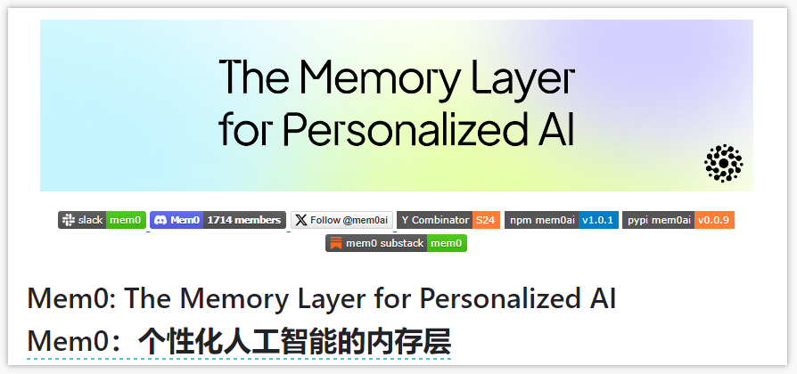
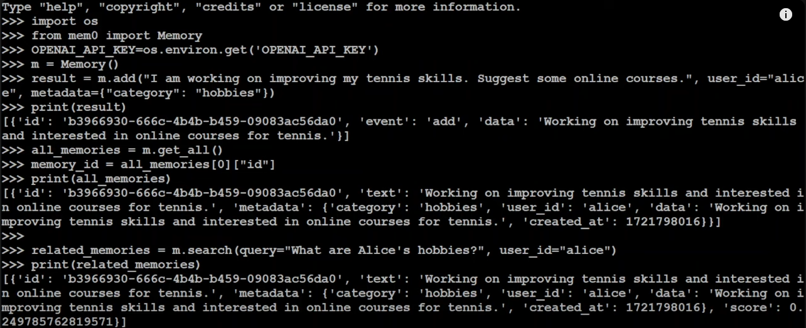
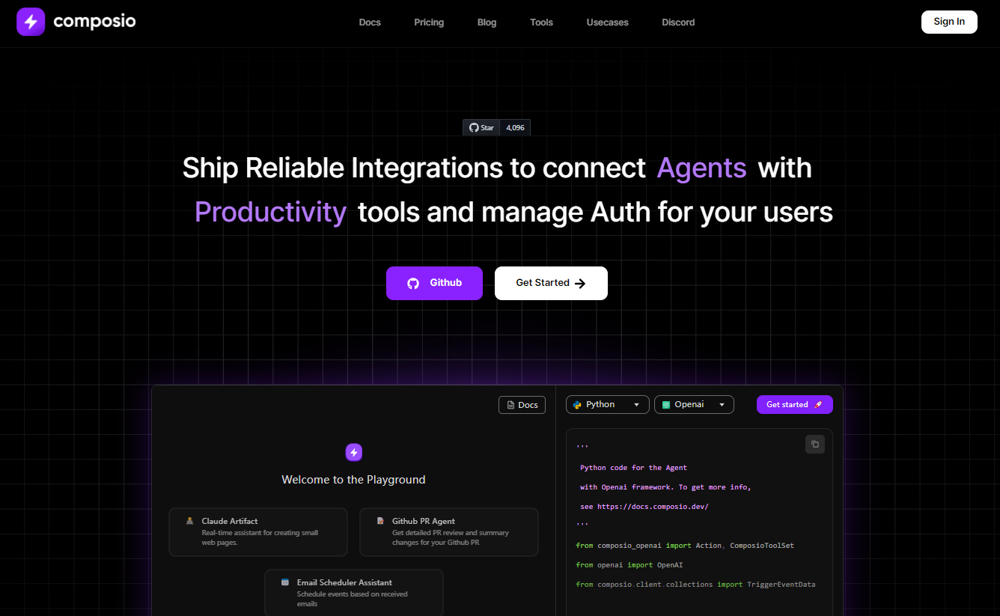
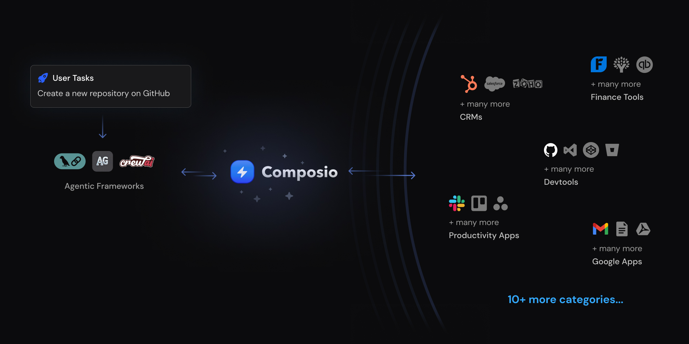
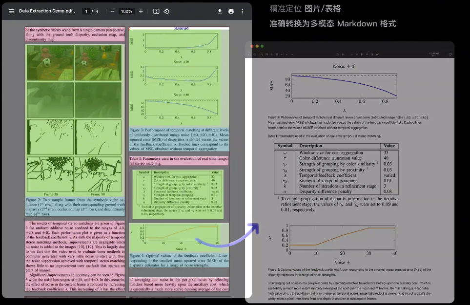
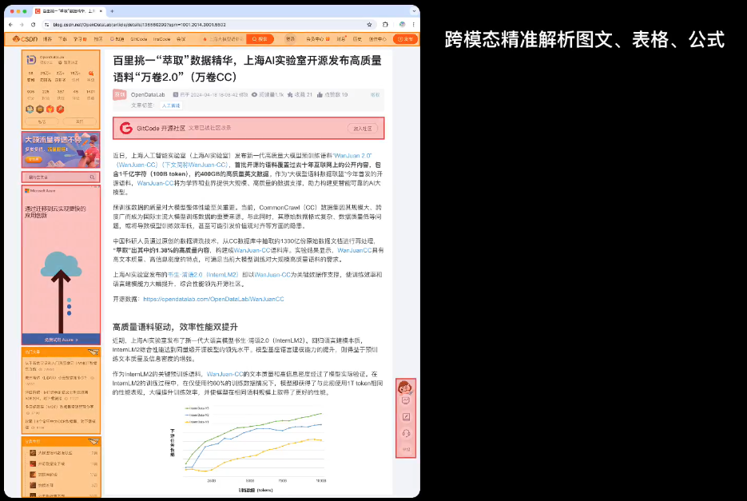
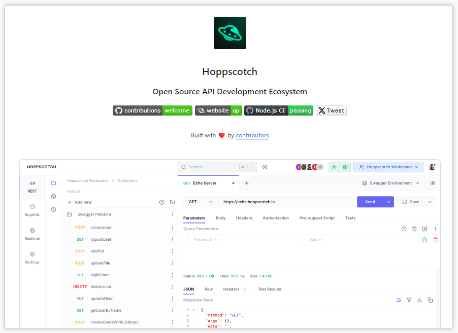
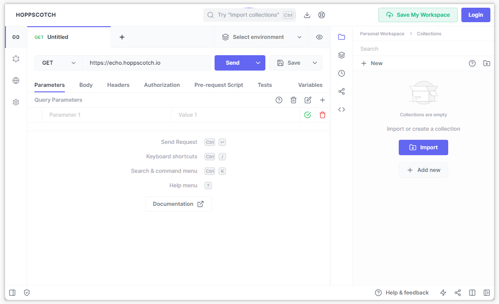

> GitHub一周热点汇总第30期 (2024.07.22-07.28)，梳理每周热门的GitHub项目，了解热点技术趋势，掌握前沿科技方向，发掘更多商机！


### 本期看点
1. 当大模型有了记忆…让 AI 更接近 AI 🤖
2. 一款适配 AI 代理的高质量工具集，助你高效打造自己的 AI 工作流 
3. 一款一站式、开源高质量数据提取工具，支持PDF/网页/多格式电子书提取📕
4. 又一款 Postman 的开源平替 API 开发工具 🔧


### 1. mem0ai / mem0

```text
🔥 本周 stars：7,488
🔨 语 言：Python
⭐ stars：17,774
🍴 fork：1,696
```

Mem0 为大型语言模型 (LLMs) 提供了一个智能、自适应的内存层，用户可以通过保留和利用跨不同应用程序的上下文信息来增强个性化 AI 体验。这种增强的记忆能力对于诸如：客户支持、医疗诊断、自主系统以及个性化内容推荐等应用至关重要。通过 Mem0 可以使人工智能能够记住用户偏好，适应个人需求，并随着时间的推移不断改进。



使用 Mem0 提供的 API 进行大模型记忆的存取。



### 2. ComposioHQ / composio

```text
🔥 本周 stars：2,036
🔨 语 言：Python
⭐ stars：4,026
🍴 fork：1,032
```


Composio 是一个与 AI 代理适配的高质量工具集。项目的作者相信相信基于人工智能的代理/工作流程是未来， 而 Composio 是将 AI 代理集成到最佳代理工具并使用它们完成任务的最佳工具集。

例如，你要让 AI 代理要完成”在 GitHub 上创建新仓库”之类的任务，你的代理需要与 GitHub 的 API 集成。具体来说，将会涉及将 API 规范转换为函数可调用模式、管理多个用户的身份验证……而这些操作 Composio 已经帮大家封装成了开箱即用的功能。


目前 Composio 已经支持 100+ 的工具，涵盖各个类型的软件等：
- **软件**：在 GitHub、Notion、Linear、Gmail、Slack、Hubspot、Salesforce 等 90 多个平台上执行任何操作。
- **操作系统**：点击任意位置、输入任何内容、复制到剪贴板等。
- **浏览器**：智能搜索、截图、MultiOn、下载、上传等。
- **搜索**：Google 搜索、Perplexity 搜索、Tavily、Exa 等。
- **软件工程**：Ngrok、数据库、Redis、Vercel、Git 等。
- **RAG**：即时为任何类型的数据提供代理 RAG！



### 3. opendatalab / MinerU

```text
🔥 本周 stars：942
🔨 语 言：Python
⭐ stars：1,932
🍴 fork：157
```

MinerU 是一款一站式、开源高质量数据提取工具，支持PDF/网页/多格式电子书提取。主要包含以下功能：
- Magic-PDF PDF文档提取
- Magic-Doc 网页与电子书提取

Magic-PDF 是一款将 PDF 转化为 markdown 格式的工具。支持转换本地文档或者位于支持S3协议对象存储上的文件。主要功能包括：多种前端模型输入、删除页眉、页脚、脚注、页码等、提取图像和表格并在markdown中展示……



Magic-Doc 是一款支持将网页或多格式电子书转换为 markdown 格式的工具。主要功能包括：Web网页提取、电子书文献提取、语言类型鉴定……


### 4. hoppscotch / hoppscotch

```text
🔥 本周 stars：771
🔨 语 言：TypeScript
⭐ stars：62,401
🍴 fork：4,309
```

hoppscotch 旨在打造开源 API 开发生态系统，可以作为 Postman、Insomnia 的开源替代品。

项目提供了一个在线试用的环境。


以上就是本期的全部内容，有感兴趣的赶紧去试试吧！我是四阿哥，关注我不错过每一周的热点项目，也可以在我的[主页](https://siage.netlify.app/)查看往期的精彩内容！
