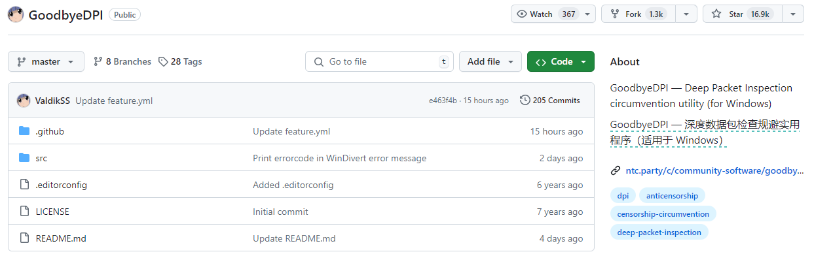
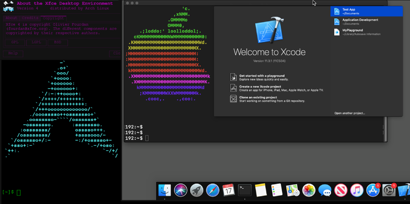
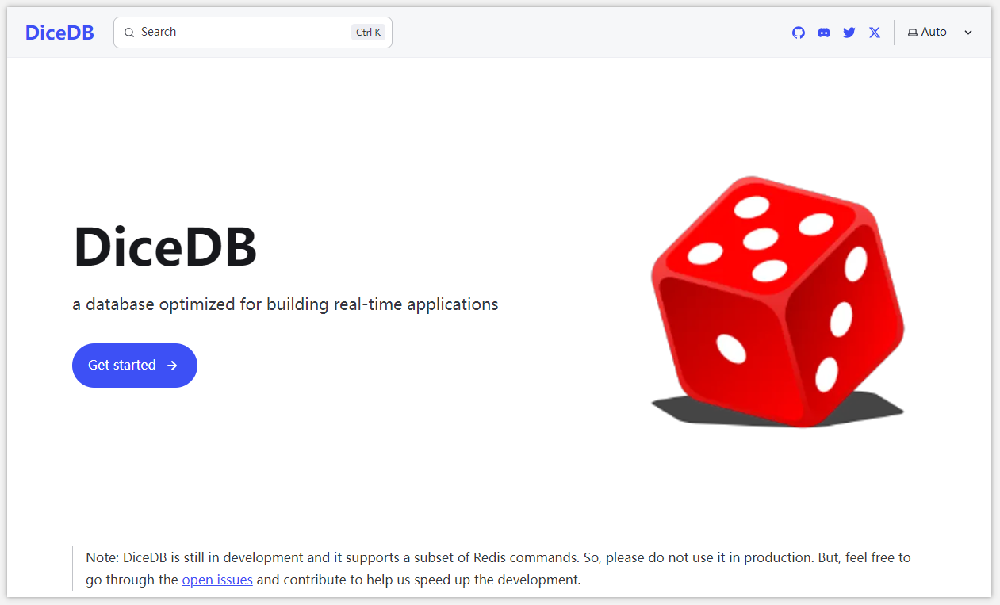
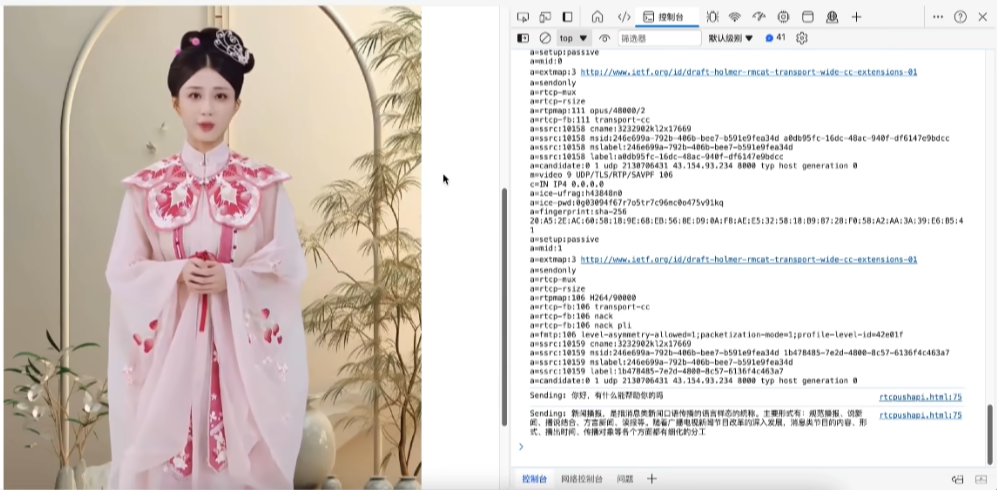

> GitHub一周热点汇总第31期 (2024.07.29-08.04)，梳理每周热门的GitHub项目，了解热点技术趋势，掌握前沿科技方向，发掘更多商机！


### 本期看点
1. 一个规避深度包检测工具，用技术打败魔法？
2. Docker 中也能运行 Mac OS 了！？想体验 Mac 系统的小伙伴快去试试！
3. 又一个 Redis 开源平替！并且基于 Redis 做了改进！
4. 流浪地球中的数字人幻想照进了现实？一个开源实时交互流式数字人项目！


### 1. ValdikSS / GoodbyeDPI

```text
🔥 本周 stars：5,667
🔨 语 言：C
⭐ stars：16,921
🍴 fork：1,289
```

GoodbyeDPI 是一个规避深度包检测（Deep packet inspection，DPI）从而访问被互联网服务提供商封锁的网络内容的工具，由俄罗斯开发者使用 C 语言开发。不过目前该工具仅适用于  Windows 系统。

它的工作原理是，基于 Windows 过滤修改和过滤数据包。可以分为两种方式：主动 DPI 和被动 DPI。
- 被动 DPI，通常被动DPI对于要被封锁的HTTP连接会发送HTTP 302重定向；对于HTTPS连接则发送TCP重置包。
- 主动 DPI，主动DPI更难欺骗，目前工具主要使用 7 种方法来规避主动 DPI。

对于这个工具感兴趣的可以前往其官方仓库，查看更多信息。



### 2. sickcodes / Docker-OSX

```text
🔥 本周 stars：2,656 
🔨 语 言：Shell
⭐ stars：38,960 
🍴 fork：1,892
```

Docker-OSX 项目能够实现在 Docker 中以接近本机 OSX-KVM 的方式运行！ 支持 X11 转发！适合 iMessage 的安全研究！iPhone USB 也能正常工作！



### 3. DiceDB / dice

```text
🔥 本周 stars：1,403 
🔨 语 言：Go
⭐ stars：2,422
🍴 fork：320
```

DiceDB 是 Redis 的直接替代品，并且内置了基于 SQL 的实时反应机制。

DiceDB 相较于 Redis 有什么不同？
1. DiceDB 是多线程的，遵循无共享架构。
2. DiceDB 支持一个名为 `QWATCH` 的新命令，该命令允许客户端侦听 SQL 查询并在发生变化时实时收到通知。





### 4. lipku / metahuman-stream

```text
🔥 本周 stars：1,310
🔨 语 言：Python
⭐ stars：2,401
🍴 fork：359
```

metahuman-stream 是一个实时交互流式数字人项目，能够实现音视频同步对话，基本可以达到商用效果。

目前数字人模型效果最好的是 ernerf，其借鉴了nerf体渲染的思路，在输入维度上添加了音频特征，通过音频来影响渲染效果（控制嘴型）。项目作者基于 ernerf 模型实现了实时流式数字人。




以上就是本期的全部内容，有感兴趣的赶紧去试试吧！我是四阿哥，关注我不错过每一周的热点项目，也可以在我的[主页](https://siage.netlify.app/)查看往期的精彩内容！


