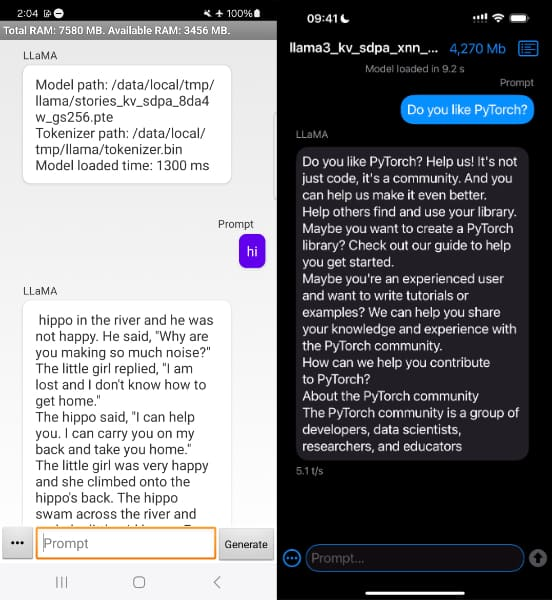
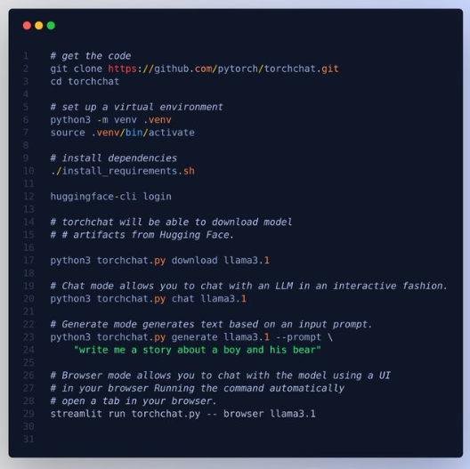
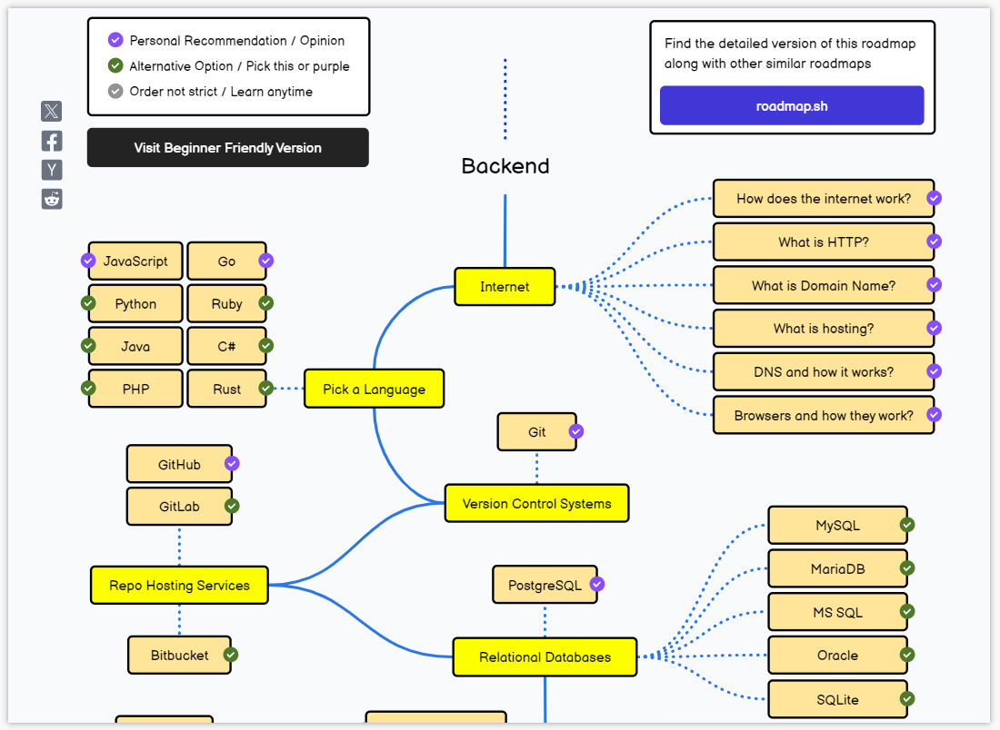
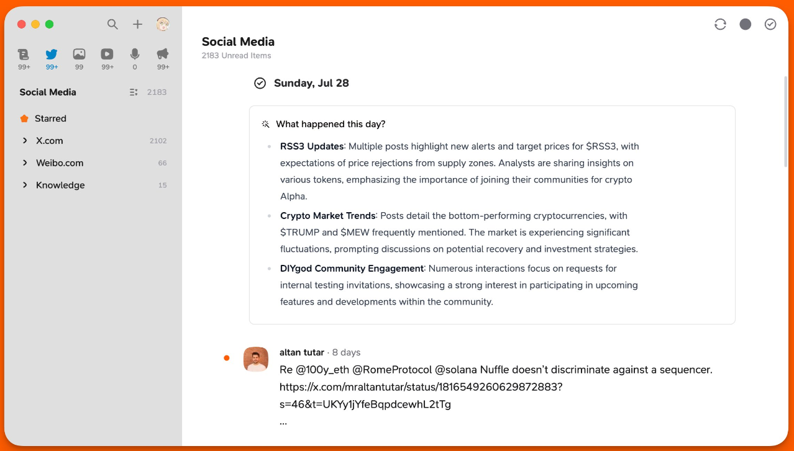
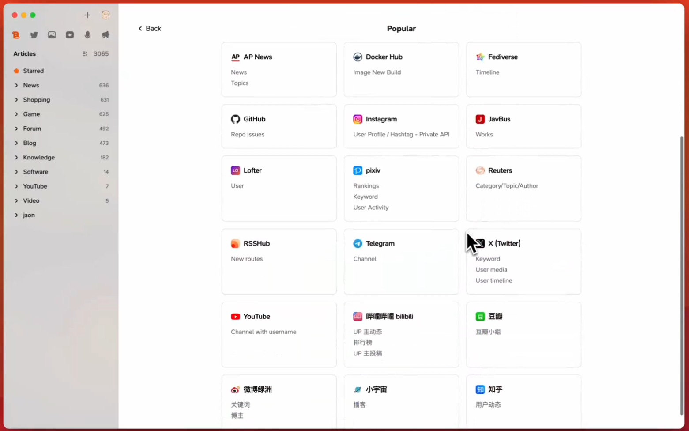
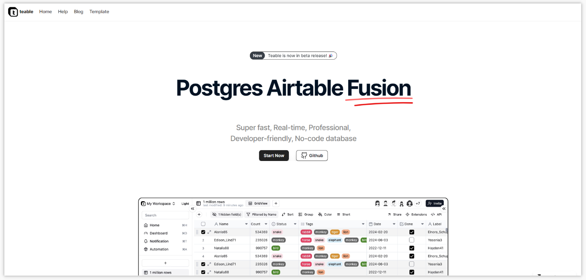
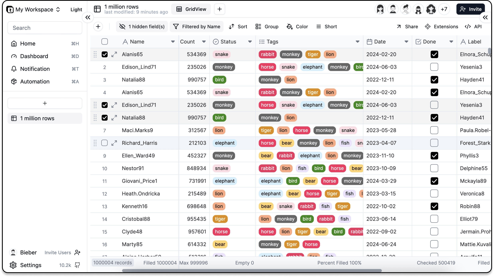

> GitHub一周热点汇总第32期 (2024.08.05-08.11)，梳理每周热门的GitHub项目，了解热点技术趋势，掌握前沿科技方向，发掘更多商机！


### 本期看点
1. PyTorch 发布了torchchat！旨在让本地运行 LLMs 变得更简单。
2. 自学计算机的福利！一个涵盖前端、后端、移动端、全栈…的学习路线图和资源。
3. RSS 爱好者狂喜！新一代 RSS 聚合工具，支持订阅视频、播客内容…
4. 用电子表格的方式操作数据库，又一个无代码数据库产品，可作为 Airtable 的平替！


### 1. pytorch / torchchat

```text
🔥 本周 stars：1,924
🔨 语 言：Python
⭐ stars：2,686
🍴 fork：165
```

TorchChat 是一个小型代码库，可以提供无缝对接大型语言模型 （LLMs）的能力。项目是由 PyTorch 团队开源的 Python 库，旨在简化大型语言模型 (LLMs) 的运行，您可以在自己的 （C/C++） 应用程序（桌面或服务器）以及 iOS 和 Android 上使用 Python 轻松的运行 LLMs。




使用方法很简单，仅需获取 torchchat 代码、安装虚拟环境、安装必需依赖、下载大模型、使用大模型这几步。



### 2. kamranahmedse / developer-roadmap

```text
🔥 本周 stars：1,806
🔨 语 言：TypeScript
⭐ stars：286,463
🍴 fork：38,075
```

这是一个由开源社区驱动的，面向开发者提供学习路线（roadmaps），以及对应的文章和学习资源的项目。在上面你可以看到包括前端、后端、DevOps、全栈开发、AI、数据分析、iOS/安卓等各个方向的学习路线。非常适合自学、转码、程序员职业规划，以及进阶。


值得注意的是，路线图都是交互式的，也就是说你可以点击各个节点，查看这一阶段的学习文章和资源。



### 3. RSSNext / Follow

```text
🔥 本周 stars：2,887
🔨 语 言：TypeScript
⭐ stars：286,463
🍴 fork：38,075
```

Follow 旨在打造下一代的信息“浏览器”。不同于传统的 RSS，Follow 还支持视频、播客等内容的订阅。可以作为个人强大的信息聚合工具。


不过项目目前还处于开发阶段，试用的话需要邀请码，感兴趣的可以持续关注项目的进展！



### 4. teableio / teable

```text
🔥 本周 stars：650
🔨 语 言：TypeScript
⭐ stars：8,697
🍴 fork：375
```

Teable 是一个建立在 Postgres 上的超快速、实时、专业、开发人员友好、无代码数据库。它使用一个简单的、类似电子表格的界面来创建复杂的企业级数据库应用程序。使用无代码解锁高效的应用程序开发，摆脱数据安全性和可扩展性的障碍。可以作为 Airtable 的平替。






以上就是本期的全部内容，有感兴趣的赶紧去试试吧！我是四阿哥，关注我不错过每一周的热点项目，也可以在我的[主页](https://siage.netlify.app/)查看往期的精彩内容！
