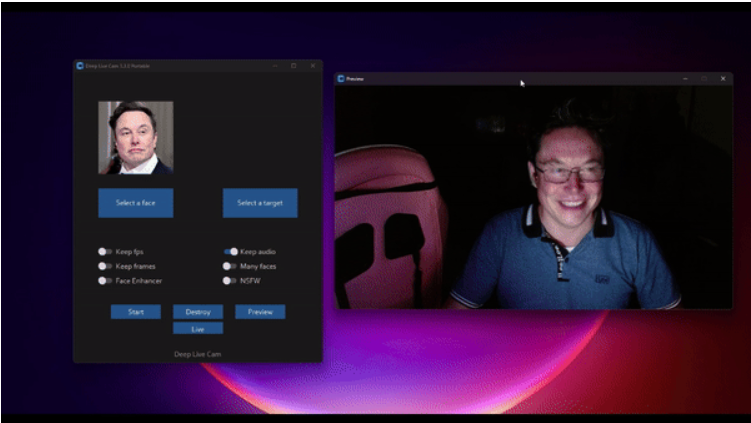
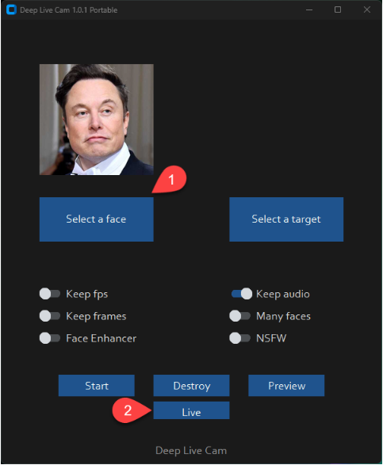
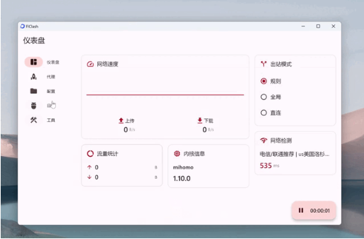
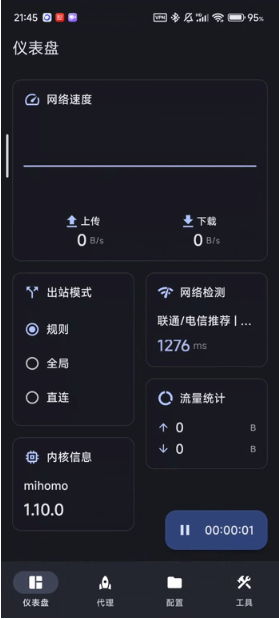
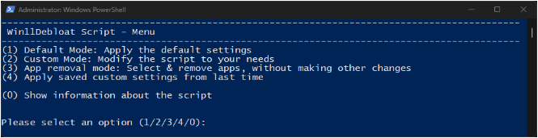
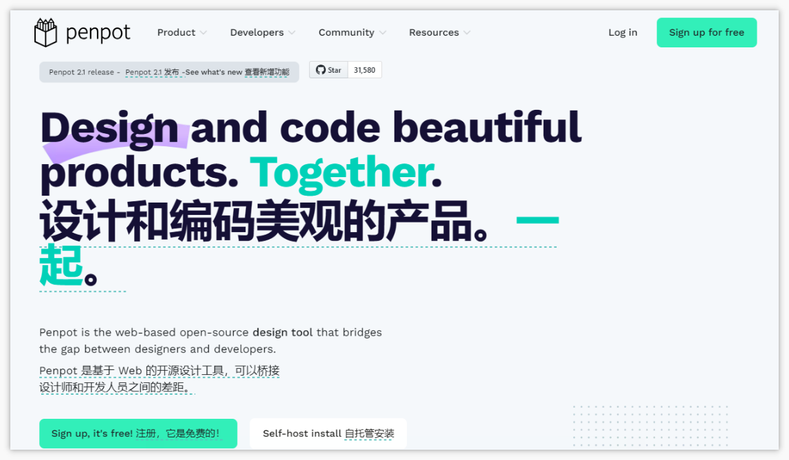
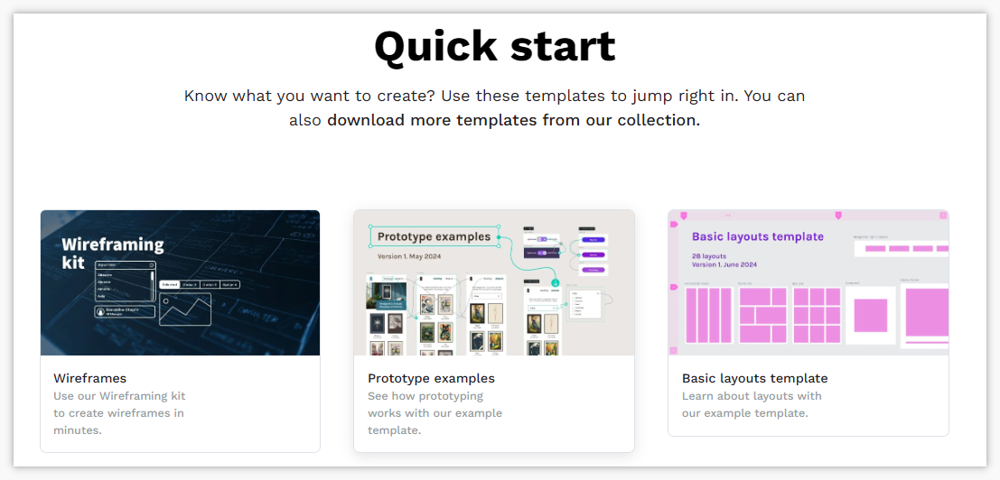

> 👋大家好，我是四阿哥！欢迎阅读 GitHub 周刊第33期 (2024.08.12-08.18)。【GitHub 周刊】专栏旨在收集每周热门的 GitHub 项目，帮助大家了解技术趋势，掌握前沿科技方向，发掘潜在商机！


### 本期看点
1. 本周最火开源项目！一周斩获 16k，仅需一张照片就能实现直播/视频通话实时换脸！
2. 一款基于 ClashMeta 的多平台代理客户端，简单易用！
3. 一键搞定！Win11Debloat 脚本让你的 Windows 系统更清爽！
4. Penpot：创新开源设计工具，重塑设计与代码协作格局！


### 1. AI 实时视频换脸

```text
🎯 名称：Deep-Live-Cam
🔥 本周 stars：16,319 
🔨 语 言：Python
⭐ stars：25,048
🍴 fork：3,396
```

Deep-Live-Cam 项目可以实现，仅用一张照片就可以进行实时换脸和一键视频 deepfake。

技术是把双刃剑，开发人员意识到其可能会被不道德的人利用，它还有一个内置的检查功能，可以在一定程度上防止程序在不合适的媒体上工作。

演示中，博主使用马斯克的照片进行实时换脸，并且使用手电筒将光打在脸上，灯光也会实时反应在被“偷换”的脸上。


使用它也很简单，选择一张想要替换的脸，再选择要被替换脸的图像/视频。点击开始，选择要输出的文件夹，程序会生成一个名为 `<video_title>` 的目录，可以在其中实时查看正在交换的帧。处理完成后，它将创建输出文件。



### 2. 基于 ClashMeta 的多平台代理客户端

```text
🎯 名称：FlClash
🔥 本周 stars：2,231
🔨 语 言：Dart
⭐ stars：5,781
🍴 fork：330
```

FlClash 是一款基于 ClashMeta 的多平台代理客户端。它简单易用，并且开源免费无广告。

支持在 pc 上运行。


支持在安卓设备上运行。



### 3. 一键获取纯净 Win11 的脚本

```text
🎯 名称：Win11Debloat
🔥 本周 stars：1,665
🔨 语 言：PowerShell
⭐ stars：10,934
🍴 fork：455
```

Win11Debloat 是一个简单、易用且轻量级的 PowerShell 脚本，可用于从 Windows 中删除预装应用、禁用遥测、从 Windows 搜索中移除 Bing 等，以清理和改善 Windows 体验，适用于 Windows 10 和 Windows 11。

它具备以下功能特点：
- **应用移除**：可移除多种预装应用，包括微软和第三方的应用；可移除用户在开始菜单中固定的所有应用（仅 Windows 11）。
- **隐私和跟踪**：禁用遥测、诊断数据、活动历史、应用启动跟踪和定向广告；禁用开始、设置、通知、文件资源管理器和锁屏中的提示、技巧、建议和广告。
- **搜索和助手**：禁用并移除 Windows 搜索中的 Bing 网络搜索和 Cortana；禁用 Windows Copilot（仅 Windows 11）；禁用 Windows Recall 快照（仅 Windows 11）。
- **文件资源管理器**：显示隐藏文件、文件夹和驱动器；显示已知文件类型的文件扩展名；隐藏文件资源管理器侧边栏中的某些部分（如 Windows 11 中的图库部分，Windows 10 中的 3D 对象、音乐或 OneDrive 文件夹）；隐藏文件资源管理器侧边栏中重复的可移动驱动器条目。
- **任务栏**：在 Windows 11 中，可将任务栏图标对齐到左侧；隐藏或更改任务栏上的搜索图标 / 框；隐藏任务视图按钮；禁用小部件服务并隐藏任务栏中的图标；隐藏聊天（立即开会）图标。
- ……



### 4. 设计和代码协作的设计工具
 
```text
🎯 名称：penpot
🔥 本周 stars：1,368
🔨 语 言：Clojure
⭐ stars：31,521
🍴 fork：1,554
```

Penpot 是一个用于设计和代码协作的开源设计工具。设计师可以使用它创建令人惊叹的设计、交互式原型、大规模设计系统，而开发人员则可以享受现成的代码，并使他们的工作流程变得简单快捷。而所有这一切都没有交接的戏剧性。



项目官网上还提供了许多开箱即用的线框图、原型等可供使用。



以上就是本期的全部内容，有感兴趣的赶紧去试试吧！我是四阿哥，关注我不错过每一周的热点项目，也可以在我的[主页](https://siage.netlify.app/)查看往期的精彩内容！