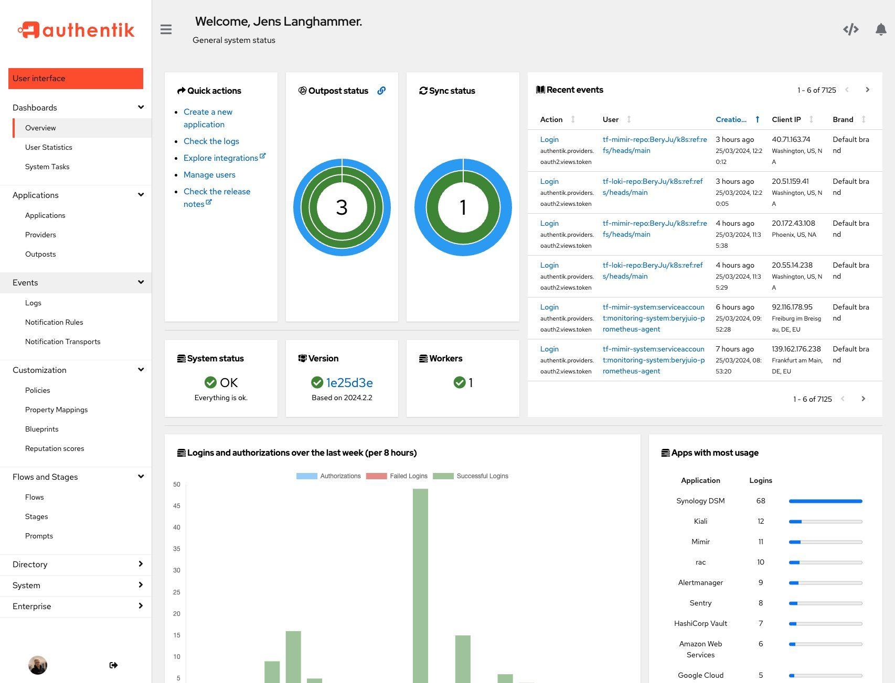

> 👋大家好，我是四阿哥！欢迎阅读 GitHub 周刊第34期 (2024.08.19-08.25)。【GitHub 周刊】专栏旨在收集每周热门的 GitHub 项目，帮助大家了解技术趋势，掌握前沿科技方向，发掘潜在商机！


### 本期看点
1. 轻松整合 OAuth2、SAML、LDAP 等多种协议，为您的应用提供一站式认证服务！
2. 一款先进的 JavaScript 实用工具库，为您带来卓越的性能和便捷的开发体验。
3. 一款集工作流管理、协作编辑与视频会议于一身的开源一体化项目管理平台，可作为 Linear、Jira、Slack 等的平替。
4. 一款专为 macOS 设计的平铺窗口管理器，为您带来高效、便捷的窗口管理体验。


### 1. 一站式认证服务

```text
🎯 名称：authentik
🔥 本周 stars：3,523
🔨 语 言：Python
⭐ stars：11,889
🍴 fork：819
```

authentik 是一个开源的认证服务提供商，它能够提供安全、灵活性和通用性的 IdP（Identity Provider）和 SSO（single sign on）。为站点管理员、应用开发者和安全工程师提供了可靠的认证解决方案。

项目目前提供两个版本：永远免费的开源项目和开放核心、源代码可用的企业版本，企业版本具有支持中心和其他功能。





### 2. 高性能 JS 工具库

```text
🎯 名称：es-toolkit
🔥 本周 stars：1,430
🔨 语 言：TypeScript
⭐ stars：5,729
🍴 fork：233
```

es-toolkit 是一个先进的、高性能的 JavaScript 实用工具库，具有小的捆绑包大小和强大的类型注解。
- es-toolkit 提供多种现代实现的日常实用函数，如 debounce、delay、chunk、sum 和 pick。
- es-toolkit 在设计时考虑了性能，在现代 JavaScript 环境中实现了 2-3 倍的性能提升。
- es-toolkit 支持开箱即用，并且与其他库相比，可以将 JavaScript 代码减少高达 97%。
- es-toolkit 包含内置的 TypeScript 支持，提供直观且强大的类型。它还提供诸如 isNotNil 等有用的类型保护。
- es-toolkit 经过了百分之百的测试覆盖率的实战检验，确保其可靠性和稳健性。


### 3. 一站式项目管理平台

```text
🎯 名称：platform
🔥 本周 stars：948
🔨 语 言：TypeScript
⭐ stars：6,852
🍴 fork：548
```

Huly 是一个开源的一体化项目管理平台，可以作为 Linear、Jira、Slack、Notion 和 Motion 等工具平替方案。


Huly 提供强大的功能套件，包括工作流管理、个人日程安排、协作编辑和视频会议等，能够简化项目管理流程，与现实工作流的复杂性和动态性无缝契合。


### 4. macOS 窗口管理器

```text
🎯 名称：AeroSpace
🔥 本周 stars：344
🔨 语 言：Swift
⭐ stars：4,797
🍴 fork：72
```

AeroSpace 是适用于 macOS 的类似 i3 的平铺窗口管理器。i3 是 Linux 平台一款功能强大且高效的平铺窗口管理器。这意味着 AeroSpace 也可以实现类似的多窗口管理，可以通过键盘高效切换窗口布局！


AeroSpace 目前处于公测阶段，安装它可以通过 `Homebrew`，也可以下载安装包手动进行安装。


以上就是本期的全部内容，有感兴趣的赶紧去试试吧！我是四阿哥，关注我不错过每一周的热点项目，也可以在我的[主页](https://siage.netlify.app/)查看往期的精彩内容！
