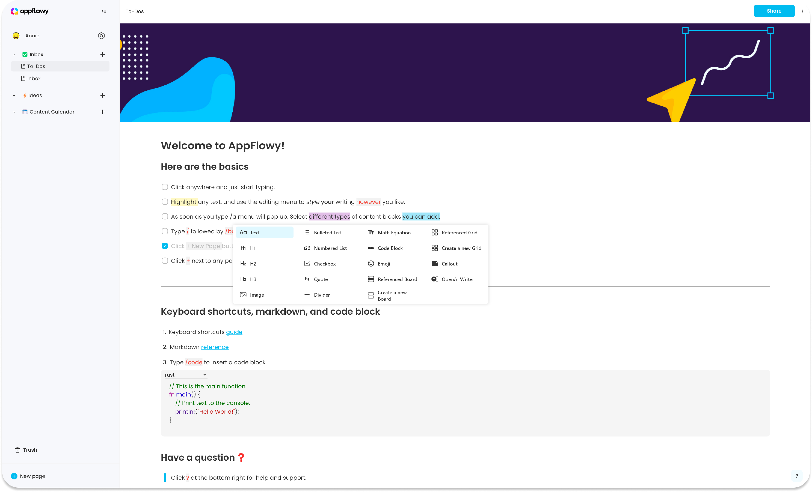
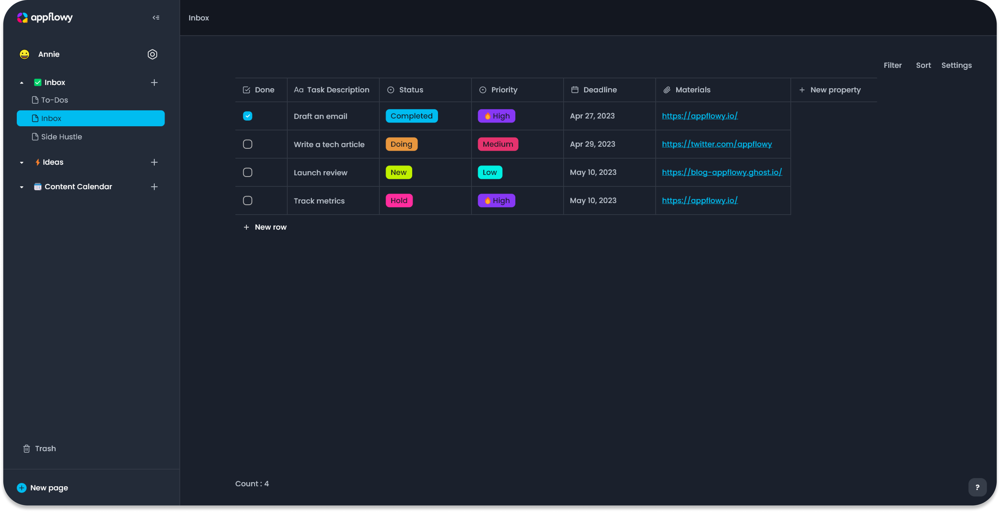
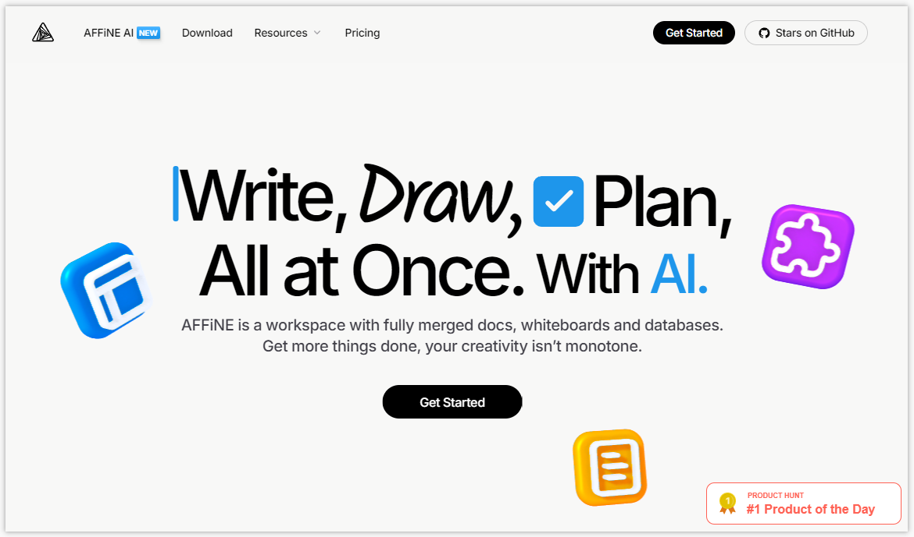
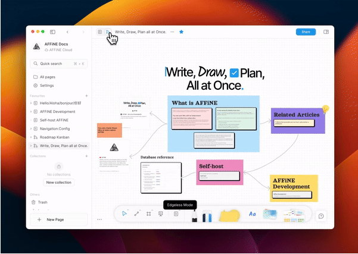
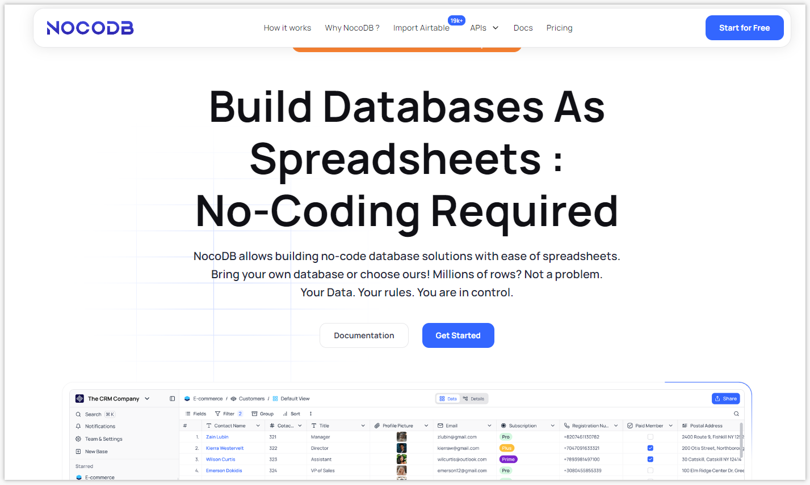
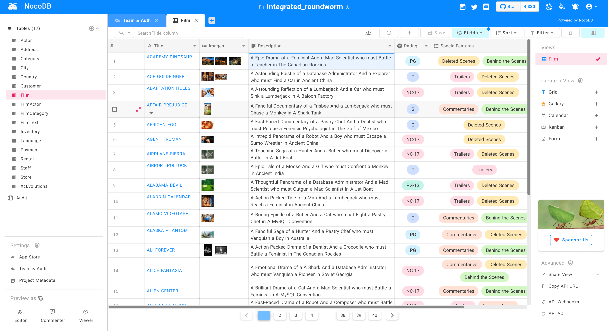
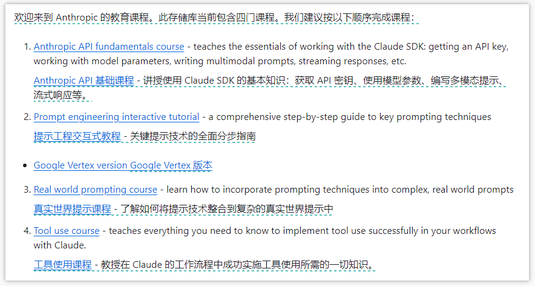

 

>👋大家好，我是四阿哥！欢迎阅读 GitHub 周刊第35期 (2024.08.26-09.01)。【GitHub 周刊】专栏旨在收集每周热门的 GitHub 项目，帮助大家了解技术趋势，掌握前沿科技方向，发掘潜在商机！


### 本期看点
1. 一款 Notion 的开源平替。AppFlowy，畅享 AI 协作与数据安全、重塑协作新高度。
2. AFFiNE：新一代知识管理平台，文档、画布和表格高度融合，让你轻松组装知识库。
3. 数据库变身智能电子表格，无需任何代码轻松玩转数据库。
4. Claude 的公司 Anthropic 推出了它们的 AI 课程，对 AI 大模型感兴趣的不要错过！

### 1. Notion 的开源平替

```text
🎯 名称：AppFlowy
🔨 语 言：Dart
⭐ stars：53,407
🍴 fork：3,516
```

AppFlowy 可以作为 Notion 的开源平替版。它强调了用户对数据的控制权，因此用户可以放心使用。此外它还结合了 AI 的协作工作空间，有助于用户实现更多目标。

相较于 Notion，AppFlowy 的优势在于：
1. **数据控制权**：AppFlowy 强调用户对数据的控制权，用户自己负责数据安全，而 Notion 在这方面可能存在一些用户担忧的问题。
2. **开源特性**：AppFlowy 是开源的，这使得代码可以被社区审查和改进，可能减少潜在的安全漏洞，同时也为用户提供了更多自定义和扩展的可能性。
如果你非常注重自己数据隐私安全，或者想要实现定制化的功能，那么 AppFlowy 绝对值得一试！






### 2. 新一代知识管理平台
 
```text
🎯 名称：AppFlowy
🔨 语 言：TypeScript
⭐ stars：39,407
🍴 fork：2,545
```

AFFiNE 是一个集规划、整理和创建于一体的下一代知识管理平台。适用于组装知识库等所有构建块 - wiki、知识管理、演示文稿和数字资产。它是 Notion 和 Miro 的更好替代品。


AFFiNE 主要有以下功能特性：
- **真正的画布**：文档、画布和表格高度融合，支持多种形式的构建块，如富文本、便签、网页、数据库、链接页面、形状和幻灯片等。
- **多模态 AI 伙伴**：可帮助撰写专业工作报告、将大纲转换为演示幻灯片、总结文章为思维导图、整理工作计划和任务待办事项等，通过一个提示直接绘制和编码原型应用和网页。
- **本地优先和实时协作**：强调本地优先，用户拥有自己的数据，同时支持实时同步和跨平台协作。
- **自托管和定制**：用户可以自由管理、自托管、分叉和构建自己的 AFFiNE，插件社区和第三方块即将推出。




### 3. 无代码数据库

```text
🎯 名称：nocodb
🔨 语 言：TypeScript
⭐ stars：45,841
🍴 fork：3,137
```

NocoDB 是一款 Airtable 的开源替代品，可将 MySQL、PostgreSQL、SQL Server、SQLite 或 MariaDB 转换为智能电子表格。


这就有点儿意思了，这意味着你可以不用编写一行代码，就能实现数据的增删改查。NocoDB 具备以下功能特性：
- **丰富的电子表格功能**：包括基本操作（对表、列和行进行增删改查）、字段操作（排序、过滤、隐藏 / 取消隐藏列）、多种视图（网格、画廊和表单视图）、视图权限（协作视图和锁定的视图）、分享基础 / 视图（公开或私人，有密码保护）、多种单元格类型（ID、链接到另一记录、查找、滚动、单行文本、附件、货币、公式等）、基于角色的访问控制等。
- **工作流程自动化的应用商店**：提供聊天（Slack、Discord、Mattermost 等）、电子邮件（AWS SES，SMTP，MailerSend 等）、存储（AWS S3，Google Cloud Storage，Minio 等）等不同集成。
- **使用 API 编程访问**：提供 REST APIs 和 NocoDB SDK，用户可以使用 Token（JWT 或 Social Auth）签署对 NocoDB 授权的请求。
- **架构同步**：允许用户同步架构更改，但需注意附有自己的迁移架构才能从一个环境迁移到其他环境。
- **审计**：保存所有用户操作日志。
- **生产部署**：默认使用 SQLite 存储元数据，也可指定自己的数据库，连接参数在`NC_DB`环境变量中指定，还提供其他环境变量进行配置。



### 4. 免费人工智能课程

```text
🎯 名称：courses
🔨 语 言：Jupyter Notebook
⭐ stars：2,728
🍴 fork：234
```

courses 项目是 anthropics 推出的人工智能课程。Anthropic PBC，是一家美国的人工智能（AI）初创企业和公益公司，由OpenAI的前成员创立。Anthropic专注于开发通用AI系统和语言模型，开发了自己的 AI 聊天机器人 Claude。

课程内容包含：
- **Anthropic API fundamentals course**：教授使用 Claude SDK 的基础知识，包括获取 API 密钥、处理模型参数、编写多模态提示、流式响应等。
- **Prompt engineering interactive tutorial**：关于关键提示技术 Prompt 的全面分步指南。
- **Real world prompting course**：学习如何将提示技术融入复杂的实际提示中。
- **Tool use course**：教授在使用 Claude 的工作流程中成功实现工具使用所需的一切知识。




以上就是本期的全部内容，有感兴趣的赶紧去试试吧！我是四阿哥，关注我不错过每一周的热点项目，也可以在我的[主页](https://siage.netlify.app/)查看更多往期的精彩内容！
