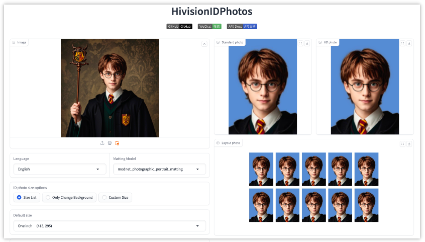
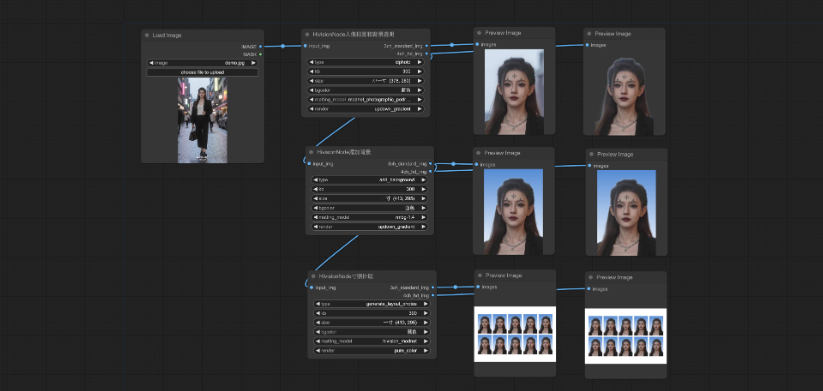
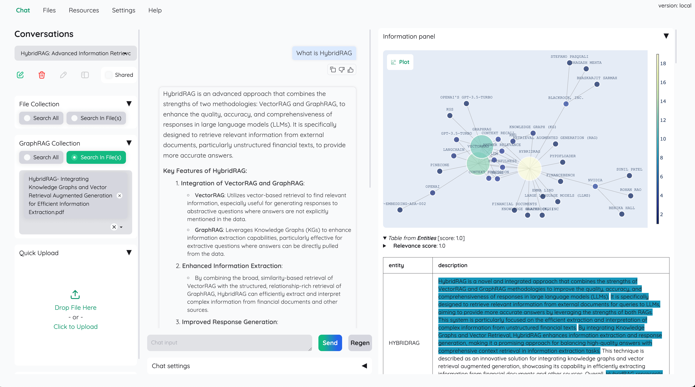
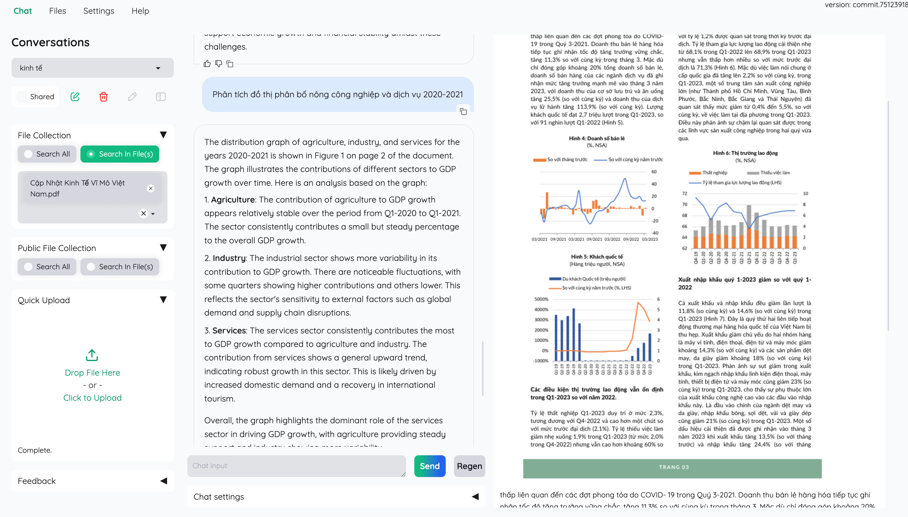
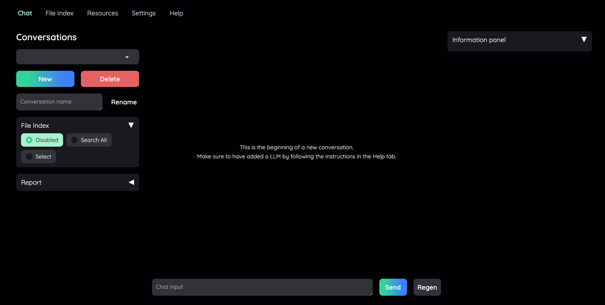
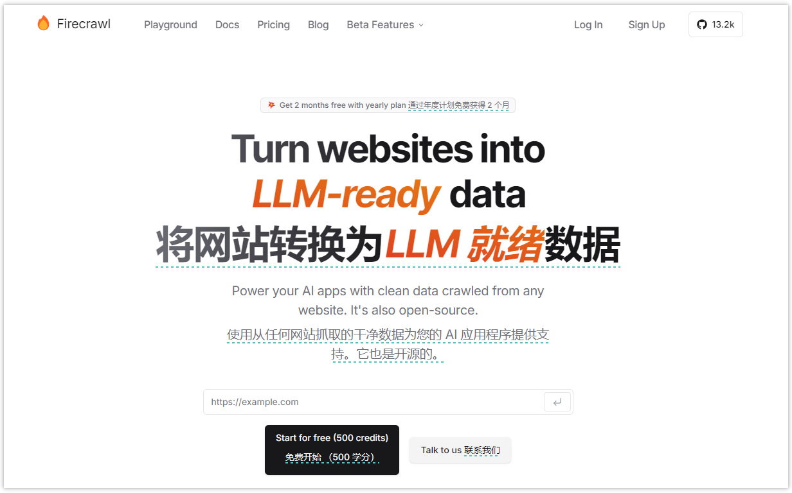
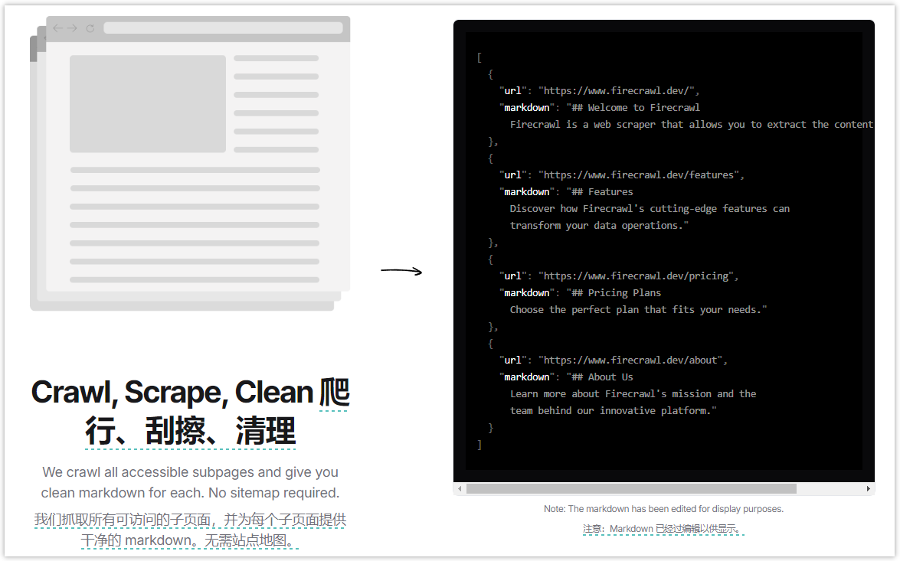
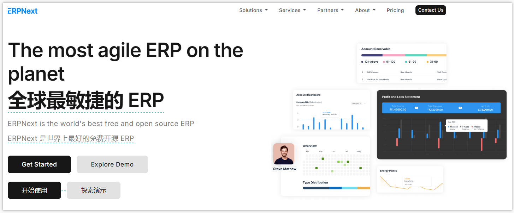
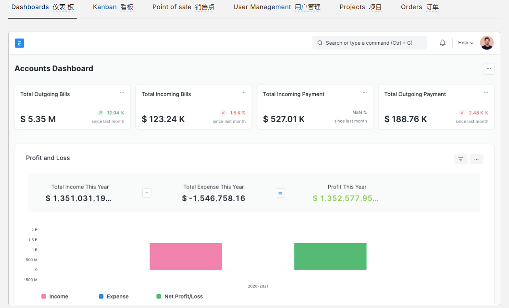
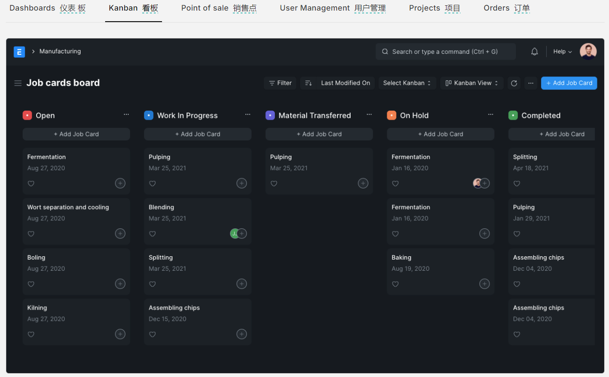

> GitHub一周热点汇总第35期 (2024.09.02-09.08)，梳理每周热门的GitHub项目，了解热点技术趋势，掌握前沿科技方向，发掘更多商机！


### 本期看点
1. HivisionIDPhotos：轻量级 AI 证件照制作神器，一键生成完美证件照
2. Kotaemon：一个基于 RAG 的开源工具，打造私人文档 Q&A 聊天神器
3. Firecrawl：智能网页抓取神器，一键将网站转换为 LLM 就绪的 markdown 或结构化数据
4. ERPNext：开启企业高效管理新时代，免费开源的 ERP 神器

### 1. Zeyi-Lin / HivisionIDPhotos

```text
🔥 本周 stars：6,488
🔨 语 言：Python
⭐ stars：7,455
🍴 fork：667
```

HivisionIDPhoto 旨在开发一种实用、系统性的证件照智能制作算法。它利用一套完善的AI模型工作流程，实现对多种用户拍照场景的识别、抠图与证件照生成。


HivisionIDPhoto 可以做到：
1. 轻量级抠图（纯离线，仅需 CPU 即可快速推理）
2. 根据不同尺寸规格生成不同的标准证件照、六寸排版照
3. 支持 纯离线 或 端云 推理
4. 美颜（waiting）
5. 智能换正装（waiting）






### 2. Cinnamon / kotaemon

```text
🔥 本周 stars：5,489
🔨 语 言：Python
⭐ stars：10,696
🍴 fork：749
```

kotaemon 提供了一个干净、可定制的 RAG UI。既可以面向终端用户提供文档问答（QA）的功能，也可以用于帮助开发者构建自己的 RAG 管道。


**面向终端用户**：
- 提供干净、简约的 RAG-based QA UI。
- 支持 LLM API （OpenAI、AzureOpenAI、Cohere 等）和本地 LLM（通过`ollama` 等）。
- 提供简单的安装脚本。
-**面向开发者**：
- 提供构建自己的 RAG-based 文档 QA 管道的框架。
- 可通过提供的 UI 自定义和查看 RAG 管道的运行情况（基于 Gradio 构建）。






### 3. mendableai / firecrawl

```text
🔥 本周 stars：1,550 
🔨 语 言：TypeScript
⭐ stars：13,163
🍴 fork：945
```

firecrawl 是一个能将整个网站转换为 LLM 就绪的 markdown 或结构化数据的工具。


Firecrawl 提供的 API 服务可以基于给定的 URL，对其进行抓取，并将其转换为干净的 markdown 或结构化数据。Firecrawl 能抓取所有可访问的子页面，并为每个子页面提供干净的数据，而无需站点地图。




### 4. frappe / erpnext

```text
🔥 本周 stars：688
🔨 语 言：Python
⭐ stars：19,837
🍴 fork：7,011
```

 erpnext 是一个免费且开源的企业资源规划（ERP）系统。项目基于 Frappe 框架构建，该框架是一个使用 Python 和 JavaScript 构建的全栈 Web 应用框架。



erpnext 提供了众多用于业务管理的功能，包括：会计、仓库管理、CRM、销售、采购、HRMS、项目管理、支持、资产管理、质量管理、制造、网站管理等功能。






以上就是本期的全部内容，有感兴趣的赶紧去试试吧！我是四阿哥，关注我不错过每一周的热点项目，也可以在我的[主页](https://siage.netlify.app/)查看往期的精彩内容！

