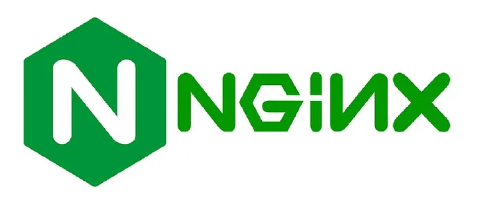
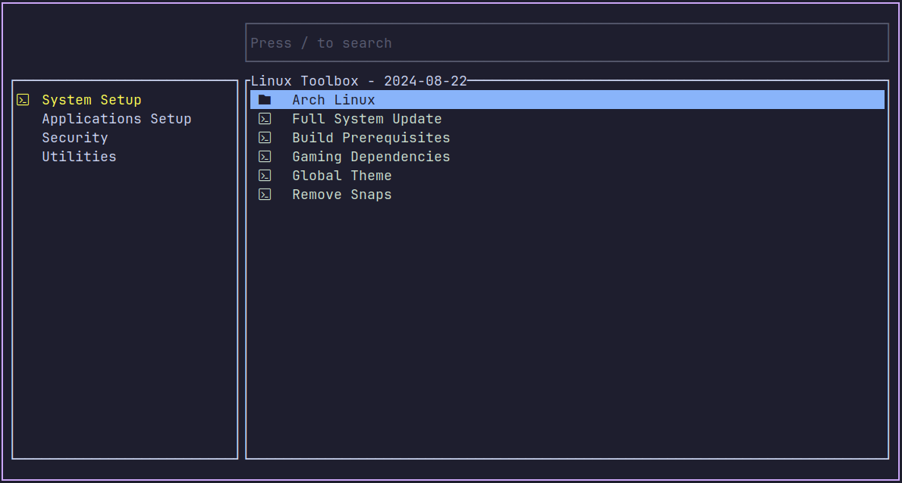

 

> GitHub一周热点汇总第37期 (2024.09.09-09.15)，梳理每周热门的GitHub项目，了解热点技术趋势，掌握前沿科技方向，发掘更多商机！


### 本期看点
1. 全球知名 Web 服务器 NGINX 宣布迁移至 GitHub 🔈，开启拥抱开源新纪元！
2. 全能 AI 应用 AnythingLLM，打造你的私人 ChatGPT，助力你的工作效率翻倍！
3. Linutil：一款 Linux用户的实用工具箱，简化日常任务，优化系统性能 🚀
4. 重塑你的 Windows 体验：Microsoft PowerToys，为专业用户打造的强大工具集⚙
5. Cursor AI 编辑器，让每个人都能成为编程高手，让编程更快速、更简单、更高效！


### 1. nginx / nginx

```text
🔥 本周 stars：2,468
🔨 语 言：C
⭐ stars：23,741
🍴 fork：6,840
```

全球知名的开源 Web 服务器软件 NGINX 近日宣布，将其开源开发存储库从 Mercurial 迁移至 GitHub，这一战略性举措标志着 NGINX 正式迈入更加现代化的开源协作时代。NGINX，作为全球最受欢迎的 Web 服务器之一，以其高性能和灵活性在全球数百万网站中得到广泛应用。



NGINX 团队承诺，为了确保平稳过渡，将在 2024 年 12 月 31 日前继续支持通过邮件列表接受补丁和社区支持。NGINX 的母公司 F5 强调，此次迁移体现了对开源事业的持续承诺，NGINX 将继续保持开源状态，并遵循 OSI 批准的开源许可证。


 

### 2. Mintplex-Labs / anything-llm

```text
🔥 本周 stars：1,873
🔨 语 言：JavaScript
⭐ stars：22,288
🍴 fork：2,256
```

AnythingLLM是一个 all-in-one 的 AI 应用。您可以使用现成的商业大语言模型或流行的开源大语言模型，再结合向量数据库解决方案构建一个私有ChatGPT，不再受制于人。

您可以将任何文档、资源（如网址链接、音频、视频）或内容片段转换为上下文，以便任何大语言模型（LLM）在聊天期间作为参考使用。您可以本地运行，也可以远程托管，并能够与您提供的任何文档智能聊天。


AnythingLLM 的主要功能特性：
- 工作区内的智能体Agent（浏览网页、运行代码等）
- 为您的网站定制的可嵌入聊天窗口
- 支持多种文档类型（PDF、TXT、DOCX等）
- 两种对话模式：聊天和查询。聊天模式保留先前的对话记录。查询模式则是是针对您的文档做简单问答


### 3. ChrisTitusTech / linutil

```text
🔥 本周 stars：922
🔨 语 言：Shell
⭐ stars：1,834 
🍴 fork：161
```

Linutil 是一个由Chris Titus Tech 开发的、基于 Rust 编写的 Linux 工具箱，旨在简化 Linux 用户的日常任务和系统优化工作。该项目提供丰富的实用工具，支持跨 Linux 发行版使用，并持续接收更新和改进。


Linutil 的开源特性和社区支持也使其成为一个值得推荐的Linux系统优化工具。



### 4. microsoft / PowerToys

```text
🔥 本周 stars：752
🔨 语 言：C#
⭐ stars：109,525
🍴 fork：6,453
```

Microsoft PowerToys 是一个功能强大的 Windows 系统增强工具集，提供了多种实用的工具来优化工作流程、提高工作效率和个性化系统体验。


PowerToys 提供了大量的系统实用工具，包括：
- **Awake**：防止系统进入睡眠模式。
- **Clipboard History**：提供剪贴板历史记录，方便快速访问之前复制的内容。
- **FancyZones**：通过自定义窗口布局管理器优化屏幕空间利用。
- **Image Resizer**：批量调整图片大小。
- **Keyboard Manager**：重映射键盘按键或创建快捷键组合。
- **PowerRename**：提供批量重命名文件的强大功能。
- **Quick Accent**：快速访问重音字符和其他特殊字符。
- **Shortcut Guide**：展示键盘快捷键的参考指南。
- ……


### 5. getcursor / cursor

```text
🔥 本周 stars：545
🔨 语 言：-
⭐ stars：23,175
🍴 fork：1,469
```

Cursor 是一款集成了大语言模型的 AI 代码编辑器，它通过 AI 辅助编程，旨在提高开发者的编程效率和代码质量。


Curosr 主要有以下核心功能特性：
- **AI 代码补全**：Cursor 提供了强大的自动补全功能，能够预测并建议代码编辑，不仅限于单行补全，还能进行多行编辑，帮助开发者快速完成代码编写。
- **智能聊天功能**：通过聊天界面，开发者可以直接向 AI 提出关于代码的问题，如询问代码中的错误或请求代码解释，AI 能够理解和回应，提供即时的编程辅助。
- **多文件编辑**：Cursor 的实验性功能 Composer 允许开发者通过自然语言指令，让 AI 帮助实现项目中的多个文件代码，甚至可以从零开始构建一个完整的项目。
- **个性化设置**：Cursor 支持导入 VS Code 的设置、主题和扩展，允许用户根据个人喜好和工作流程定制编辑器。
- **隐私模式**：考虑到代码安全性，Cursor 提供了隐私模式，用户可以选择不在服务器上存储代码，确保数据安全。
- **多模型支持**：Cursor 支持多种 AI 模型，用户可以根据需要选择不同的模型来辅助编程，这些模型包括 OpenAI 的 GPT-4、Claude 3.5 等。
- **错误检测与修复**：Cursor 能够实时分析代码，识别潜在错误，并提供修复建议，帮助开发者提高代码的准确性。
- **代码生成**：用户可以通过简单的自然语言描述来请求 AI 生成新的代码片段，从而减少手动编码的工作量。


以上就是本期的全部内容，有感兴趣的赶紧去试试吧！我是四阿哥，关注我不错过每一周的热点项目，也可以在我的[主页](https://siage.netlify.app/)查看往期的精彩内容！
