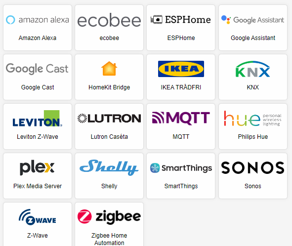

> GitHub一周热点汇总第38期 (2024.09.16-09.22)，梳理每周热门的GitHub项目，了解热点技术趋势，掌握前沿科技方向，发掘更多商机！


### 本期看点
1. eCapture：基于eBPF的通信数据捕获利器，安全分析的得力助手!
2. 零成本高质量！自学计算机的福音，来自 OSSU 的免费计算机科学课程🎓！
3. 一站式 CRM 解决方案，Krayin Laravel CRM 让客户关系管理变得简单而高效！
4. Home Assistant：🏠轻松打造易于集成、安全、隐私的智能家居中枢！


### 1. gojue / ecapture

```text
🔥 本周 stars：2,489
🔨 语 言：Go
⭐ stars：12,589
🍴 fork：1,333
```

eCapture 是一款基于 eBPF 技术实现的用户态数据捕获工具。不需要CA证书，即可捕获 HTTPS/TLS 的通讯明文。使用 Golang 语言开发，具有良好的系统兼容性，无依赖快速部署，更适合云原生场景。

eCapture 的主要功能特性：
1. 不需要CA证书，即可捕获HTTPS/TLS通信数据的明文。
2. 在bash审计场景，可以捕获bash命令。
3. 数据库审计场景，可以捕获mysqld/mariadDB的SQL查询。


### 2. ossu / computer-science

```text
🔥 本周 stars：1,827
🔨 语 言：-
⭐ stars：170,101
🍴 fork：21,463
```

OSSU（Open Source Society University）的计算机科学课程是一个完整的在线计算机科学教育体系，旨在通过全球学习社群的支持，为自学者提供全面且深入的计算机科学基础知识。


课程由浅入深，主要可以分为 3 个部分：
- **Intro CS**：引导学生进入计算机科学领域，适合初学者尝试并判断是否适合继续深入学习。
- **Core CS**：对应计算机科学本科前三年的核心课程，包括编程基础、数据结构与算法、系统编程等。
- **Advanced CS**：对应本科最后一年的选修课程，学生可根据兴趣选择深入学习某一领域，如高级编程、机器学习等。

课程的内容涵盖了从编程语言、数据结构与算法、软件开发到人工智能等各个学科领域，内容详实且非常全面。并且制定了完善的学习计划，非常适合自学者循序渐进地学习计算机。


### 3. krayin / laravel-crm

```text
🔥 本周 stars：1,138
🔨 语 言：Blade
⭐ stars：10,192
🍴 fork：658
```

Krayin Laravel CRM是一个专为中小企业（SMEs）和大型企业设计的免费且开源的客户关系管理（CRM）解决方案。项目基于Laravel（PHP框架）和 Vue.js（渐进式JavaScript框架）等热门开源技术构建。


项目的核心功能包括：
- **模块化设计**：采用模块化方法构建，便于扩展和维护。
- **管理面板**：提供描述性和简单的管理面板，包括自定义属性、电子邮件解析（通过Sendgrid）等功能。
- **集成功能**：支持WhatsApp CRM集成和VoIP CRM集成，增强客户互动和通信能力。


### 4. home-assistant / core

```text
🔥 本周 stars：509
🔨 语 言：Python
⭐ stars：71,629
🍴 fork：29,930
```


Home Assistant Core 是一个活跃的开源家庭自动化项目，强调本地控制和隐私保护。它采用模块化设计，易于扩展和集成新设备。可以非常方便地在 Raspberry Pi 或本地服务器上部署。





以上就是本期的全部内容，有感兴趣的赶紧去试试吧！我是四阿哥，关注我不错过每一周的热点项目，也可以在我的[主页](https://siage.netlify.app/)查看往期的精彩内容！
