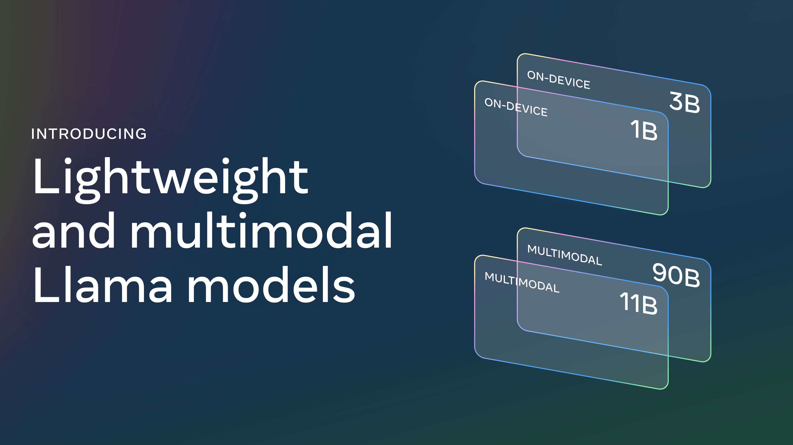
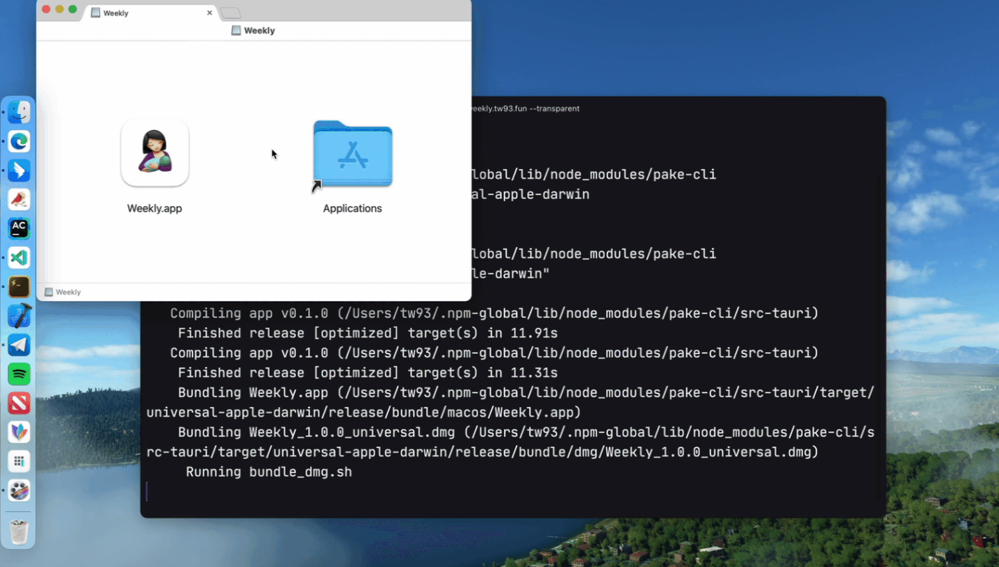
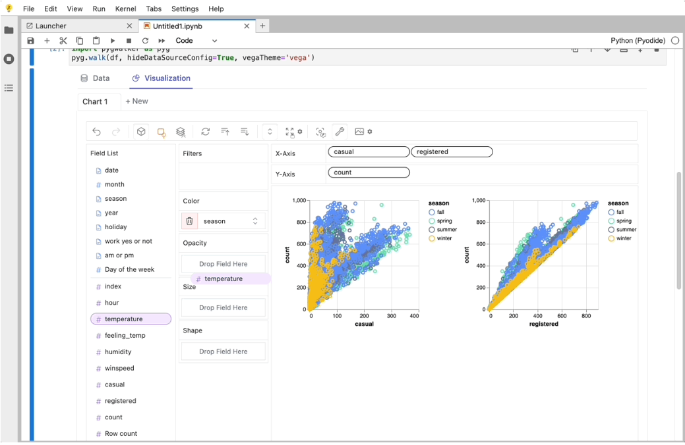
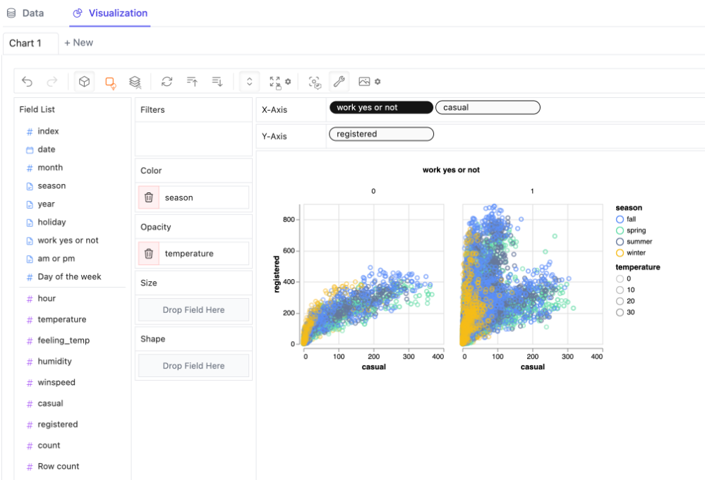
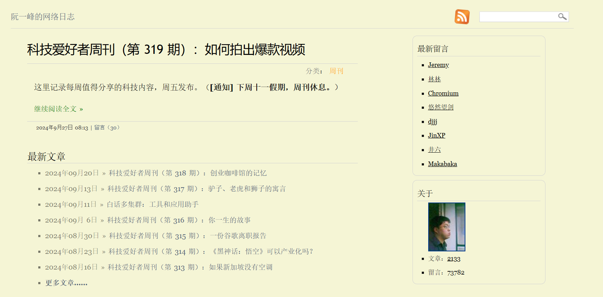

> GitHub一周热点汇总第39期 (2024.09.23-09.29)，梳理每周热门的GitHub项目，了解热点技术趋势，掌握前沿科技方向，发掘更多商机！

### 本期看点
1. 一站式API服务：Llama Stack 助力 AI 大模型开发提效
2. Pake：轻松将网页秒变桌面应用的神奇工具
3. PyGWalker: 一行代码将数据集转化为交互式可视化分析工具
4. 《科技爱好者周刊》——技术爱好者的每周必读手册

### 1. meta-llama / llama-stack

```text
🔥 本周 stars：1,601
🔨 语 言：Python
⭐ stars：2,134
🍴 fork：221
```

Llama Stack 是近期由 Meta 推出的，随着最新的 Llama 3.2 模型一起发布的一套标准化接口。它旨在简化大型语言模型（LLMs）的开发和部署流程。它允许开发者方便地在不同的环境和设备上使用 Llama 模型，包括云端、本地、单节点服务器和终端设备。Llama Stack包括了命令行界面（CLI）、多语言客户端代码、以及多种发行版，如单节点、云端和设备端等。


Llama Stack的推出，是为了配合Meta最新的Llama 3.2模型系列。Llama 3.2系列包括了1B、3B、11B和90B四个版本的模型，其中11B和90B版本支持多模态能力，能够处理图像和文本数据，而1B和3B则是轻量级模型，专为边缘和移动设备设计，能够在设备上本地运行，提供强大的隐私保护。


### 2. tw93 / Pake

```text
🔥 本周 stars：1,551 
🔨 语 言：Rust
⭐ stars：28,010
🍴 fork：4,929
```

Pake 是一个轻量级的桌面应用程序构建工具，基于 Rust 和 Tauri 技术栈打造。它旨在帮助开发者轻松地将网页转换为跨平台的应用程序，支持macOS、Windows和Linux操作系统。


Pake 的特点包括：
- 🎐 相比传统的 Electron 套壳打包，要小将近 20 倍，5M 上下。
- 🚀 Pake 的底层使用的 Rust Tauri 框架，性能体验较 JS 框架要轻快不少，内存小很多。
- 📦 不是单纯打包，实现了快捷键的透传、沉浸式的窗口、拖动、样式改写、去广告、产品的极简风格定制。
- 👻 只是一个很简单的小玩具，用 Tauri 替代之前套壳网页打包的老思路，其实 PWA 也很好。


### 3. Kanaries / pygwalker

```text
🔥 本周 stars：1,458
🔨 语 言：Python
⭐ stars：12,652
🍴 fork：656
```

PyGWalker 是个在 Jupyter Notebook 环境中运行的可视化探索式分析工具，仅一条命令即可生成一个可交互的图形界面，以类似 Tableau/PowerBI 的方式，通过拖拽字段进行数据分析。

过去在python中进行数据可视化分析时，经常需要查询大量的可视化类的代码，并编写胶水代码将其应用在数据集上。PyGWalker的目标是通过一行代码，将数据集转化为一个可视化分析工具，只需拖拉拽即可生成图表，从而减少数据分析师在数据可视化上的时间成本。






### 4. ruanyf / weekly

```text
🔥 本周 stars：1,276
🔨 语 言：-
⭐ stars：46,635
🍴 fork：2,835
```

weekly 是阮一峰的《科技爱好者周刊》的官方仓库。《科技爱好者周刊》是一个每周五发布的科技内容分享平台，它记录了每周值得分享的科技内容。该周刊是开源的，欢迎读者投稿，并且还有一个《谁在招人》的服务，专门发布程序员的招聘信息。周刊的内容涵盖了科技动态、文章、工具等多个方面，旨在为科技爱好者提供有价值的信息。

投稿，推荐或自荐文章等可以通过提 issue 的方式来进行。


以上就是本期的全部内容，有感兴趣的赶紧去试试吧！我是四阿哥，关注我不错过每一周的热点项目，也可以在我的[主页](https://siage.netlify.app/)查看往期的精彩内容！