> GitHub一周热点汇总第40期 (2024.09.30-10.06)，梳理每周热门的GitHub项目，了解热点技术趋势，掌握前沿科技方向，发掘更多商机！

### 本期看点
1. Crawl4AI：开源、高效，基于 AI 大型语言模型打造的数据爬取神器
2. 全天候屏幕录制工具 Screenpipe，用AI解锁屏幕和音频数据的无限可能
3. The Algorithms：GitHub 上最大的开源算法库，全面覆盖各类算法实现！
4. exo 让旧设备焕发新机！用你的 iPhone、iPad、Android 设备打造私人 AI 集群


### 1. unclecode / crawl4ai

```text
🔥 本周 stars：6,647
🔨 语 言：Python
⭐ stars：11,686
🍴 fork：818
```

Crawl4AI 是一个专为大语言模型（LLMs）和人工智能（AI）应用设计的开源网页爬虫和数据提取工具。它通过简化网页爬取和数据提取流程，使得数据获取变得更加高效和便捷。Crawl4AI  完全免费开源，且高性能，输出格式对 LLM 友好，支持多种安装和部署方式。

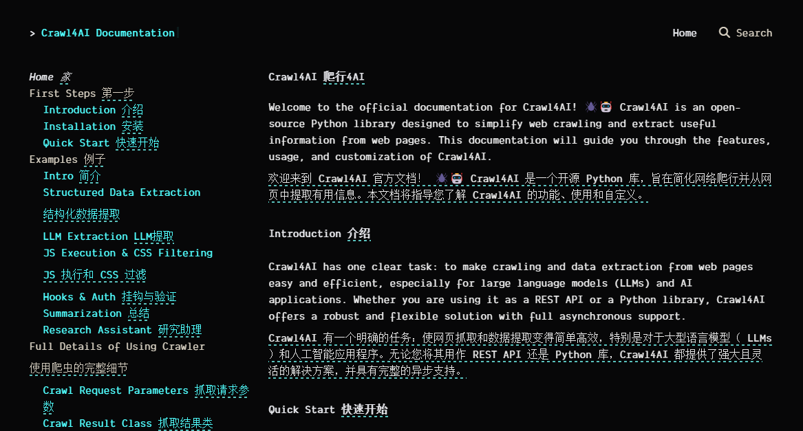

下面是 Crawl4AI 的一些核心特性：
- **媒体标签提取**：能提取图片、音频和视频等媒体标签。
- **链接提取**：提取所有外部和内部链接。
- **元数据提取**：从页面提取元数据。
- **自定义钩子**：支持认证、头部信息和页面修改等自定义操作。
- **用户代理定制**：支持用户代理的自定义设置。
- **页面截图**：支持对页面进行截图。
- **自定义JavaScript执行**：在爬取前执行多个自定义JavaScript。
- **结构化输出**：无需LLM即可生成结构化输出。
- **分块策略**：支持基于主题、正则表达式、句子等多种分块策略。
- **高级提取策略**：支持余弦聚类、LLM等高级提取策略。

下面是一个简单的爬取 NBC 新闻网站的代码示例。输出结果为爬取网站的 Markdown 格式（仅展示部分结果）。


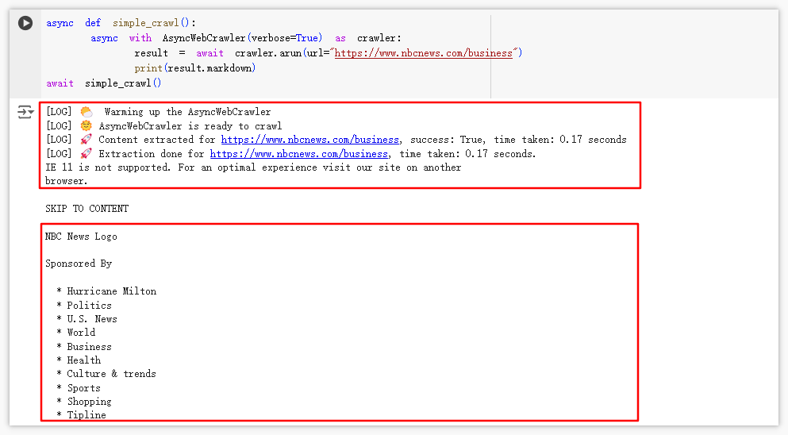


### 2. mediar-ai / screenpipe

```text
🔥 本周 stars：4,578
🔨 语 言：Rust
⭐ stars：6,918 
🍴 fork：361
```

Screenpipe 是一个创新的开源 AI 工具。它能 7 x 24 小时录制用户的屏幕内容和音频。并将这些数据与人工智能（AI）技术相结合，以实现各种个性化的AI应用场景。


例如，个人可以用 Screenpipe 来快速生成日常活动和学习笔记的智能摘要，从而提高个人生产力。或者用于在线面试、线上会议的自动记录。企业可以用 Screenpipe  来监控企业内部活动，预防安全风险和确保合规性。

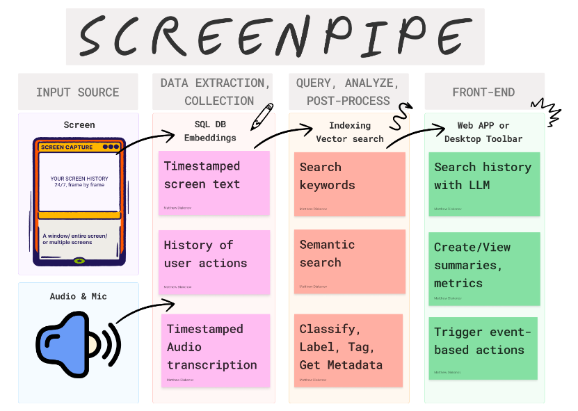

下面是Screenpipe的一些关键特性：
- **全天候屏幕和音频捕获**：Screenpipe能够不间断地记录用户的屏幕和音频活动，并将数据安全地存储在本地设备上
- **支持多平台**：它支持MacOS、Windows和Linux操作系统
- **AI驱动的数据魔法**：Screenpipe利用AI技术处理和分析捕获的数据，例如自动生成会议摘要、日常活动报告等
- **插件系统**：Screenpipe支持灵活的插件系统，允许开发者使用TypeScript创建自定义功能，这些插件在Deno运行时中运行，以扩展功能

借助大模型可以对录制的内容进行问答和总结。

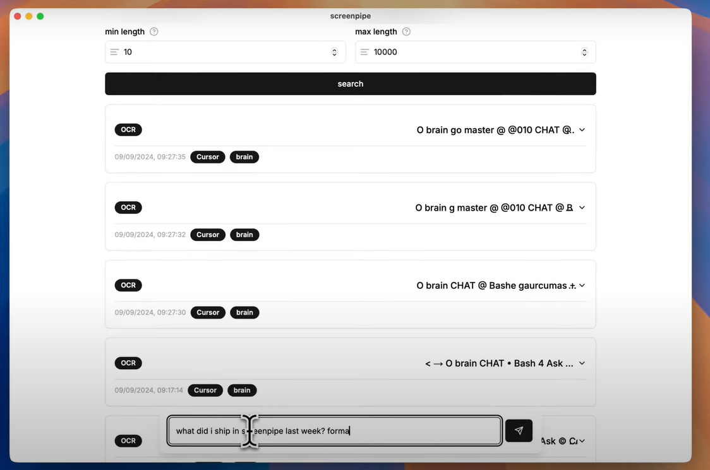

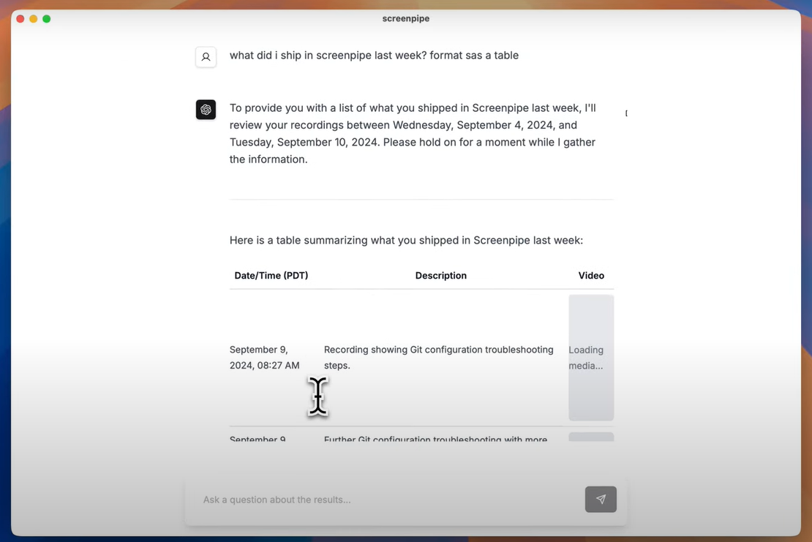

### 3. TheAlgorithms / Python

```text
🔥 本周 stars：4,053 
🔨 语 言：Python
⭐ stars：189,924
🍴 fork：44,982
```

TheAlgorithms / Python 是一个开源项目，它提供了一个全面的使用 Python 语言实现的算法库。这个项目旨在帮助开发者和学生解决常见的算法问题，并提供一个学习和实验算法的平台。

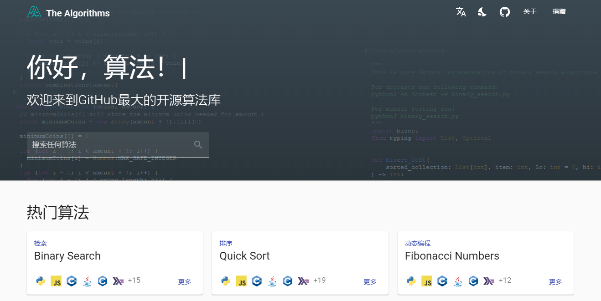

以下是该项目的一些主要特性：
- **广泛的算法覆盖**：算法涵盖了排序、搜索、图论、动态规划、机器学习、密码学、神经网络等多个领域的算法实现。
- **高质量的代码实现**：算法的实现考虑了效率和可读性，适合学习和实际使用。
- **详尽的文档和示例**：项目提供了详尽的文档和示例代码，便于用户理解和使用。
- **清晰的目录结构**：项目采用了清晰且逻辑分明的目录结构来组织不同类型的算法和数据结构，如排序(`Sorting`)、搜索(`Searching`)等。
- **多种编程语言支持**：虽然项目主要关注 Python，但它是更广泛的 The Algorithms 项目的一部分，该项目支持多种编程语言的算法实现。

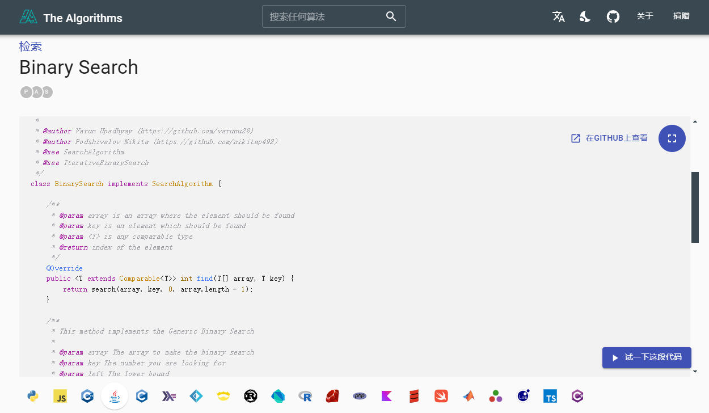

### 4. exo-explore / exo

```text
🔥 本周 stars：2,172
🔨 语 言：Python
⭐ stars：9,738 
🍴 fork：520
```

Exo 是一个创新的开源项目，它允许用户将日常设备如 iPhone、iPad、Android 设备、Mac 和 Linux 电脑等整合成一个强大的 AI 集群，从而实现高性能计算。这个项目的主要目标是提供一种经济高效的方式来运行大型 AI 模型，而不需要依赖昂贵的 NVIDIA GPU。

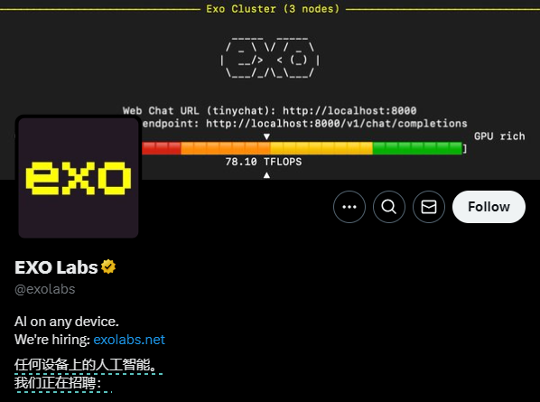

以下是 Exo 的一些核心特性和价值：
- **广泛的模型支持**：Exo 支持多种流行的 AI 模型，包括 LLaMA 等，并通过 MLX 和 tinygrad 两种不同的实现方式来支持这些模型 。
- **动态模型分区**：Exo 能够根据当前网络拓扑和可用设备资源自动优化模型的分割，允许用户运行比单个设备内存更大的模型 。
- **自动设备发现**：Exo 可以自动发现网络中的其他设备，并将它们纳入计算集群，实现了即插即用的特性 。
- **ChatGPT 兼容 API**：Exo 提供了一个与 ChatGPT 兼容的 API，使得开发者只需一行代码的改动，就可以将原本调用 ChatGPT 的应用迁移到 Exo 上 。
- **设备平等性**：Exo 采用了点对点（P2P）的连接方式，而非主从架构，确保了网络中每个设备的重要性，并充分发挥了所有硬件的潜力 。
- **支持多种推理引擎**：Exo 支持 MLX 和 tinygrad 作为推理引擎，并且对 llama.cpp 的适配工作也正在进行中 。
- **网络模块支持**：Exo 支持 GRPC 网络模块，并且正在开发 Radio 和 Bluetooth 模块 。
- **应用场景广泛**：Exo 可以用于个人 AI 助手、小型企业 AI 解决方案、教育和研究、创意产业以及家庭自动化等多个领域 。

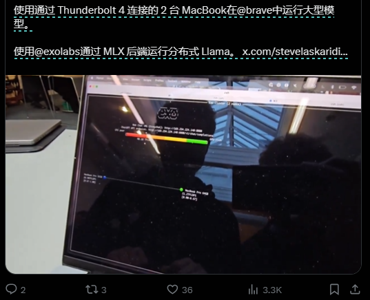

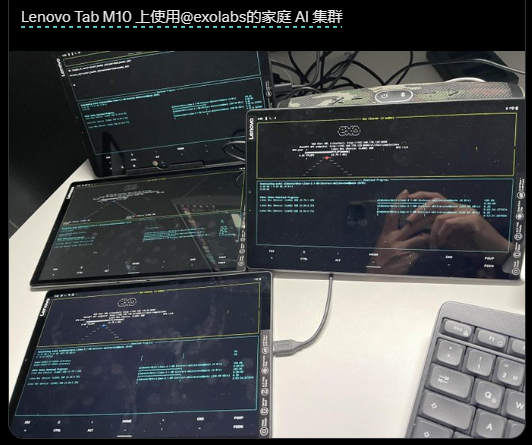

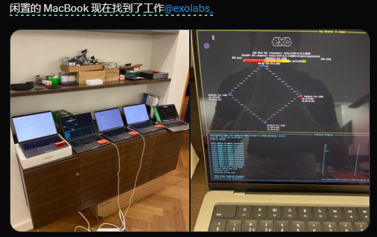


以上就是本期的全部内容，有感兴趣的赶紧去试试吧！我是四阿哥，关注我不错过每周的热门开源项目！也可以在我的[主页](https://siage.netlify.app/)查看往期的精彩内容！


