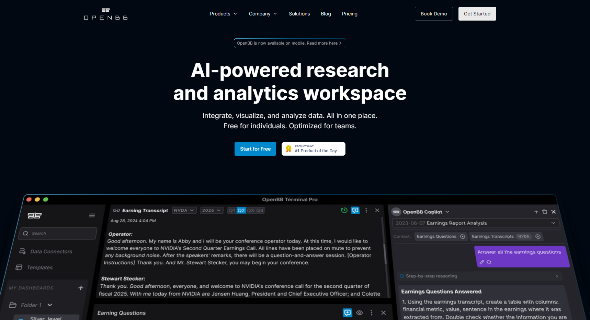
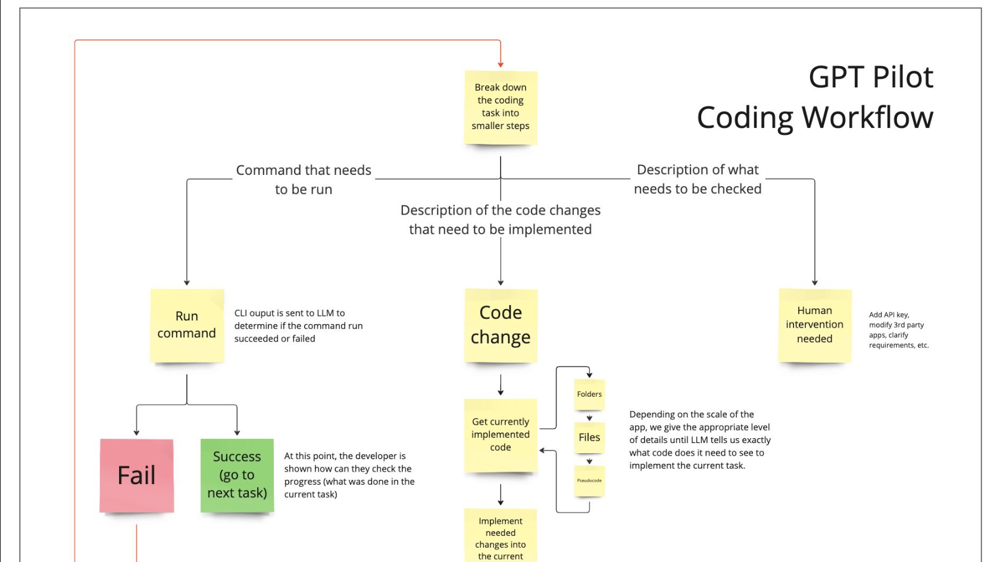

> 👋大家好，我是四阿哥！欢迎阅读 GitHub 周刊第42期 (2024.10.14-10.20)。【GitHub 周刊】专栏旨在收集每周热门的 GitHub 项目，帮助大家了解技术趋势，掌握前沿科技方向，发掘潜在商机！

### 本期看点
1. 简化开发，加速创新：LiveKit Agents，让实时通信 AI 应用的开发更加高效！
2. Taipy，让数据讲故事，用 Python 一站式构建数据驱动的 Web 应用！
3. OpenBB，让复杂的金融分析变得简单直观，将数据科学和机器学习带入您的投资工具箱！
4. 让 AI 来完成 95% 的代码，gpt-pilot，您的个人 AI 开发助手！


### 1. 3b1b / manim

```text
🔥 本周 stars：1,947
🔨 语 言：Python
⭐ stars：3,224
🍴 fork：320
```

LiveKit Agents 旨在提供一系列代理服务，用于增强实时通信应用的功能性和灵活性。这些代理服务不仅包括参与者的连接管理，还可能涉及录制、转码、身份验证等多个方面，使得开发者能够更便捷地构建高质量的音视频交互应用。通过LiveKit Agents，开发者可以利用已封装好的组件加速开发流程，无需从零开始搭建复杂的实时通讯架构。


简单来说，LiveKit Agents 可以用来帮助你高效地构建类似 AI 语音助手、聊天机器人等诸如此类的实时交互应用。

LiveKit Agents 主要包含以下功能特性：
- **插件生态系统**：提供预构建的插件，与 OpenAI、DeepGram、Google、ElevenLabs 等流行服务的集成。
- **实时音频/视频传输**：基于LiveKit 的基础设施，实现客户端设备到服务器的实时音频和视频传输。
- **简化的抽象层**：为常见的任务（如语音识别、文本到语音转换、使用大型语言模型）提供简化的接口。
- **端到端开发体验**：支持本地开发和无缝部署到生产环境，包括 LiveKit 服务器和 LiveKit Cloud。
- **编排和扩展**：内置的工作服务支持 agent 编排和负载均衡，便于横向扩展。
- **边缘优化**：基于LiveKit Cloud 的全球边缘网络，减少延迟，提高推理时间。

使用 STT、 LLM和 TTS 管道的基本语音代理


使用 Cerebras 托管的 Llama 3.1 的超快速语音代理


### 2. Avaiga / taipy

```text
🔥 本周 stars：1,020
🔨 语 言：Python
⭐ stars：13,475 
🍴 fork：1,465
```

Taipy 是一款用于 UI 生成、场景/数据管理的二合一工具。它专为数据科学家和机器学习工程师构建数据和 AI Web 应用程序而设计。
Taipy通过提供一套丰富的工具和组件，使开发者能够快速构建和维护复杂的业务逻辑和数据交互界面。这意味着你可以使用 Python 这一种语言来同时构建前后端应用，甚至都不需要太多的前端知识。


Taipy 的主要特性包括：
- **用户界面生成**：Taipy GUI库提供了Python类，可以轻松创建强大的Web应用程序。它支持使用Markdown或HTML语法来定义页面内容，并提供了丰富的可视化控件，如图表、表格、按钮等，使得开发人员可以快速构建交互式仪表板。
- **场景和数据管理**：Taipy Core提供了强大的后端功能，包括场景管理、数据节点、任务调度等。这使得开发人员可以轻松处理复杂的数据流和业务逻辑。
- **大数据支持**：Taipy内置了对大数据集的支持。例如，它为图表提供了decimator功能，可以智能地减少数据点数量，在保持数据形状的同时节省时间和内存。
- **集成能力**：Taipy可以轻松与领先的数据平台集成，如Databricks、Dataiku、Google Colab和AWS SageMaker等，使得它可以成为现有数据基础设施的强大补充。
- **可视化编辑器**：提供一个直观的界面来设计和调整应用的布局和元素。
- **数据绑定**：允许开发者直接将界面组件与数据模型绑定，实现自动更新。
- **模块化开发**：支持模块化的开发方式，方便管理大型应用的不同部分


### 3. OpenBB-finance / OpenBB

```text
🔥 本周 stars：745
🔨 语 言：Python
⭐ stars：32,315
🍴 fork：2,962
```

OpenBB 是一个开源的金融平台，旨在帮助人们进行投资研究。它提供了一个名为 OpenBB Terminal 的交易终端软件，这是一个基于 Python 的高颜值命令行投资分析工具。它允许用户在终端中查看金融市场行情和进行分析，支持股票、虚拟货币、ETF 等多种金融资产。



下面是 OpenBB 的主要功能和特性：
- **多平台支持**：OpenBB Terminal 可以连接多个交易平台，如 Binance、Huobi、OKEx 等，提供多种交易对。
- **易于配置**：用户可以通过简单的配置创建多种交易策略和自定义交易规则。
- **自动化交易**：提供自动化下单功能，帮助用户更轻松地进行交易，减少错误。
- **多种监视器和指标**：提供多种监视器和指标，如移动均线、MACD、KDJ 等，帮助用户分析市场趋势。
- **多种报告**：能够生成交易日报告、实时交易报告等多种报告。
- **数据科学和机器学习支持**：作为一个现代的基于 Python 的环境，OpenBB Terminal 提供了对数据科学和机器学习库的访问，如 Pandas、Numpy、Scipy、Jupyter，以及 Pytorch、Tensorflow、Sklearn 等。


### 4. Pythagora-io / gpt-pilot

```text
🔥 本周 stars：700
🔨 语 言：Python
⭐ stars：31,230
🍴 fork：3,140
```

gpt-pilot 是一个由 Pythagora-io 开发的开源 AI 开发助手项目，它的目标是成为“第一个真正的 AI 开发者”。项目旨在通过 AI 帮助开发者更高效地构建应用程序。项目的作者认为，AI 可以为应用程序编写大部分代码（也许 95%），但对于其余的 5%，在我们获得完整的 AGI 之前，现在和将来都需要开发人员。


以下是 gpt-pilot 的一些核心功能和特性：
- **真正的AI开发者伴侣**：gpt-pilot 不仅仅是一个自动完成工具或PR消息助手，它能够编写完整的功能、调试代码、与开发者讨论问题并请求代码审查。
- **高效的开发流程**：gpt-pilot 通过定义AI代理来模拟应用程序开发的每个步骤，包括产品经理、规格撰写、架构师、技术主管、开发者、代码编写、审阅者、故障排除、调试和技术文档撰写等，每个代理负责开发过程中的特定任务，共同协作完成应用程序的构建。
- **快速开始**：如果使用 VS Code，可以通过下载 GPT Pilot VS Code 扩展来快速开始。对于 CLI 用户，可以通过克隆仓库、创建虚拟环境、安装依赖、设置配置文件和启动 GPT Pilot 来进行操作。
- **高效的代码生成**：gpt-pilot 的目标是研究在开发人员监督实施的同时，GPT-4 可在多大程度上用于生成可完全正常运行、可投入生产的应用程序。它能够为应用程序编写大部分代码（可能是 95%），但对于剩下的 5%，在实现完全的通用人工智能（AGI）之前，开发者的参与仍然是必需的。
- **易于使用和部署**：gpt-pilot 提供了详细的命令行指南，以便在不同的开发环境中使用和管理。它支持 Docker 部署，适用于需要在隔离环境中运行或测试的场景。




以上就是本期的全部内容，有感兴趣的赶紧去试试吧！我是四阿哥，关注我不错过每周的【GitHub 周刊】！也可以在我的[主页](https://siage.netlify.app/)查看更多往期的精彩内容！


