> 👋大家好，我是四阿哥！欢迎阅读 GitHub 周刊第44期 (2024.10.28-11.03)。【GitHub 周刊】专栏旨在收集每周热门的 GitHub 项目，帮助大家了解技术趋势，掌握前沿科技方向，发掘潜在商机！

### 本期看点
1. Skyvern：基于 AI 大模型和计算机视觉的浏览器工作流，轻松实现智能自动化。
2. llama-recipes：Meta  官方出品的 Llama 模型微调和应用构建指南。
3. ToolJet：强大的开源低代码框架，通过拖拽构建应用，支持 50+ 数据源，快速构建和部署企业工具。
4. Zerox：一个开源的 OCR 工具，利用大模型轻松将 PDF 等文件转化为 Markdown 格式。


### 1. Skyvern-AI / skyvern

```text
🔥 本周 stars：1,947
🔨 语 言：Python
⭐ stars：3,224
🍴 fork：320
```

Skyvern 是一个基于 LLM（大模型）和计算机视觉的浏览器自动化工作流。

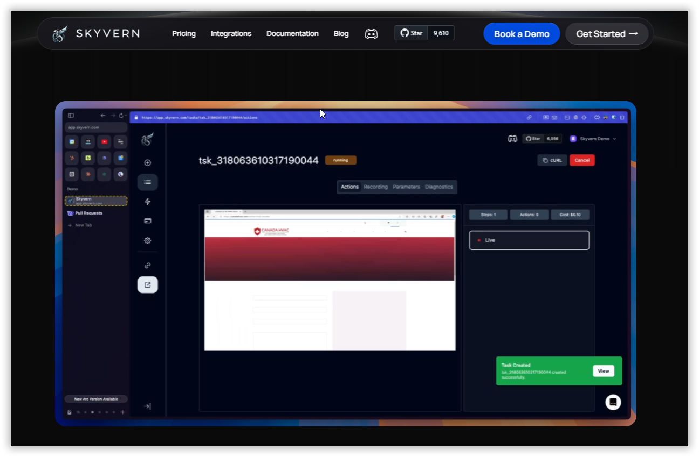

传统的浏览器自动化方法需要为网站编写自定义脚本，通常依赖于 DOM 解析和基于 XPath 的交互，每当网站布局发生变化时，这些交互就会中断。
Skyvern 不仅依赖代码定义的 XPath 交互，还依赖提示以及计算机视觉和 LLMs 来实时解析视区中的项目，创建交互计划并与之交互。

Skyvern 具有以下特点：
- **无需定制代码**：Skyvern能够在无需任何定制代码的情况下，自动化多个网站上的手动工作流程。
- **抵抗网站布局变化**：由于Skyvern不依赖预定义的XPath或其他选择器，它不会受到网站布局变化的影响。
- **跨网站工作流应用**：Skyvern能够将单一工作流应用于大量网站，因为它能够理解完成工作流所需的交互。
- **复杂情况处理**：Skyvern利用LLMs推理交互，以确保能够覆盖复杂情况。
- **使用场景**：Skyvern可以应用于多种场景，包括保险报价获取、竞争对手分析、发票下载、工作申请和材料采购等。
- **API端点**：Skyvern提供了一个简单的API端点来完全自动化网站上的手动工作流。用户可以通过创建任务（Tasks）和工作流（Workflows）来指导Skyvern完成特定的目标。

项目原理图。
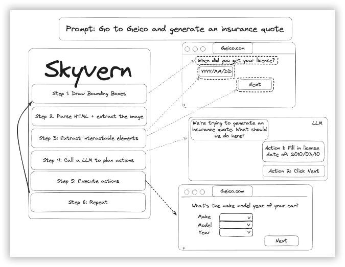

项目还提供了大量的真实的使用案例。

在不同网站上下载发票。


自动化投简历。
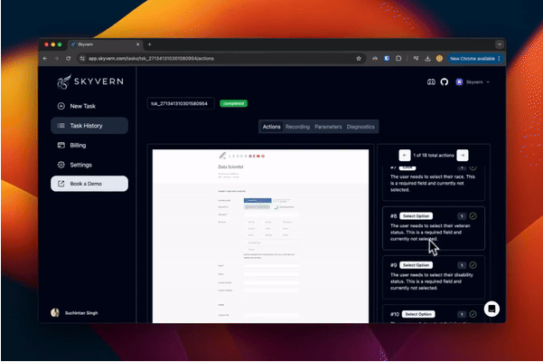

实现采购自动化。
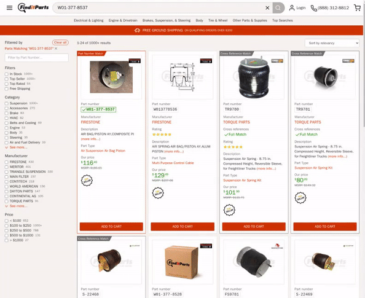


### 2. meta-llama / llama-recipes

```text
🔥 本周 stars：1,947
🔨 语 言：Python
⭐ stars：3,224
🍴 fork：320
```

llama-recipes 是 Meta 为 Llama 模型系列推出的配套工具库，旨在帮助开发者快速上手 Llama 模型的微调和应用。

仓库中包含了大量的示例脚本和笔记，这些资源可以帮助用户在不同的应用场景中开始使用 Llama 模型。包括了微调模型以适应特定领域的指南，以及如何结合 Llama 模型和其他 LLM（大型语言模型）生态系统中的工具来构建应用程序。

快速入门指南。
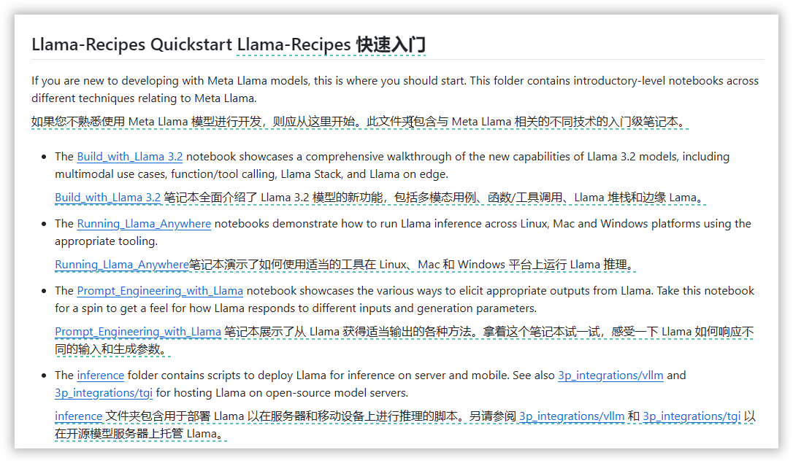

Llama3 的常见用例。
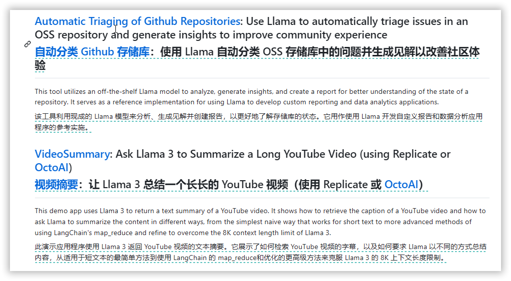


### 3. ToolJet / ToolJet

```text
🔥 本周 stars：1,947
🔨 语 言：Python
⭐ stars：3,224
🍴 fork：320
```

ToolJet 是一个开源的低代码框架，旨在帮助开发者和企业快速构建和部署内部工具。ToolJet 提供了一个拖放式的前端构建器，用户可以在几分钟内创建复杂、响应迅速的前端。此外，ToolJet 支持连接到多种数据源，包括数据库（如 PostgreSQL、MongoDB、MS SQL Server、Snowflake、BigQuery 等）、API/GraphQL 端点、SaaS 工具（如 Airtable、Google Sheets 等）以及云对象存储服务（如 AWS S3、Google Cloud Storage 和 Minio）。

以下是ToolJet的一些核心功能和特性：
- **可视化应用构建器**：ToolJet 提供了一个拖放式的前端构建器，允许用户通过45个预构建组件快速创建复杂的应用程序。
- **数据源集成**：ToolJet 支持连接到多种数据源，包括数据库（如 PostgreSQL、MongoDB、MS SQL Server、Snowflake、BigQuery 等）、API/GraphQL 端点、SaaS 工具（如 Airtable、Google Sheets 等）以及云对象存储服务（如 AWS S3、Google Cloud Storage 和 Minio）。
- **内置数据库**：ToolJet DB 是 ToolJet 的内置数据库，建立在 PostgreSQL 之上，支持无代码数据库管理。
- **业务逻辑编写**：用户可以使用 JavaScript 或 Python 编写业务逻辑或与应用程序的用户界面交互的查询。
- **工作流自动化**：ToolJet 简化了复杂手动业务流程的自动化，减少了所需的工程工作量。
- **企业级安全性**：ToolJet 设计了先进的安全功能和可扩展的基础设施，以满足企业团队的需求。
- **单点登录（SSO）支持**：ToolJet 支持多种 SSO 提供商，包括 Okta、Google、Azure AD 和 OpenID Connect。
- **多环境支持**：ToolJet 允许创建和管理多个环境，以高效地管理应用程序的生命周期。

可视化的应用构建。
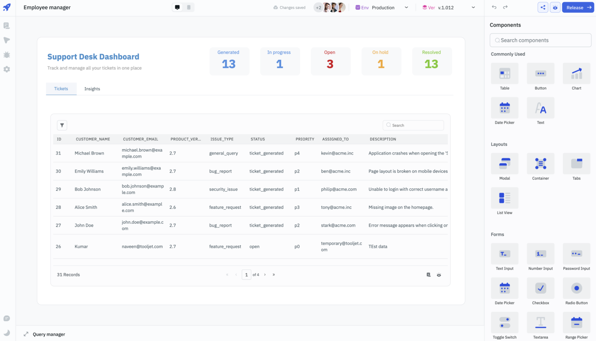

集成数据源（支持 50+ 数据库和应用的集成）。
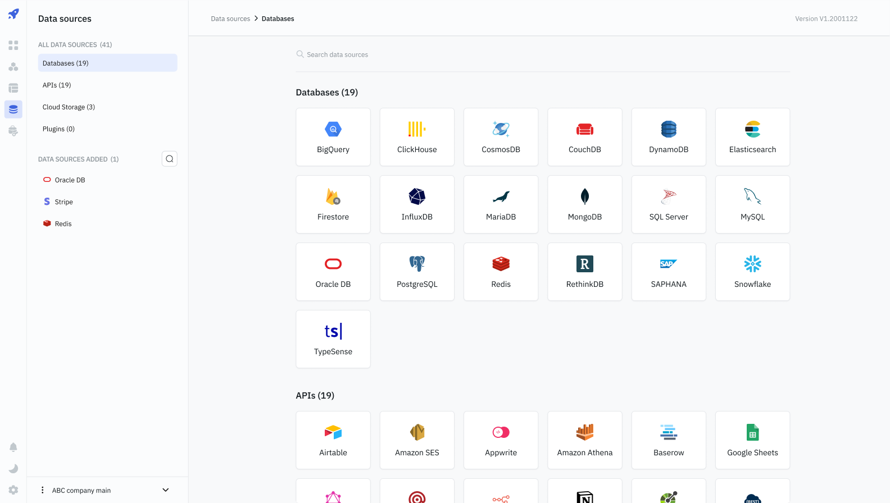

自动化工作流。
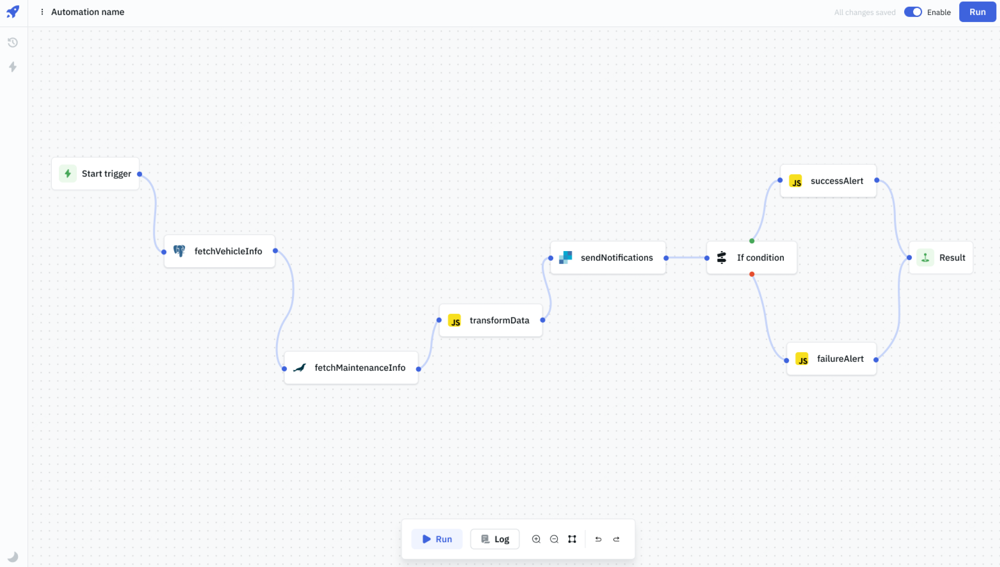


### 4. getomni-ai / zerox

```text
🔥 本周 stars：1,947
🔨 语 言：Python
⭐ stars：3,224
🍴 fork：320
```

Zerox 是一个开源的 OCR（光学字符识别）工具，旨在将 PDF、DOCX 等文件转换为 Markdown 格式。它利用先进的 GPT 模型，例如 GPT-4o-mini，实现了高效的文档处理。

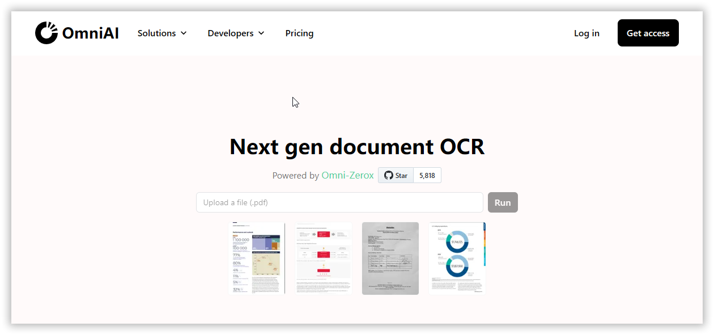

Zerox 的工作流程如下：
- 输入一个文件（如 PDF、DOCX 或图像）。
- 将该文件转换成一系列图像。
- 将每个图像提交给 GPT 模型，并请求转换为 Markdown 格式。
- 汇总所有回应，并返回 Markdown 格式的文档。

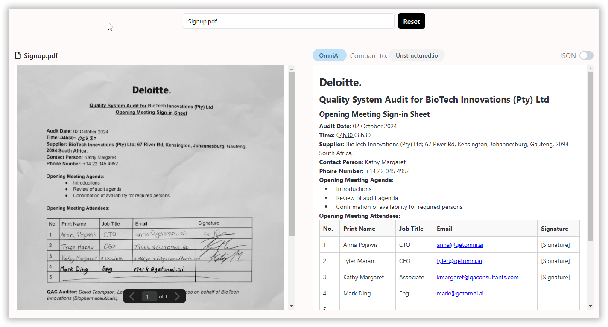


以上就是本期的全部内容，有感兴趣的赶紧去试试吧！我是四阿哥，关注我不错过每周的【GitHub 周刊】！也可以在我的[主页](https://siage.netlify.app/)查看更多往期的精彩内容！


